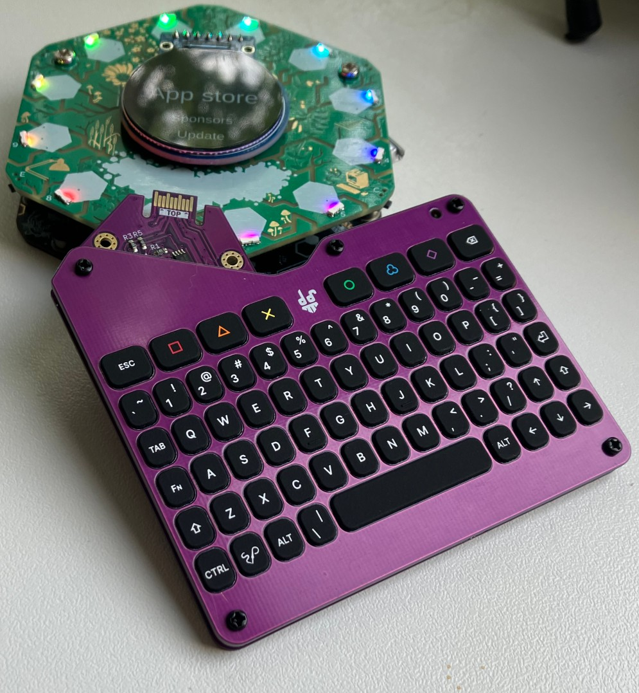

# Keepdexpansion

{: style="width:300px; height: auto" , align=right }

The *keebdexpansion* our first official hexpansion - a keyboard, so you can tap out messages and be less frustrated when entering wifi passwords.

Available for EMF 2026 camp ticket holders on the emfcamp website. See [the blog post introducing the Spaceagon](https://blog.emfcamp.org/2026/05/28/tildagon-2026-spaceagon/) for more info.

Hardware was originally started by [@davedarko](https://github.com/davedarko). Later [@kliment](https://github.com/kliment) changed the leds to RGB leds, altered the shape and added designs by Morag.

The driver software for the hexpansion is [provided by @sodoku](https://github.com/sodoku/tildagon-keebdeck).

## Features

- Full layout keyboard
- RGB Backlit keys
- Type in text inputs
- Auto-installs driver when plugged in

## Key combinations

| Keys | Description |
| ---- | ----------- |
| FN + ESC | Turn leds off|
| FN + SQUARE | Set all leds to red |
| FN + TRIANGLE | Set all leds to orange |
| FN + CROSS | Set all leds to yellow |
| FN + CIRCLE | Set all leds to green |
| FN + CLOUD | Set all leds to blue |
| FN + DIAMOND | Set all leds to purble |
| FN + SOLDERPARTY | Make leds follow tildagon pattern |

Note: `SOLDERPARTY` is the key next to CTRL

