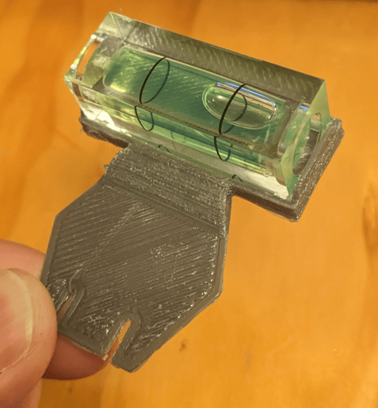

# Tildagon

As in previous years, we're making a badge. Unlike previous years, we're trying to make a longer-lasting platform. We're publishing more information ahead of the event so that people can build things for the badge early on. You can reasonably expect things you build for this year's badge to work in future years too.

- [I'm a badge holder and I want to know how to use the badge](using-the-badge)
- [I'm a software hacker and I want to make a badge app](tildagonos-apps)
- [I'm a hardware hacker and I want to make a hexpansion](hexpansions)
- [I'm a volunteer (or I want to be) and I want to hack on badge firmware](tildagonos-firmware)

!!! info

    Need help?

    - irc: __irc.libera.chat #emfcamp-badge__
    - matrix: __[#badge:emfcamp.org][matrix]__

This year's badge is the Tildagon badge. It's a hexagon with a slot on each side that you can plug hexpansions into. A hexpansion is a 1 mm thick object with a particular shape on one edge. It can be made of cardstock, so you can quickly add some cat ears to your badge, or it can be a printed circuit board.

- Hardware - [emfcamp/badge-2024-hardware](https://github.com/emfcamp/badge-2024-hardware)
- Software - [emfcamp/badge-2024-software](https://github.com/emfcamp/badge-2024-software)

## Badge specs

The processor in the badge will be the same as in 2022, and it will run [MicroPython](https://micropython.org/).

- ESP32-S3 microcontroller with 2MB of PSRAM and 8MB of flash
- USB-C connector
- WiFi
- Six hexpansion connectors
- Round screen, six buttons, lots of colourful LEDs
- Power management, motion sensing

## Hexpansions

Hexpansions are things that plug into the badge's expansion connectors. Almost anything can be a hexpansion: the simplest hexpansion is just a piece of 1 mm card cut into the right shape. Hexpansion connectors provide:

- Up to 600mA of 3.3V power (current-limited)
- An I2C bus (separate for each hexpansion)
- 4 high-speed GPIO pins connected directly to the ESP32-S3
- 5 lower-speed GPIO pins connected to a GPIO expander/LED driver
- 1 hexpansion detection pin (also used to switch power to the hexpansion on/off if needed)

A hexpansion can optionally provide an I2C EEPROM from the list of approved devices. If an EEPROM is present, the badge will be able to read a hexpansion identifier and name. You can also store code on the EEPROM, which will be copied to the badge and run from there.

The hexpansion technical documentation, pinout, and paper and PCB templates for them, are in [this repository](https://github.com/emfcamp/badge-2024-hardware).

## Why are we doing this?

We're tired of building the same thing over and over just to make it new and special. We're tired of putting ever-increasing stacks of e-waste into the drawers of the hacking world. We're especially tired of people not being able to meaningfully build things for the badge before the event, and none of those things working by the next event.

Instead of redesigning badges from scratch every two years, we're building a reusable platform with an interchangeable part that is specific to the event, and a base part which will remain compatible over multiple years. This will not only let us waste less effort and fewer materials, but also provide all attendees with a stable base to build on. We're putting more effort and better parts than usual into the base board, providing infrastructure so we don't have to remake things that tend to stay the same, or rewrite software and drivers for every event. We've put all the power management, communications, USB, expansion connectors, storage, motion sensing, and battery charging into this board.

We want to let you make physical things that interact with the badge more easily, in the knowledge that those things are going to continue working with future event badges. In previous years, expandability has always been an afterthought - people still managed to do amazing things with their badges, but it was a lot of effort.

In future events, we will reuse the base part and maintain compatibility in software and hardware for the existing hexpansions. We put all the expensive and hard-to-get-right functionality on the base part, so that we don't waste those parts and it doesn't end up in a drawer forever. The most energy-intensive part of each badge is the battery, so we've made it compatible with the batteries from the 2016 and 2018 badges. Instead of having a lanyard, we are making the USB cable itself be the lanyard for this badge - cables in different lengths are available for people of different sizes, and it can also be used for badge-to-badge and badge-to-computer communication.

## A list of variously realistic hexpansion ideas

- GPS / compass / IMU (for joust)
- Buzzer (for notifing the wearer and joust)
- Speaker (for notifying everyone near the wearer and joust)
- Heart rate monitor
- Modular synthesizer
- Pretty / blinding LEDs
- ePaper
- Actual paper
- Sandpaper
- Cat ears
- Drone arms
- Hexapod legs
- Fuzzy tail
- Googly eyes
- Memory card reader
- RFID reader
- TV-b-gone
- Infrared communication port
- Ultrasonic emitter
- Big red button
- Weather station
- Bicycle mount
- Polearm attachment
- Gnat attractor
- Keyboard

[matrix]: https://matrix.to/#/#badge:emfcamp.org
[using-the-badge]: "./using-the-badge"
[tildagonos-apps]: "./tildagonos-apps"
[hexpansions]: "./hexpansions"
[tildagonos-firmware]: "./tildagonos-firmware"
