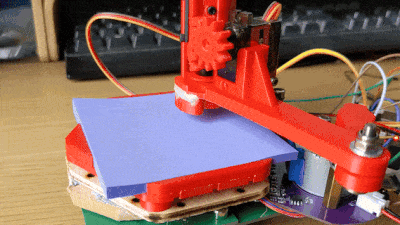
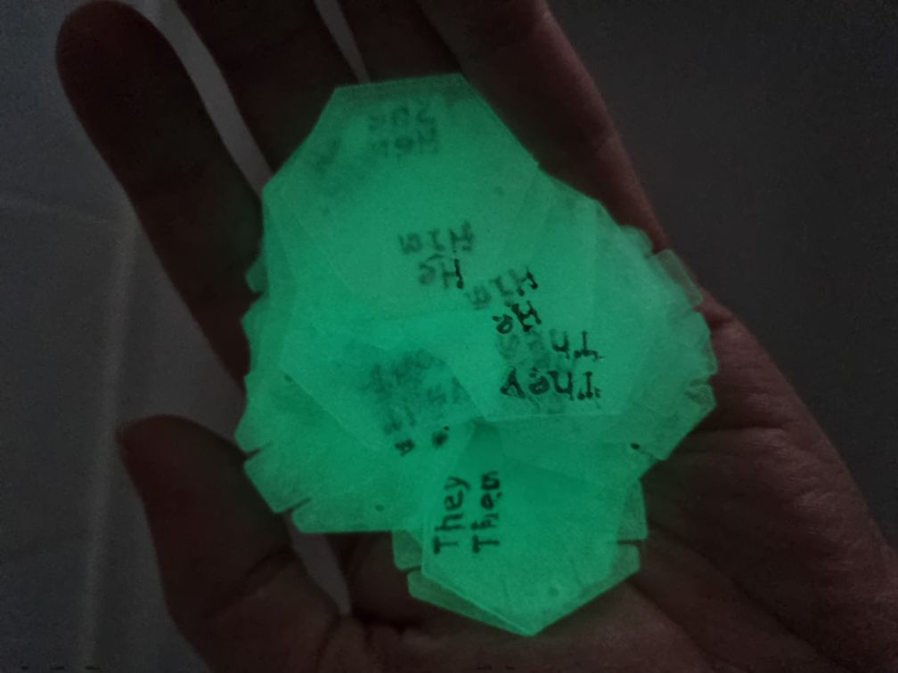

# Tildagon

{: style="width:300px; height: auto" , align=right }

This year's badge is the Tildagon badge. It's a hexagon with a slot on each side that you can plug _[hexpansions](#hexpansions)_ into. A hexpansion is a 1 mm thick object with a hexagon shape on one edge (a six-sided polygon like this: ⬡). It can be made of cardstock, so you can quickly add some cat ears to your badge, or it can be a printed circuit.

Unlike in previous years, [Electromagnetic Field](https://www.emfcamp.org/) is trying to make a [longer-lasting platform](#a-reusable-platform-with-an-interchangeable-part) so any apps developed for it will work for multiple years.

 

## What would you like to do with your badge?

- [I want to know how to use the badge](using-the-badge/end-user-manual.md)
- [I want to make a badge app](tildagon-apps/development.md)
- [I want to make a hexpansion](hexpansions/creating-hexpansions.md)
- [I want to hack on badge firmware](tildagon-firmware/index.md)

!!! info "Need help? Ask here:"

    - irc: __irc.libera.chat #emfcamp-badge__
    - matrix: __[#badge:emfcamp.org][matrix]__

## Badge specs

{: style="width:300px;height: auto;margin:auto;display:block;" }

- ESP32-S3 microcontroller with 2MB of PSRAM and 8MB of flash
- USB-C connector
- WiFi
- Six [hexpansion](#hexpansions) connectors
- Round screen, six buttons, lots of colourful LEDs
- Power management, motion sensing

!!! info "The processor in the badge is the same as in 2022, and it will run [MicroPython](https://micropython.org/)."

## Hexpansions

<!--hexpansions-definition-start-->
Hexpansions are accessories that plug into the badge's expansion connectors. Almost anything can be a hexpansion - the simplest hexpansion is just a piece of 1 mm card cut into the right hexagonal shape. Here are some community examples: (1)
{ .annotate }

1.  If you want to add your hexpansion to this gallery, you can [file a PR](https://github.com/emfcamp/badge-2024-documentation/blob/main/docs/index.md) or let us know on the irc! We'd love to feature all of your creations!
<!--hexpansions-definition-end-->

<!--hexpansions-start-->
  
    
    Emergency Hot Sauce hexpansion (chipotle flavor) by John Thurmond
  
  
    
    EEH Hexpansion by Matt
  
  
    
    Untitled Goose by Skyler Mansfield
  
  
    
    LED Filament hexpansion by John Thurmond
  
  
    
    <a href="https://www.makerspace.org.uk/">Maker Space</a> badge by Dan
  
  
    
    Plotter hexpansion by Danny Walker
  
  
    
    Floppy disk "Flopagon" by Nathan Dumont
  
  
    
    Omni wheel by Nathan Dumont
  
  
    
    7-Segment display by Iain Yarnall.
  
  
    
    Mysterious QR Code by grajohnt
  
  
    
    Spirit level by Chris
  
  
    
    That Rabbit by Dan
  
  
    
    Le Carnard de Bleu by Dan
  
  
    
    Fidget Spinner by Catherine
  
  
    
    Breadbeard Hexpansion by Danny Walker
  
  
    
    Hex-Drive and Hex-Dev by Team RobotMad
  
  
    
    Hex-Drives by Team RobotMad
  
  
    
    <a href="https://www.printables.com/model/883719-emf-tildagon-hexpansion-gridfinity">Gridfinity expansion hexpansion</a> by Jack Fitton
  
  
    
    GCHQ.NET markers by <a href="https://gchq.net/">GCHQ.NET</a>
  
  
    
    Megadrive controller by Matthew Wilkes
  
  
    
    <a href="https://www.thingiverse.com/thing:6633547">Eye hexpansion</a> by Alistair
  
  
    
    <a href="https://www.thingiverse.com/thing:6635025">Smile hexpansion</a> by Alistair
  
  
    
    <a href="https://www.printables.com/model/893545-spirit-level-hexpansions">Spirit level hexpansions</a> by Andy Piper
  
  
    
    Duck pond hexpansion by Andy Piper
  
  
    
    Bat wing hexpansions by clayalien
  
  
    
    <a href="https://www.printables.com/model/894472-not-lego-baseplate-hexpansion">Not lego baseplate hexpansion</a> by adie
  
  
    
    <a href="https://www.printables.com/model/894438-display-platform-hexpansion">Display platform hexpansion</a> by adie
  
  
    
    <a href="https://www.printables.com/model/885935-pronoun-hexpansion">Glowing pronoun hexpansions</a> by adie
  
  
    
    <a href="https://www.printables.com/model/885935-pronoun-hexpansion">Pronoun hexpansions</a> by adie
  
  
    
    Keyboard by Bob
  
  
    
    Frog prototype by Bob
  
  
    
    Many eyes by Bob
  
<!--hexpansions-end-->

??? tip "Expand to show a list of variously realistic hexpansion ideas"

    - GPS / compass / IMU (for joust)
    - Buzzer (for notifing the wearer and joust)
    - Speaker (for notifying everyone near the wearer and joust)
    - Heart rate monitor
    - Modular synthesizer
    - Pretty / blinding LEDs
    - ePaper
    - Actual paper
    - Sandpaper
    - Cat ears
    - Drone arms
    - Hexapod legs
    - Fuzzy tail
    - Googly eyes
    - Memory card reader
    - RFID reader
    - TV-b-gone
    - Infrared communication port
    - Ultrasonic emitter
    - Big red button
    - Weather station
    - Bicycle mount
    - Polearm attachment
    - Gnat attractor
    - Keyboard

For more information, see:

- [Create a hexpansion](hexpansions/creating-hexpansions.md)
- [Technical documentation, pinout, and paper and PCB templates][badge-2024-hardware]

## A reusable platform with an interchangeable part

Instead of redesigning badges from scratch every two years, we're building:

- a reusable platform
- a base part which will remain compatible over multiple years.
  The base contains power management, communications, USB, expansion connectors, storage, motion sensing, and battery charging into this board
- an interchangeable part that is specific to the event

### Why are we doing this?

We want to let you make physical things that interact with the badge more easily, in the knowledge that those things are going to continue working with future event badges. In previous years, expandability has always been an afterthought - people still managed to do amazing things with their badges, but it was a lot of effort.

Additionally, we're tired of building the same thing over and over just to make it new and special. We're tired of putting ever-increasing stacks of e-waste into the drawers of the hacking world. We're especially tired of people not being able to meaningfully build things for the badge before the event, and none of those things working by the next event.

The Tildagon will not only let us waste fewer materials, but it also provides us and attendees with a stable base to build on and invest in.

For us, the stable infrastructure means we do not need to rewrite software and drivers for every event. Instead we can focus our efforts on the smaller event-specific part.

Investing in the Tildagon for multiple years also means we've put more effort and better parts than usual into the base board. We put all the expensive and hard-to-get-right functionality on the base part. In future events, we will reuse this base part and maintain compatibility in software and hardware for existing hexpansions.

The most energy-intensive part of each badge is the battery, so we've made it compatible with the batteries from the 2016 and 2018 badges.

Instead of having a lanyard, we are making the USB cable itself be the lanyard for this badge - cables in different lengths are available for people of different sizes, and it can also be used for badge-to-badge and badge-to-computer communication.

[badge-2024-hardware]: https://github.com/emfcamp/badge-2024-hardware
[badge-2024-software]: https://www.github.com/emfcamp/badge-2024-software
[badge-2024-documentation]: https://www.github.com/emfcamp/badge-2024-documentation
[badge-2024-app-store]: https://www.github.com/emfcamp/badge-2024-app-store
[badge-tent-volunteering]: ./badge-tent-volunteering.md
[matrix]: https://matrix.to/#/#badge:emfcamp.org
