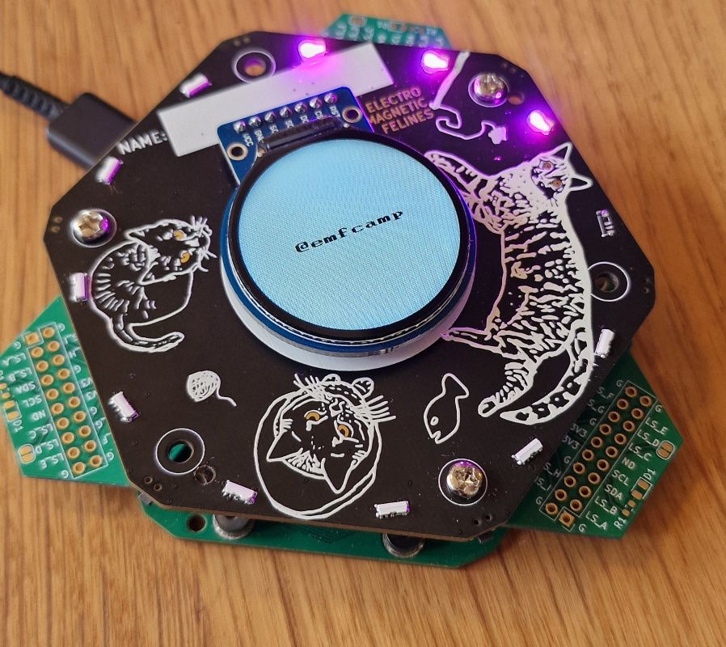
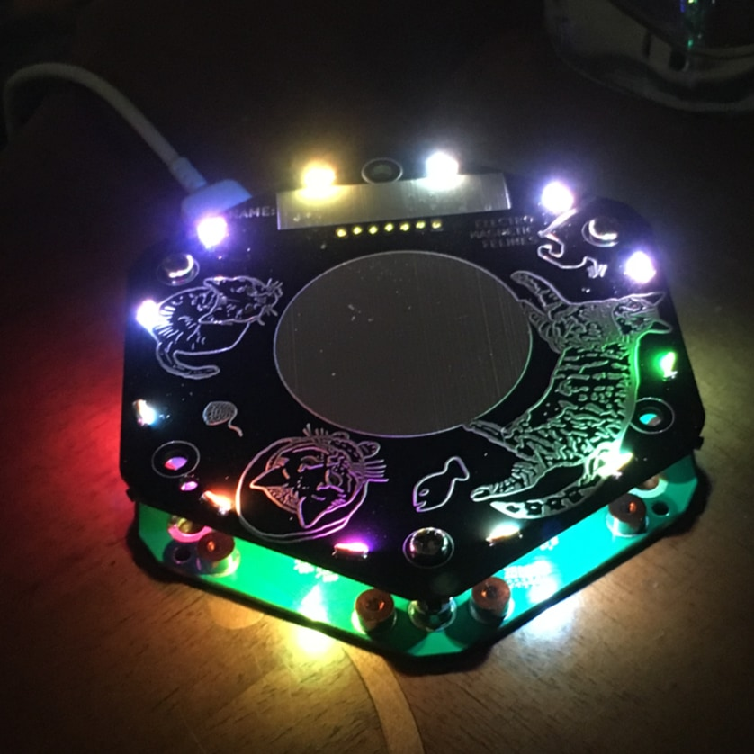

# Tildagon

{: style="width:300px; height: auto" , align=right }

This year's badge is the Tildagon badge. It's a hexagon with a slot on each side that you can plug _[hexpansions](#hexpansions)_ into. A hexpansion is a 1 mm thick object with a hexagon shape on one edge (a six-sided polygon like this: ⬡). It can be made of cardstock, so you can quickly add some cat ears to your badge, or it can be a printed circuit.

Unlike in previous years, [Electromagnetic Field](https://www.emfcamp.org/) is trying to make a [longer-lasting platform](#a-reusable-platform-with-an-interchangeable-part) so any apps developed for it will work for multiple years.

 

## What would you like to do with your badge?

- [I want to know how to assemble and use the badge](using-the-badge/end-user-manual.md)
- [I want to connect to another Wi-Fi network](using-the-badge/connect-to-wifi.md)
- [I want to make a badge app](tildagon-apps/development.md)
- [I want to make a hexpansion](hexpansions/creating-hexpansions.md)
- [I want to hack on badge firmware](tildagon-firmware/index.md)

!!! info "Need help? Ask here:"

    - irc: __irc.libera.chat #emfcamp-badge__
    - matrix: __[#badge:emfcamp.org][matrix]__

## Badge specs

{: style="width:300px;height: auto;margin:auto;display:block;" }

- ESP32-S3 microcontroller with 2MB of PSRAM and 8MB of flash
- USB-C connector
- WiFi
- Six [hexpansion](#hexpansions) connectors
- Round screen, six buttons, lots of colourful LEDs
- Power management, motion sensing
- An IMU (gyro + accelerometer)
- Bluetooth (BLE)

!!! info "The processor in the badge is the same as in 2022, and it will run [MicroPython](https://micropython.org/)."

## Hexpansions

<!--hexpansions-definition-start-->
Hexpansions are accessories that plug into the badge's expansion connectors. Almost anything can be a hexpansion - the simplest hexpansion is just a piece of 1mm card cut into the right hexagonal shape. Here are some community examples: (1)
{ .annotate }

1. If you want to add your hexpansions to this gallery, you can [add them to the registry](https://github.com/hughrawlinson/hexpansion-registry) or [add them to this issue](https://github.com/emfcamp/badge-2024-documentation/issues/149) or let us know on the IRC/Matrix! We'd love to feature all of your creations!

<!--hexpansions-definition-end-->

<!--hexpansions-start-->
  
    
    <a href="https://github.com/emfcamp/badge-2024-hardware/tree/main/hexpansion">OG Hexpansion</a> by kliment
    

      
Link: <a href="https://github.com/emfcamp/badge-2024-hardware/tree/main/hexpansion">GitHub</a>

    

  
  
    
    Emergency Hot Sauce hexpansion (chipotle flavor) by John Thurmond
  
  
    
    <a href="https://www.instagram.com/tiffleek/reel/C7yx5jmNJ9d/">Ducks hexpansion</a> by Tiff
    

      
EMF ducks sixties style flying porcelain ducks

      
Link: <a href="https://www.instagram.com/tiffleek/reel/C7yx5jmNJ9d/">Instagram</a>

    

  
  
    
    EEH Hexpansion by Matt
  
  
    
    Untitled Goose by Skyler Mansfield
  
  
    
    LED Filament hexpansion by John Thurmond
  
  
    
    <a href="https://www.makerspace.org.uk/">Maker Space</a> badge by Dan
    

      
Link: <a href="https://www.makerspace.org.uk/">GitHub</a>

    

  
  
    
    Plotter hexpansion by Danny Walker
  
  
    
    Floppy disk <a href="https://github.com/hairymnstr/Flopagon">"Flopagon"</a> by Nathan Dumont
    

      
Link: <a href="https://github.com/hairymnstr/Flopagon">GitHub</a>

    

  
  
    
    40mm Googly Eye by John Dumont
  
  
    
    <a href="https://github.com/hairymnstr/omni-wheel-hexpansion">Omni wheel</a> by Nathan Dumont
    

      
Link: <a href="https://github.com/hairymnstr/omni-wheel-hexpansion">GitHub</a>

    

  
  
    
    Little Monsters by Talula
  
  
    
    <a href="https://www.printables.com/model/888549-emf-tildagon-hexpansion-7-segment-display">7-Segment display</a> by Iain Yarnall.
    

      
Link: <a href="https://www.printables.com/model/888549-emf-tildagon-hexpansion-7-segment-display">Printables</a>

    

  
  
    
    Mysterious QR Code by grajohnt
  
  
    
    Spirit level by Chris
  
  
    
    That Rabbit by Dan
  
  
    
    Le Carnard de Bleu by Dan
  
  
    
    Fidget Spinner by Catherine
  
  
    
    Breadbeard Hexpansion by Danny Walker
  
  
    
    Hex-Drive and Hex-Dev by Team RobotMad
  
  
    
    Hex-Drives by Team RobotMad
  
  
    
    <a href="https://www.printables.com/model/883719-emf-tildagon-hexpansion-gridfinity">Gridfinity expansion hexpansion</a> by Jack Fitton
    

      
Link: <a href="https://www.printables.com/model/883719-emf-tildagon-hexpansion-gridfinity">Printables</a>

    

  
  
    
    GCHQ.NET markers by <a href="https://gchq.net/">GCHQ.NET</a>
    

      
Link: <a href="https://gchq.net/">GCHQ</a>

    

  
  
    
    Megadrive controller by Matthew Wilkes
  
  
    
    <a href="https://www.thingiverse.com/thing:6633547">Eye hexpansion</a> by Alistair
    

      
Link: <a href="https://www.thingiverse.com/thing:6633547">Thingiverse</a>

    

  
  
    
    <a href="https://www.thingiverse.com/thing:6635025">Smile hexpansion</a> by Alistair
    

      
Link: <a href="https://www.thingiverse.com/thing:6635025">Thingiverse</a>

    

  
  
    
    <a href="https://www.printables.com/model/893545-spirit-level-hexpansions">Spirit level hexpansions</a> by Andy Piper
    

      
Link: <a href="https://www.printables.com/model/893545-spirit-level-hexpansions">Printables</a>

    

  
  
    
    Duck pond hexpansion by Andy Piper
  
  
    
    Bat wing hexpansions by clayalien
  
  
    
    <a href="https://www.printables.com/model/894472-not-lego-baseplate-hexpansion">Not lego baseplate hexpansion</a> by adie
    

      
Link: <a href="https://www.printables.com/model/894472-not-lego-baseplate-hexpansion">Printables</a>

    

  
  
    
    <a href="https://www.printables.com/model/894438-display-platform-hexpansion">Display platform hexpansion</a> by adie
    

      
Link: <a href="https://www.printables.com/model/894438-display-platform-hexpansion">Printables</a>

    

  
  
    
    <a href="https://www.printables.com/model/885935-pronoun-hexpansion">Glowing pronoun hexpansions</a> by Emily S
    

      
Link: <a href="https://www.printables.com/model/885935-pronoun-hexpansion">Printables</a>

    

  
  
    
    <a href="https://www.printables.com/model/885935-pronoun-hexpansion">Pronoun hexpansions</a> by Emily S
    

      
Link: <a href="https://www.printables.com/model/885935-pronoun-hexpansion">Printables</a>

    

  
  
    
    Keyboard by Bob
  
  
    
    Frog prototype by Bob
  
  
    
    <a href="https://github.com/emfcamp/badge-2024-addons/tree/main/thinkl33t/googly-eye-hexpansion">Many eyes</a> by Bob
    

      
Link: <a href="https://github.com/emfcamp/badge-2024-addons/tree/main/thinkl33t/googly-eye-hexpansion">GitHub</a>

    

  
  
     by dratini0" data-description=".custom-desc-sao">
    <a href="https://github.com/dratini0/legacy-adapter-hexpansion">&quot;Legacy&quot; adapter (SAO, TiDAL, QW/ST)</a> by dratini0
    

      
Link: <a href="https://github.com/dratini0/legacy-adapter-hexpansion">GitHub</a>

    

  
  
    
    <a href="https://github.com/dratini0/hub75-hexpansion">HUB75 hexpansion</a> by dratini0
    

      
Link: <a href="https://github.com/dratini0/hub75-hexpansion">GitHub</a>

    

  
  
    
    Blank Hexpansion by Nathan Dumont
  
  
    
    Corellian Freighter Hexpansion by Andy Piper
  
  
    
    <a href="https://www.printables.com/de/model/888105-catear-and-whisker-hexpansion">Cat ears and whiskers</a> by catnerd
    

      
Link: <a href="https://www.printables.com/de/model/888105-catear-and-whisker-hexpansion">Printables</a>

    

  
  
    
    ECHQ hexpansion by ECHQ village
  
  
    
    Pimoroni Breakout Garden I2C by <a href="https://github.com/jpwsutton">James Sutton</a>
    

      
Link: <a href="https://github.com/jpwsutton">GitHub</a>

    

  
  
    
    Hexaspansaputer (hexpansion supercomputer) by o0mouse0o
  
  
    
    A pride rainbow by o0mouse0o
  
  
    
    <a href="https://www.printables.com/model/895999-6flags-hexpansion">6flags Hexpansion</a> by Ambrosia
    

      
Link: <a href="https://www.printables.com/model/895999-6flags-hexpansion">Printables</a>

    

  
  
    
    <a href="https://github.com/eastabrooka/badge-2024-addons/tree/eastabrooka/Interposer/UntitledGoose-Eastabrooka">Interposer</a> by The Untitled Goose
    

      
Link: <a href="https://github.com/eastabrooka/badge-2024-addons/tree/eastabrooka/Interposer/UntitledGoose-Eastabrooka">GitHub</a>

    

  
  
    
    Simple Honk by The Untitled Goose
  
  
    
    Pacman by The Untitled Goose
  
  
    
    Doom Keycard by The Untitled Goose
  
  
    
    Hexnotoad by The Untitled Goose
  
  
    
    Hack the Planet by The Untitled Goose
  
  
    
    Henchmen by Brian Corteil
  
  
    
    Googly Eye Alien by Brian Corteil
  
  
    
    Lamp hexpansion by Tilde
  
  
    
    Breakout hexpansion by Tilde
  
  
    
    <a href="https://github.com/walkerdanny/caffeine-jitters/">Caffeine Jitters</a> by Danny Walker
    

      
Link: <a href="https://github.com/walkerdanny/caffeine-jitters/">GitHub</a>

    

  
  
    
    Petals by <a href="https://indieweb.social/@lornajane/112536772003752312">lornajane</a>
    

      
Petals on a badge

    

  
  
    
    Laser Tag Shieldallion by <a href="https://oldbytes.space/@kianryan/112541772244815335">kianryan</a>
    

      
Sofware link may be available later...

    

  
  
    
    Cat hexpansion
  
  
    
    Brainslug by <a href="https://x.com/guru/status/1793620540403613986">Paul Beech</a>
    

      
Link: <a href="https://x.com/guru/status/1793620540403613986">Twitter</a>

    

  
<!--hexpansions-end-->

!!! tip "Add your hexpansion! We'd love to feature all of your creations!"

    If you want to add your hexpansions to this gallery, you can [add them to the registry](https://github.com/hughrawlinson/hexpansion-registry) or [add them to this issue](https://github.com/emfcamp/badge-2024-documentation/issues/149) or let us know on the IRC/Matrix! We'll do the rest!

For more information, see:

- [Create a hexpansion](hexpansions/creating-hexpansions.md)
- [Technical documentation, pinout, and paper and PCB templates][badge-2024-hardware]

## A reusable platform with an interchangeable part

Instead of redesigning badges from scratch every two years, we're building:

- a reusable platform
- a base part which will remain compatible over multiple years.
  The base contains power management, communications, USB, expansion connectors, storage, motion sensing, and battery charging into this board
- an interchangeable part that is specific to the event

### Why are we doing this?

We want to let you make physical things that interact with the badge more easily, in the knowledge that those things are going to continue working with future event badges. In previous years, expandability has always been an afterthought - people still managed to do amazing things with their badges, but it was a lot of effort.

Additionally, we're tired of building the same thing over and over just to make it new and special. We're tired of putting ever-increasing stacks of e-waste into the drawers of the hacking world. We're especially tired of people not being able to meaningfully build things for the badge before the event, and none of those things working by the next event.

The Tildagon will not only let us waste fewer materials, but it also provides us and attendees with a stable base to build on and invest in.

For us, the stable infrastructure means we do not need to rewrite software and drivers for every event. Instead we can focus our efforts on the smaller event-specific part.

Investing in the Tildagon for multiple years also means we've put more effort and better parts than usual into the base board. We put all the expensive and hard-to-get-right functionality on the base part. In future events, we will reuse this base part and maintain compatibility in software and hardware for existing hexpansions.

The most energy-intensive part of each badge is the battery, so we've made it compatible with the batteries from the 2016 and 2018 badges.

Instead of having a lanyard, we are making the USB cable itself be the lanyard for this badge - cables in different lengths are available for people of different sizes, and it can also be used for badge-to-badge and badge-to-computer communication.

[badge-2024-hardware]: https://github.com/emfcamp/badge-2024-hardware
[badge-2024-software]: https://www.github.com/emfcamp/badge-2024-software
[badge-2024-documentation]: https://www.github.com/emfcamp/badge-2024-documentation
[badge-2024-app-store]: https://www.github.com/emfcamp/badge-2024-app-store
[badge-tent-volunteering]: ./badge-tent-volunteering.md
[matrix]: https://matrix.to/#/#badge:emfcamp.org
