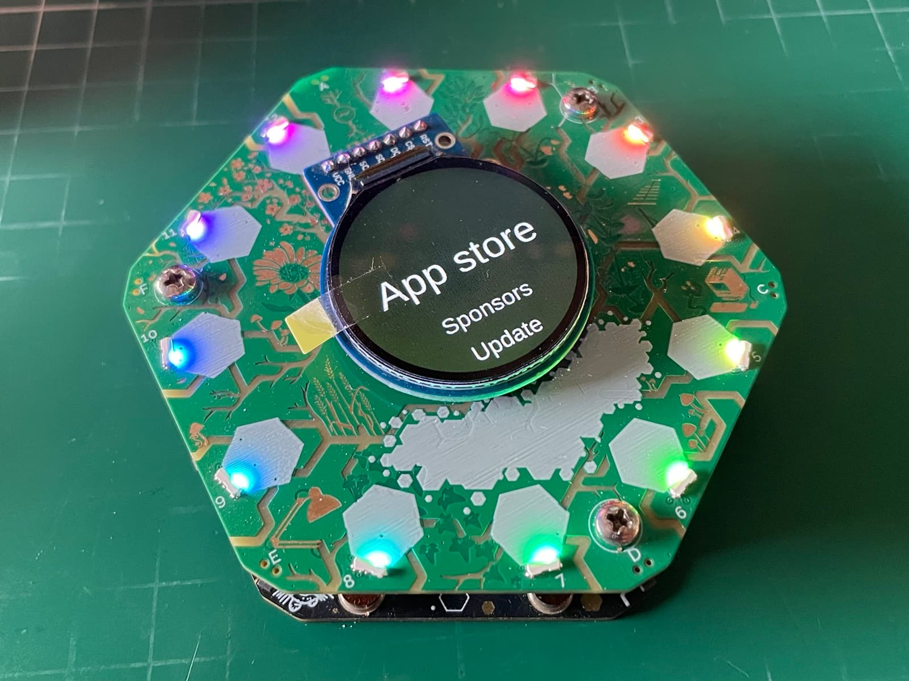
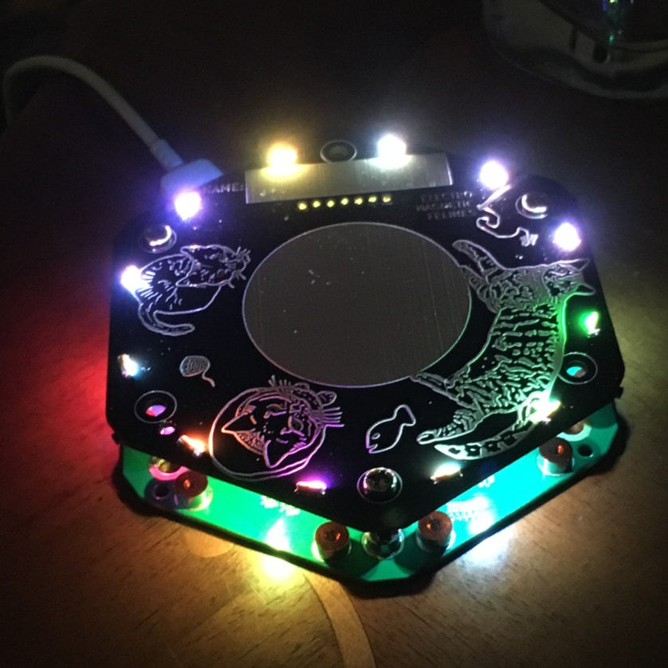

# Tildagon

{: style="width:300px; height: auto" , align=right }

This year's badge is the Tildagon badge. It's a hexagon with a slot on each side that you can plug _[hexpansions](#hexpansions)_ into. A hexpansion is a 1 mm thick object with a hexagon shape on one edge (a six-sided polygon like this: ⬡). It can be made of card stock, so you can quickly add some cat ears to your badge, or it can be a printed circuit.

Unlike in previous years, [Electromagnetic Field](https://www.emfcamp.org/) is trying to make a [longer-lasting platform](#a-reusable-platform-with-an-interchangeable-part) so any apps developed for it will work for multiple years.

 

## What would you like to do with your badge?

- [I want to get my own badge](https://www.emfcamp.org/about/badge)
- [I want to know how to assemble and use the badge](using-the-badge/end-user-manual.md)
- [I want to connect to another Wi-Fi network](using-the-badge/connect-to-wifi.md)
- [I want to make a badge app](tildagon-apps/development.md)
- [I want to make a hexpansion](hexpansions/creating-hexpansions.md)
- [I want to hack on badge firmware](tildagon-firmware/index.md)

!!! info "Need help? Ask here:"

    - irc: __irc.libera.chat #emfcamp-badge__
    - matrix: __[#badge:emfcamp.org][matrix]__

## Badge specs

{: style="width:300px;height: auto;margin:auto;display:block;" }

- ESP32-S3 microcontroller with 2MB of PSRAM and 8MB of flash
- USB-C connector
- WiFi
- Six [hexpansion](#hexpansions) connectors
- Round screen, six buttons, lots of colourful LEDs
- Power management, motion sensing
- An IMU (gyro + accelerometer)
- Bluetooth (BLE)

!!! info "The processor in the badge is the same as in 2022, and it will run [MicroPython](https://micropython.org/)."

## Hexpansions

<!--hexpansions-definition-start-->

Hexpansions are accessories that plug into the badge's expansion connectors. Almost anything can be a hexpansion - the simplest hexpansion is just a piece of 1mm card cut into the right hexagonal shape. Here are some community examples: (1)
{ .annotate }

1. If you want to add your hexpansions to this gallery, you can [add them to the registry](https://github.com/hughrawlinson/hexpansion-registry) or [add them to this issue](https://github.com/emfcamp/badge-2024-documentation/issues/149) or let us know on the IRC/Matrix! We'd love to feature all of your creations!

<!--hexpansions-definition-end-->

<!--hexpansions-start-->
  
    
    <a href="https://www.emfcamp.org/tickets/badge">Keebdexspansion</a> by sodoku, davedarko, and kliment
    <a href="https://www.emfcamp.org/tickets/badge">
💰 BUY HERE
</a>
    <a href="https://github.com/davedarko/KeebDeckHexpansion">
👀 VIEW FILES
</a>
    

      

        <a href="https://www.emfcamp.org/tickets/badge">
💰 BUY HERE
</a>
        <a href="https://github.com/davedarko/KeebDeckHexpansion">
👀 VIEW FILES
</a>
      

    

  
  
    
    <a href="https://github.com/emfcamp/badge-2024-hardware/tree/main/hexpansion">OG Hexpansion</a> by kliment
    <a href="https://github.com/emfcamp/badge-2024-hardware/tree/main/hexpansion">
👀 VIEW FILES
</a>
    

      

        <a href="https://github.com/emfcamp/badge-2024-hardware/tree/main/hexpansion">
👀 VIEW FILES
</a>
      

    

  
  
    
    <a href="https://www.instagram.com/tiffleek/reel/C7yx5jmNJ9d/">Ducks hexpansion</a> by Tiff
    

      
EMF ducks sixties style flying porcelain ducks

      
Link: <a href="https://www.instagram.com/tiffleek/reel/C7yx5jmNJ9d/">Instagram</a>

    

  
  
    
    Goosespansion by Skyler Mansfield
    <a href="https://github.com/skyler84-tildagon-addons/goosepansion">
👀 VIEW FILES
</a>
    

      

        <a href="https://github.com/skyler84-tildagon-addons/goosepansion">
👀 VIEW FILES
</a>
      

    

  
    
    
    <a href="https://www.youtube.com/watch?v=itg0bViiKIg">Bleepie paging hexpansion</a> by Sam Machin
    <a href="https://www.youtube.com/watch?v=itg0bViiKIg">
🎥 WATCH IT
</a>
    

      
Paging hexpansion with RAIO2, RP2040, and bleeper modules. The badge detects the hexpansion on plug-in and can send and receive pages.

      
Videos: <a href="https://www.youtube.com/watch?v=itg0bViiKIg">YouTube</a> · <a href="https://www.youtube.com/watch?v=791P1Sn_h2k">YouTube</a>

      

        <a href="https://www.youtube.com/watch?v=itg0bViiKIg">
🎥 WATCH IT
</a>
        <a href="https://www.youtube.com/watch?v=791P1Sn_h2k">
🎥 WATCH IT
</a>
      

    

  
  
    
    <a href="https://github.com/eastabrooka/badge-2024-addons/tree/eastabrooka/Interposer/UntitledGoose-Eastabrooka">Interposer</a> by The Untitled Goose
    <a href="https://www.gavinchester.com/Hexpansion.htm">
💰 BUY HERE
</a>
    <a href="https://github.com/eastabrooka/badge-2024-addons/tree/eastabrooka/Interposer/UntitledGoose-Eastabrooka">
👀 VIEW FILES
</a>
    

      

        <a href="https://www.gavinchester.com/Hexpansion.htm">
💰 BUY HERE
</a>
        <a href="https://github.com/eastabrooka/badge-2024-addons/tree/eastabrooka/Interposer/UntitledGoose-Eastabrooka">
👀 VIEW FILES
</a>
      

    

  
  
    
    Plotter hexpansion by Danny Walker
  
  
    
    <a href="https://www.tindie.com/products/jakew/protoboard-hexpansion/">Protoboard Hexpansion</a> by Jake Walker
    <a href="https://www.tindie.com/products/jakew/protoboard-hexpansion/">
💰 BUY HERE
</a>
    

      

        <a href="https://www.tindie.com/products/jakew/protoboard-hexpansion/">
💰 BUY HERE
</a>
      

    

  
  
    
    <a href="https://themachineshop.uk/products/gps-hexpansion">GPS Hexpansion</a> by The Machine Shop
    <a href="https://themachineshop.uk/products/gps-hexpansion">
💰 BUY HERE
</a>
    <a href="https://github.com/TechCabin/EMFBadge-Hexpansions-GPS">
👀 VIEW FILES
</a>
    

      

        <a href="https://themachineshop.uk/products/gps-hexpansion">
💰 BUY HERE
</a>
      

    

  
  
    
    <a href="https://github.com/jasonalexander-ja/dectspansion">DECTspansion</a> by <a href="https://github.com/jasonalexander-ja">jasonalexander-ja</a>
    <a href="https://github.com/jasonalexander-ja/dectspansion">
👀 VIEW FILES
</a>
    

      
DECT module for the Tildagon badge. Requires a headphone (audio) connection. Design builds on the SC14CVM DECT devboard and the EMF hexpansion. Early prototype. License: CERN-OHL-S-2.0.

      

        <a href="https://github.com/jasonalexander-ja/dectspansion">
👀 VIEW FILES
</a>
      

    

  
  
    
    LED Filament hexpansion by John Thurmond
  
  
    
    <a href="https://robotmad.odoo.com/shop">Hex-Drive and Hex-Dev</a> by Team RobotMad
    <a href="https://robotmad.odoo.com/shop">
💰 BUY HERE
</a>
    

      

        <a href="https://robotmad.odoo.com/shop">
💰 BUY HERE
</a>
      

    

  
  
    
    EEH Hexpansion by Matt
  
  
    
    Emergency Hot Sauce hexpansion (chipotle flavor) by John Thurmond
  
  
    
    <a href="https://www.makerspace.org.uk/">Maker Space</a> badge by Dan Nixon
    <a href="https://github.com/DanNixon/hexpansions/tree/main/makerspace-badge">
👀 VIEW FILES
</a>
    

      

        <a href="https://github.com/DanNixon/hexpansions/tree/main/makerspace-badge">
👀 VIEW FILES
</a>
      

    

  
  
    
    <a href="https://github.com/DanNixon/ethernet-hexpansion">Ethernet hexpansion</a> by Dan Nixon
    <a href="https://github.com/DanNixon/ethernet-hexpansion">
👀 VIEW FILES
</a>
    

      
W5500-based Ethernet and PoE hexpansion using a WIZnet WIZPoE-P1 module.

      

        <a href="https://github.com/DanNixon/ethernet-hexpansion">
👀 VIEW FILES
</a>
      

    

  
  
    
    <a href="https://themachineshop.uk/products/dual-sd-card-hexpansion">Dual SD Card hexpansion</a> by Dan Nixon
    <a href="https://themachineshop.uk/products/dual-sd-card-hexpansion">
💰 BUY HERE
</a>
    <a href="https://github.com/DanNixon/microsd-hexpansion">
👀 VIEW FILES
</a>
    

      
Two microSD card slots on a shared SPI bus, with physical card detection.

      
Link: <a href="https://fediscience.org/@samtygier/116778172027213412">@samtygier on fediscience.org</a>

      

        <a href="https://themachineshop.uk/products/dual-sd-card-hexpansion">
💰 BUY HERE
</a>
        <a href="https://github.com/DanNixon/microsd-hexpansion">
👀 VIEW FILES
</a>
      

    

  
  
    
    Smol breakout hexpansion by Dan
    <a href="https://github.com/DanNixon/smol-breakout-hexpansion">
👀 VIEW FILES
</a>
  
  
    
    <a href="https://morehammer.uk/@bencc/116704814965510084">James Webb Space Telescope hexpansion</a> by Ben C
    

      
Decorative hexpansion with 18 yellow hexagonal tiles arranged like the James Webb Space Telescope primary mirror.

      
Link: <a href="https://morehammer.uk/@bencc/116704814965510084">@bencc on morehammer.uk</a>

    

  
  
    
    Floppy disk <a href="https://github.com/hairymnstr/Flopagon">"Flopagon"</a> by Nathan
    Dumont
    <a href="https://github.com/hairymnstr/Flopagon">
👀 VIEW FILES
</a>
    

      
Floppy disk hexpansion with app and EEPROM support. See the <a href="https://github.com/hairymnstr/flopagon#software">software setup instructions</a> on GitHub.

      

        <a href="https://github.com/hairymnstr/Flopagon">
👀 VIEW FILES
</a>
      

    

  
  
    
    Croc-clip friendly I/O pads hexpansion by Nathan Dumont
  
  
    
    <a href="https://codeberg.org/kliment/flipspansion">Flipspansion</a> by kliment
    <a href="https://codeberg.org/kliment/flipspansion">
👀 VIEW FILES
</a>
    

      
Adapter to mount a hexpansion upside down. Use only in hexpansion slots that are <em>not</em> above a USB port (see project README).

      
As requested by DuncanT.

      

        <a href="https://codeberg.org/kliment/flipspansion">
👀 VIEW FILES
</a>
      

    

  
  
    
    SD card hexpansion by DuncanT
  
  
    
    <a href="https://github.com/davedarko/KeebDeckHexpansion">KeebDeck Hexpansion Prototype</a> by davedarko and sodoku
    <a href="https://github.com/davedarko/KeebDeckHexpansion">
👀 VIEW FILES
</a>
    

      
Full-layout keyboard hexpansion using the <a href="https://www.solder.party/docs/keebdeck/keyboard/">solder.party KeebDeck</a>, with RGB-backlit keys for typing in text inputs. Hardware by Dave; software by sodoku.

      
Software: <a href="https://github.com/sodoku/tildagon-keebdexpansion">tildagon-keebdexpansion</a>

      

        <a href="https://github.com/davedarko/KeebDeckHexpansion">
👀 VIEW FILES
</a>
      

    

  
  
    
    <a href="https://codeberg.org/davedarko/LEGspansion">LEGspansion</a> by davedarko
    <a href="https://codeberg.org/davedarko/LEGspansion">
👀 VIEW FILES
</a>
    

      
Tildagon hexpansion PCB with three servo outputs. Firmware for the CH32V003 microcontroller is based on <a href="https://github.com/deshipu/mite-servo">deshipu's mite-servo</a>.

      

        <a href="https://codeberg.org/davedarko/LEGspansion">
👀 VIEW FILES
</a>
      

    

  
  
    
    <a href="https://mastodon.social/@GlitchEngine/116410291765902200">Microphone hexpansion</a> by Lix
    <a href="https://mastodon.social/@GlitchEngine/116410291765902200">
🎥 WATCH IT
</a>
    

      
Microphone hexpansion that captures audio samples and runs on-device visualisations from EEPROM.

      
Video: <a href="https://mastodon.social/@GlitchEngine/116410291765902200">@GlitchEngine on Mastodon</a>

      

        <a href="https://mastodon.social/@GlitchEngine/116410291765902200">
🎥 WATCH IT
</a>
      

    

  
  
    
    <a href="https://infosec.exchange/@fridgehead/116240064715205161">DECTalk hexpansion</a> by tomwyatt
    

      
Hexpansion with a DECtalk speech synthesizer

      
Link: <a href="https://infosec.exchange/@fridgehead/116240064715205161">@fridgehead on infosec.exchange</a>

    

  
  
    
    <a href="https://github.com/ArcaneNibble/hexpansion-headphones">Headphone jack hexpansion</a> by ArcaneNibble
    <a href="https://github.com/ArcaneNibble/hexpansion-headphones">
👀 VIEW FILES
</a>
    

      
Hexpansion with ES8388 headphone codec and 3.5mm jack.

      

        <a href="https://github.com/ArcaneNibble/hexpansion-headphones">
👀 VIEW FILES
</a>
      

    

  
  
    
    <a href="https://github.com/ArcaneNibble/hexpansion-ir-tool">IR Tx/Rx hexpansion</a> by ArcaneNibble
    <a href="https://github.com/ArcaneNibble/hexpansion-ir-tool">
👀 VIEW FILES
</a>
    

      
38 kHz consumer infrared transmit and receive, with a Puya PY32 microcontroller.

      

        <a href="https://github.com/ArcaneNibble/hexpansion-ir-tool">
👀 VIEW FILES
</a>
      

    

  
  
    
    <a href="https://github.com/tonygoacher/tildagon_soundtolight">TGSTL</a> sound-to-light by Tony Goacher
    <a href="https://github.com/tonygoacher/tildagon_soundtolight">
👀 VIEW FILES
</a>
    <a href="https://hackaday.io/project/205329-sound-to-light-for-emf-tildagon-badge">
📖 READ BLOG
</a>
    <a href="https://www.youtube.com/watch?v=Oy822CMz1iM">
🎥 WATCH IT
</a>
    

      
TGSTL turns the Tildagon badge into a portable sound-to-light unit using the onboard LEDs, with multiple lighting effects and adjustable sensitivity. There is also a manually selectable RGB fader when there is no music.

      
Video: <a href="https://www.youtube.com/watch?v=Oy822CMz1iM">YouTube</a> · Photo: <a href="https://photos.app.goo.gl/WsUy2U74gAunsbfm8">Google Photos</a> · Resources: <a href="https://github.com/tonygoacher/tildagon_soundtolight">GitHub</a>

      

        <a href="https://github.com/tonygoacher/tildagon_soundtolight">
👀 VIEW FILES
</a>
        <a href="https://hackaday.io/project/205329-sound-to-light-for-emf-tildagon-badge">
📖 READ BLOG
</a>
        <a href="https://www.youtube.com/watch?v=Oy822CMz1iM">
🎥 WATCH IT
</a>
      

    

  
  
    
    <a href="https://www.printables.com/model/826094-emf-tildagon-hexpansion-template">EMF Tildagon hexpansion template</a> by Andy Piper
    <a href="https://www.printables.com/model/826094-emf-tildagon-hexpansion-template">
🖨️ PRINT ME
</a>
    

      
Templates for prototyping hexpansion boards for the Tildagon badge.

      

        <a href="https://www.printables.com/model/826094-emf-tildagon-hexpansion-template">
🖨️ PRINT ME (Printables)
</a>
        <a href="https://www.thingiverse.com/thing:6556964">
🖨️ PRINT ME (Thingyverse)
</a>
      

    

  
  
    
    Edge-lit Millennium Falcon hexpansion by grajohnt
  
  
    
    Hexatetrahedron by grajohnt
  
  
    
    Audio output hexpansion hexpansion by Andrea
  
  
    
    <a href="https://github.com/webmariner/Radiolarian">Radiolarian</a> by webmariner
    <a href="https://github.com/webmariner/Radiolarian">
👀 VIEW FILES
</a>
    

      
A flexible digital radio hexpansion for the Tildagon.

      

        <a href="https://github.com/webmariner/Radiolarian">
👀 VIEW FILES
</a>
      

    

  
  
    
    Mustache hexpansion by GPPK
  
  
    
    EMF sign hexpansion by GPPK
  
    
    
    Max hexpansion by Catherine
  
  
    
    40mm Googly Eye by John Dumont
  
  
    
    <a href="https://github.com/hairymnstr/omni-wheel-hexpansion">Omni wheel</a> by Nathan Dumont
    <a href="https://github.com/hairymnstr/omni-wheel-hexpansion">
👀 VIEW FILES
</a>
    

      

        <a href="https://github.com/hairymnstr/omni-wheel-hexpansion">
👀 VIEW FILES
</a>
      

    

  
  
    
    Little Monsters by Talula
  
  
    
    <a href="https://www.printables.com/model/888549-emf-tildagon-hexpansion-7-segment-display">7-Segment display</a> by Iain Yarnall
    <a href="https://www.printables.com/model/888549-emf-tildagon-hexpansion-7-segment-display">
🖨️ PRINT ME
</a>
    

      

        <a href="https://www.printables.com/model/888549-emf-tildagon-hexpansion-7-segment-display">
🖨️ PRINT ME
</a>
      

    

  
  
    
    <a href="https://www.printables.com/model/1746745-emf-festival-tildagon-hexpansion-earplug-case">Earplug case hexpansion</a> by Iain Yarnall
    <a href="https://www.printables.com/model/1746745-emf-festival-tildagon-hexpansion-earplug-case">
🖨️ PRINT ME
</a>
    

      
Box hexpansion for keeping earplugs safe at the festival.

      

        <a href="https://www.printables.com/model/1746745-emf-festival-tildagon-hexpansion-earplug-case">
🖨️ PRINT ME
</a>
      

    

  
  
    
    <a href="https://mastodon.social/@IainY/116782414199666576">Multi-threading hexpansion</a> by Iain Yarnall
    

      
A multi-threading hexpansion for EMF Camp.

      
Link: <a href="https://mastodon.social/@IainY/116782414199666576">Iain Y</a>

    

  
  
    
    <a href="https://www.printables.com/model/1741153-hexpansion-sample-tube-holders">Sample tube holders hexpansion</a> by NekoLilly
    <a href="https://www.printables.com/model/1741153-hexpansion-sample-tube-holders">
🖨️ PRINT ME
</a>
    

      
Hexpansion adapters for 5 ml sample tubes.

      

        <a href="https://www.printables.com/model/1741153-hexpansion-sample-tube-holders">
🖨️ PRINT ME
</a>
      

    

  
  
    
    Mysterious QR Code by grajohnt
  
  
    
    Spirit level by Chris
  
  
    
    That Rabbit by Dan Nixon
    <a href="https://github.com/DanNixon/hexpansions/tree/main/rabbit">
👀 VIEW FILES
</a>
  
  
    
    Le Carnard de Bleu by Dan Nixon
    <a href="https://github.com/DanNixon/hexpansions/tree/main/le-carnard-bleu">
👀 VIEW FILES
</a>
  
  
    
    Duck light by Frankie
  
  
    
    Flame hexpansion by Frankie (Threadz 'n' Webz)
  
  
    
    LED driver hexpansion by grajohnt
  
  
    
    HypnoSnail hexpansion by grajohnt
    <a href="https://photos.app.goo.gl/PaQdymf4zkRWYKiZ8">
🎥 WATCH IT
</a>
    

      
Video: <a href="https://photos.app.goo.gl/PaQdymf4zkRWYKiZ8">watch this</a>

      <a href="https://photos.app.goo.gl/PaQdymf4zkRWYKiZ8">
🎥 WATCH IT
</a>
    

  
  
    
    <a href="https://chaos.social/@grajohnt/116261942753286887">Duospander</a> by grajohnt
    

      
Unpowered hexpansion duospander. These will be available at EMF Camp.

      
Link: <a href="https://chaos.social/@grajohnt/116261942753286887">grajohnt on chaos.socia</a>

    

  
  
    
    <a href="https://www.printables.com/model/925402-tildagon-hexpansion-fidget-spinnery">Fidget Spinner</a> by Catherine
    <a href="https://www.printables.com/model/925402-tildagon-hexpansion-fidget-spinner">
🖨️ PRINT ME
</a>
    

      

        <a href="https://www.printables.com/model/925402-tildagon-hexpansion-fidget-spinner">
🖨️ PRINT ME
</a>
      

    

  
  
    
    Breadbeard Hexpansion by Danny Walker
  
  
    
    Hex-Drives by Team RobotMad
  
  
    
    <a href="https://www.printables.com/model/883719-emf-tildagon-hexpansion-gridfinity">Gridfinity expansion hexpansion</a> by Jack Fitton
    <a href="https://www.printables.com/model/883719-emf-tildagon-hexpansion-gridfinity">
🖨️ PRINT ME
</a>
    

      

        <a href="https://www.printables.com/model/883719-emf-tildagon-hexpansion-gridfinity">
🖨️ PRINT ME
</a>
      

    

  
  
    
    GCHQ.NET markers by <a href="https://gchq.net/">GCHQ.NET</a>
    

      
Link: <a href="https://gchq.net/">GCHQ</a>

    

  
  
    
    Megadrive controller by Matthew Wilkes
  
  
    
    Too many LED hexpansion by Matthew Wilkes
  
  
    
    <a href="https://www.thingiverse.com/thing:6633547">Eye hexpansion</a> by Alistair
    <a href="https://www.thingiverse.com/thing:6633547">
🖨️ PRINT ME
</a>
    

      

        <a href="https://www.thingiverse.com/thing:6633547">
🖨️ PRINT ME
</a>
      

    

  
  
    
    <a href="https://www.thingiverse.com/thing:6635025">Smile hexpansion</a> by Alistair
    <a href="https://www.thingiverse.com/thing:6635025">
🖨️ PRINT ME
</a>
    

      

        <a href="https://www.thingiverse.com/thing:6635025">
🖨️ PRINT ME
</a>
      

    

  
  
    
    <a href="https://www.printables.com/model/893545-spirit-level-hexpansions">Spirit level hexpansions</a> by Andy Piper
    <a href="https://www.printables.com/model/893545-spirit-level-hexpansions">
🖨️ PRINT ME
</a>
    

      

        <a href="https://www.printables.com/model/893545-spirit-level-hexpansions">
🖨️ PRINT ME
</a>
      

    

  
  
    
    Duck pond hexpansion by Andy Piper
  
  
    
    <a href="https://www.printables.com/model/910264-emf-tildagon-dragon-wings-hexpansion">Bat wing hexpansions</a> by clayalien
    <a href="https://www.printables.com/model/910264-emf-tildagon-dragon-wings-hexpansion">
🖨️ PRINT ME
</a>
    

      

        <a href="https://www.printables.com/model/910264-emf-tildagon-dragon-wings-hexpansion">
🖨️ PRINT ME
</a>
      

    

  
  
    
    Fairy wings by Charlotte Dumont
  
  
    
    <a href="https://www.printables.com/model/894472-not-lego-baseplate-hexpansion">Not lego baseplate hexpansion</a> by adie
    <a href="https://www.printables.com/model/894472-not-lego-baseplate-hexpansion">
🖨️ PRINT ME
</a>
    

      

        <a href="https://www.printables.com/model/894472-not-lego-baseplate-hexpansion">
🖨️ PRINT ME
</a>
      

    

  
  
    
    <a href="https://www.printables.com/model/895774-lego-compatible-hexpansion-for-emf-tilgadon-badge">Brickspansion (6x6)</a> by Crumplump
    <a href="https://www.printables.com/model/895774-lego-compatible-hexpansion-for-emf-tilgadon-badge">
🖨️ PRINT ME
</a>
    

      
Remix of Adie's design to allow 6 plates to be attached to the badge, without colliding.

      

        <a href="https://www.printables.com/model/895774-lego-compatible-hexpansion-for-emf-tilgadon-badge">
🖨️ PRINT ME
</a>
      

    

  
  
    
    <a href="https://manyfold.floppy.org.uk/models/pqlm541tkf16">Interlocking Brick Hexpansions</a> by Floppy
    <a href="https://manyfold.floppy.org.uk/models/pqlm541tkf16">
🖨️ PRINT ME
</a>
    

      
Stud-compatible plates in several sizes, including versions with a USB-C cutout. (The 2x6 is slightly oversize for the spec if you want to go there.) FDM: print on their side so layer lines are not along the board edge. Hexpansion base template: <a href="https://3dprint.social/@andypiper">@andypiper@3dprint.social</a>.

      

        <a href="https://manyfold.floppy.org.uk/models/pqlm541tkf16">
🖨️ PRINT ME
</a>
      

    

  
  
    
    <a href="https://mastodon.me.uk/@pikesley/116358523931957822">Legospansion</a> by pikesley
    

      
Lego stud hexpansion idea, prototyped with hot glue.

      
Link: <a href="https://mastodon.me.uk/@pikesley/116358523931957822">@pikesley on mastodon.me.uk</a>

    

  
  
    
    <a href="https://www.printables.com/model/894438-display-platform-hexpansion">Display platform hexpansion</a> by adie
    <a href="https://www.printables.com/model/894438-display-platform-hexpansion">
🖨️ PRINT ME
</a>
    

      

        <a href="https://www.printables.com/model/894438-display-platform-hexpansion">
🖨️ PRINT ME
</a>
      

    

  
  
    
    <a href="https://www.printables.com/model/885935-pronoun-hexpansion">Glowing pronoun hexpansions</a> by Emily S
    <a href="https://www.printables.com/model/885935-pronoun-hexpansion">
🖨️ PRINT ME
</a>
    

      

        <a href="https://www.printables.com/model/885935-pronoun-hexpansion">
🖨️ PRINT ME
</a>
      

    

  
  
    
    <a href="https://www.printables.com/model/885935-pronoun-hexpansion">Pronoun hexpansions</a> by Emily S
    <a href="https://www.printables.com/model/885935-pronoun-hexpansion">
🖨️ PRINT ME
</a>
    

      

        <a href="https://www.printables.com/model/885935-pronoun-hexpansion">
🖨️ PRINT ME
</a>
      

    

  
  
    
    Keyboard by Bob
  
  
    
    Frog prototype by Bob
  
  
    
    Social battery by Bob
  
  
    
    <a href="https://github.com/emfcamp/badge-2024-addons/tree/main/thinkl33t/googly-eye-hexpansion">Many eyes</a> by Bob
    <a href="https://github.com/emfcamp/badge-2024-addons/tree/main/thinkl33t/googly-eye-hexpansion">
👀 VIEW FILES
</a>
    

      

        <a href="https://github.com/emfcamp/badge-2024-addons/tree/main/thinkl33t/googly-eye-hexpansion">
👀 VIEW FILES
</a>
      

    

  
  
    
      
<a href="https://github.com/dratini0/legacy-adapter-hexpansion">"Legacy" adapter (SAO, TiDAL, QW/ST)</a> by dratini0
      <a href="https://github.com/dratini0/legacy-adapter-hexpansion">
👀 VIEW FILES
</a>
      

      

        

          <a href="https://github.com/dratini0/legacy-adapter-hexpansion">
👀 VIEW FILES
</a>
        

      

  
  
    
    <a href="https://github.com/dratini0/hub75-hexpansion">HUB75 hexpansion</a> by dratini0
    <a href="https://github.com/dratini0/hub75-hexpansion">
👀 VIEW FILES
</a>
    

      

        <a href="https://github.com/dratini0/hub75-hexpansion">
👀 VIEW FILES
</a>
      

    

  
  
    
    Blank Hexpansion by Nathan Dumont
  
  
    
    Corellian Freighter Hexpansion by Andy Piper
  
  
    
    <a href="https://www.printables.com/de/model/888105-catear-and-whisker-hexpansion">Cat ears and whiskers</a> by catnerd
    <a href="https://www.printables.com/de/model/888105-catear-and-whisker-hexpansion">
🖨️ PRINT ME
</a>
    

      

        <a href="https://www.printables.com/de/model/888105-catear-and-whisker-hexpansion">
🖨️ PRINT ME
</a>
      

    

  
  
    
    ECHQ hexpansion by ECHQ village
  
  
    
    Pimoroni Breakout Garden I2C by <a href="https://github.com/jpwsutton">James Sutton</a>
    

      
Link: <a href="https://github.com/jpwsutton">GitHub</a>

    

  
  
    
    Hexaspansaputer (hexpansion supercomputer) by o0mouse0o
  
  
    
    A pride rainbow by o0mouse0o
  
  
    
    <a href="https://www.printables.com/model/895999-6flags-hexpansion">6flags Hexpansion</a> by Ambrosia
    <a href="https://www.printables.com/model/895999-6flags-hexpansion">
🖨️ PRINT ME
</a>
    

      

        <a href="https://www.printables.com/model/895999-6flags-hexpansion">
🖨️ PRINT ME
</a>
      

    

  
  
    
    Simple Honk by The Untitled Goose
  
  
    
    Pacman by The Untitled Goose
  
  
    
    Doom Keycard by The Untitled Goose
  
  
    
    Hexnotoad by The Untitled Goose
  
  
    
    Hack the Planet by The Untitled Goose
  
  
    
    Nyan cat hexpansion by The Untitled Goose
  
  
    
    K9 hexpansion by emericklaw
    <a href="https://youtube.com/shorts/mpWKbsG5E6w">
🎥 WATCH IT
</a>
    

      
Video: <a href="https://youtube.com/shorts/mpWKbsG5E6w">YouTube</a>

      

        <a href="https://youtube.com/shorts/mpWKbsG5E6w">
🎥 WATCH IT
</a>
      

    

  
  
    
    Henchmen by Brian Corteil
  
  
    
    Googly Eye Alien by Brian Corteil
  
  
    
    Lamp hexpansion by Tilde
  
  
    
    Breakout hexpansion by Tilde
  
  
    
    <a href="https://github.com/walkerdanny/caffeine-jitters/">Caffeine Jitters</a> by Danny Walker
    <a href="https://github.com/walkerdanny/caffeine-jitters/">
👀 VIEW FILES
</a>
    

      

        <a href="https://github.com/walkerdanny/caffeine-jitters/">
👀 VIEW FILES
</a>
      

    

  
  
    
    <a href="https://github.com/magicmonkey/emf_badge/blob/main/hexpansion_footprints.svg">Petals</a> by <a href="https://indieweb.social/@lornajane/112536772003752312">lornajane</a>
    <a href="https://github.com/magicmonkey/emf_badge/blob/main/hexpansion_footprints.svg">
👀 VIEW FILES
</a>
    

      
Petals on a badge

      

        <a href="https://github.com/magicmonkey/emf_badge/blob/main/hexpansion_footprints.svg">
👀 VIEW FILES
</a>
      

    

  
  
    
    Laser Tag Shieldallion by <a href="https://oldbytes.space/@kianryan/112541772244815335">kianryan</a>
    

      
Software link may be available later...

    

  
  
    
    Cat hexpansion
  
  
    
    Brainslug by <a href="https://x.com/guru/status/1793620540403613986">Paul Beech</a>
    

      
Link: <a href="https://x.com/guru/status/1793620540403613986">Twitter</a>

    

  
  
    
    Polybius Biotech Employee Authenticator by Graham Sutherland (Polybius Biotech)
    

      
DESCRIPTION REDACTED BY POLYBIUS BIOTECH SECURITY

    

  
  
    
    <a href="https://www.printables.com/model/942402-katarm-hexpansion">Helping HexpHANDsion</a> by Yvan
    <a href="https://www.printables.com/model/942402-katarm-hexpansion">
🖨️ PRINT ME
</a>
    

      

        <a href="https://www.printables.com/model/942402-katarm-hexpansion">
🖨️ PRINT ME
</a>
      

    

  
  
    
    LEDspansion by eastabrooka
  
  
    
    Bodgeham Smart Pass by Joe Nash, <a href="https://www.bodgeham-on-wye-gov.uk/">(Bodgeham Electronics Consulting Co-Operative (BECCO))</a>
  
  
    
    Batspansion by Joe Nash
  
  
    
    <a href="https://catcatnya.com/@rox/116739377032116481">Cat ear hexpansion</a> by Rox
    

      
Purple PCB cat ear hexpansions with multicoloured LEDs.

      
Link: <a href="https://catcatnya.com/@rox/116739377032116481">rox</a>

    

  
  
    
    Hexpansion extender by Matt
  
  
    
    Hextension by Danny Walker
  
  
    
    Donglegon by Kristian
  
  
    
    Orrery hexpansion by Danny Walker
  
  
    
    Hexpaaaansion by kliment
    

      
Flexible PCB hexpansion with an extended arm, bringing a connector further away from the badge.

    

  
  
    
    Badgebot by Team RobotMad
    <a href="https://robotmad.odoo.com/shop">
💰 BUY HERE
</a>
    <a href="https://www.youtube.com/watch?v=nwokSwrpd7Y">
🎥 WATCH IT
</a>
    

      
HEX-DRIVE-V2: robot driver hexpansion with 2 motors, 2 servos, TOF distance sensor, and colour sensor.

      
Video: <a href="https://www.youtube.com/watch?v=nwokSwrpd7Y">The Making of BadgeBot 2026</a>

      

        <a href="https://robotmad.odoo.com/shop">
💰 BUY HERE
</a>
        <a href="https://www.youtube.com/watch?v=nwokSwrpd7Y">
🎥 WATCH IT
</a>
      

    

  
  
    
    Space Unicorn hexpansion by Brian C
  
  
    
    <a href="https://mastodon.social/@ktbsupremo/116723111354841051">LED/Buzzer/EEPROM hexpansion</a> by Ktbsupremo
    

      
First PCB design featuring 5 LEDs, 2 piezo electric buzzers and an EEPROM. The EEPROM holds code to auto-load when plugged into the Tildagon.

      
Link: <a href="https://mastodon.social/@ktbsupremo/116723111354841051">ktbsupremo</a>

    

  
  
    
    ExtSpansion by Bob
  
  
    
    <a href="https://github.com/thiseldo/hexpansion_grove/tree/main">Grove I/O Hexpansion</a> by Andrew Lindsay
    <a href="https://github.com/thiseldo/hexpansion_grove/tree/main">
👀 VIEW FILES
</a>
    

      
A hexpansion to enable the many Seeed Studio Grove compatible boards to be used with the badge. Example apps included and more to be added.

      

        <a href="https://github.com/thiseldo/hexpansion_grove/tree/main">
👀 VIEW FILES
</a>
      

    

  
  
    <button type="button" id="showmore" aria-expanded="false" onclick="window.hexpansionToggleShowMore()">SHOW MORE</button>
  
<!--hexpansions-end-->

!!! tip "Add your hexpansion! We'd love to feature all of your creations!"

    If you want to add your hexpansions to this gallery, you can [add them to the registry](https://github.com/hughrawlinson/hexpansion-registry) or [add them to this issue](https://github.com/emfcamp/badge-2024-documentation/issues/149) or let us know on the IRC/Matrix! We'll do the rest!

For more information, see:

- [Create a hexpansion](hexpansions/creating-hexpansions.md)
- [Technical documentation, pinout, and paper and PCB templates][badge-2024-hardware]

## A reusable platform with an interchangeable part

Instead of redesigning badges from scratch every two years, we're building:

- a reusable platform
- a base part which will remain compatible over multiple years.
  The base contains power management, communications, USB, expansion connectors, storage, motion sensing, and battery charging into this board
- an interchangeable part that is specific to the event

### Why are we doing this?

We want to let you make physical things that interact with the badge more easily, in the knowledge that those things are going to continue working with future event badges. In previous years, expandability has always been an afterthought - people still managed to do amazing things with their badges, but it was a lot of effort.

Additionally, we're tired of building the same thing over and over just to make it new and special. We're tired of putting ever-increasing stacks of e-waste into the drawers of the hacking world. We're especially tired of people not being able to meaningfully build things for the badge before the event, and none of those things working by the next event.

The Tildagon will not only let us waste fewer materials, but it also provides us and attendees with a stable base to build on and invest in.

For us, the stable infrastructure means we do not need to rewrite software and drivers for every event. Instead we can focus our efforts on the smaller event-specific part.

Investing in the Tildagon for multiple years also means we've put more effort and better parts than usual into the base board. We put all the expensive and hard-to-get-right functionality on the base part. In future events, we will reuse this base part and maintain compatibility in software and hardware for existing hexpansions.

The most energy-intensive part of each badge is the battery, so we've made it compatible with the batteries from the 2016 and 2018 badges.

Instead of having a lanyard, we are making the USB cable itself be the lanyard for this badge - cables in different lengths are available for people of different sizes, and it can also be used for badge-to-badge and badge-to-computer communication.

[badge-2024-hardware]: https://github.com/emfcamp/badge-2024-hardware
