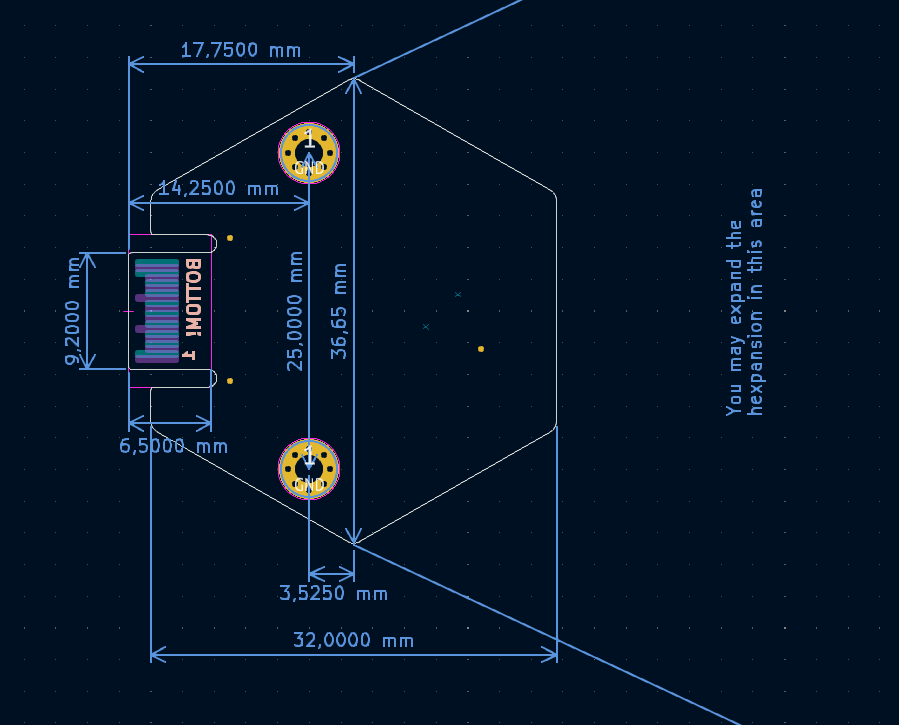
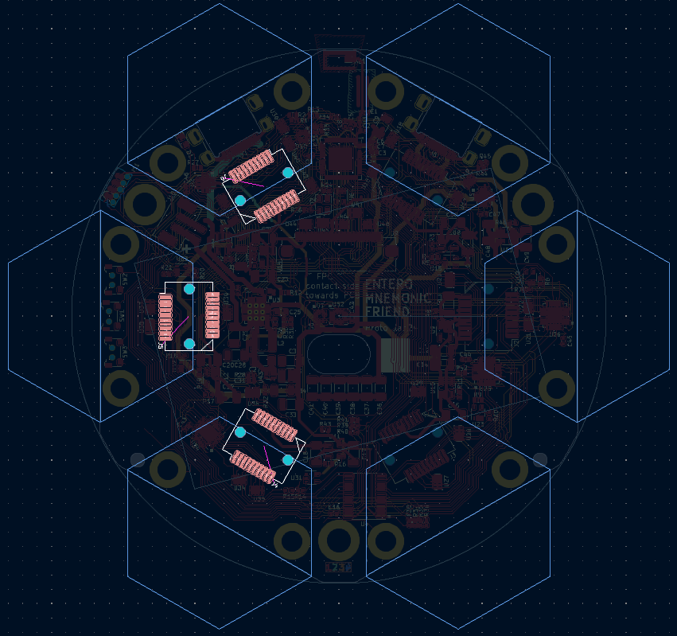
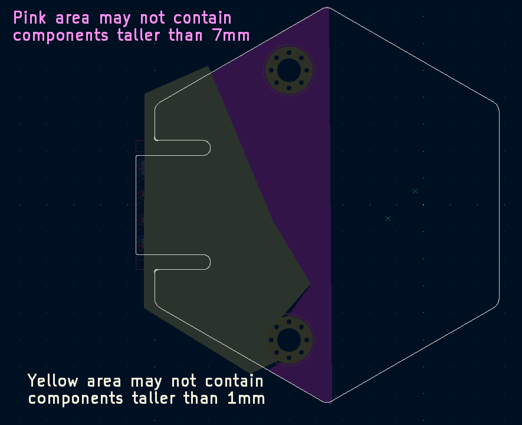

Hexpansion hardware developer guide
===

# tl;dr:
- Hexpansions **MUST BE 1mm thick!** (more on this below)
- Hexpansions can be a PCB, or can be made of any other **non-conductive material**
- Hexpansions that are a PCB must have **ENIG finish**.
- Hexpansions have to stay **within their hexagon segment**.
- There are **part height restrictions** on some parts of the board
- **Detect pin** needs to be **connected to GND** on the hexpansion if you want power to your board.
- If you use I2C, **you** must provide **I2C pullups**
- Hexpansions may **not** contain anything that uses the I2C address **0x77**
- Use the **KiCad template project** provided

## What is a hexpansion?

A Hexpansion is a thing that plugs into one of the hexpansion ports of a tildagon badge (and hopefully into other things in the future).

**A Hexpansion must be 1mm thick!!!** If it's any other thickness, it will not fit the port, and it will not work.

You can make a Hexpansion by cutting out a shape out of any sufficiently stiff non-conductive material. The simplest Hexpansion is a piece of 1mm cardstock cut into a particular shape.

## Shape and size

To fit into the slot, the Hexpansion has to have a tab sticking out that is **9.2mm** wide and **6.5mm** long. That tab is 17.75mm away from the board edge.

The standard hexpansion shape is a hexagon with 32mm between flats. This means the distance between points is approximately 36.65mm. This shape puts the edge of the badge exactly down the middle of the hexagon. You can make the part on the outside any shape you like, but you have to keep it within the continuation of the lines of the hexagon, so it won't interfere with other hexpansions. If you intend for something to plug into your hexpansion, make sure that the plug also does not cross into the adjacent segment.

The template project has guidelines to make this easier.

The "ears" around the connector tab are optional but help with mechanical stability.

If your hexpansion is a PCB, it may not have any depanelization tabs in the connector area.

## Mounting holes

Hexpansions will be held in place snugly by the connector they plug into. In most cases they will not need additional mechanical support. However, if your hexpansion extends far outside the board, will be subjected to heavy mechanical loads, or has an external connector that can be subject to heavy loads, we have an additional mechanical attachment option.

There are two M2-size standoffs below the board, 25mm apart. They are 3.525mm from the centerline of the standard hexagon, and 14.25mm from the front edge of the connection tab. You can use two M2 size screws to attach your hexpansion to these standoffs for increased mechanical strength. Unfortunately, it's not possible to do this without removing the top board of the main badge, so installing and removing hexpansions with these screws is a bit more effort.

## Electrical interface

If your hexpansion is electronic, it will connect to the tildagon with some pads on the plugin tab. These pads will only make good contact if the board is flat, so the board **must have ENIG surface finish**. Do not use HASL finish!

The connector has the same pinout at the SFP interface used in networking equipment (if you feel like making an extremely cursed transceiver, go ahead!). The pinout is as follows:

| Top side | Signal  | | Bot side | Signal |
| -------- | --------|-| -------- |--- |
| 1     | GND        |.| 11     | GND |
| 2     | Low speed 1|.| 12     | High speed 1 |
| 3     | Low speed 2|.| 13     | High speed 2 |
| 4     | I2C SDA    |.| 14     | GND |
| 5     | I2C SCL    |.| 15     | +3V3 |
| 6     | Detect     |.| 16     | +3V3 |
| 7     | Low speed 3|.| 17     | GND |
| 8     | Low speed 4|.| 18     | High speed 3 |
| 9     | Low speed 5|.| 19     | High speed 4 |
| 10    | GND        |.| 20     | GND |

The Detect pin lets the tildagon know that a hexpansion has been inserted or removed. It also controls power to the hexpansion. The pin has a weak pullup, and you should connect it to GND on your hexpansion. If you want the ability to disconnect power from your hexpansion, you can add a circuit to disconnect Detect from GND.

The +3V3 pins can provide up to 600mA of current at 3.3V. If your hexpansion needs more power than that, you will have to provide it externally. 3.3V power to your hexpansion will be disconnected if you exceed this current level.

Pins 4 and 5 provide an I2C interface. Each hexpansion port has a separate I2C interface. You can put any devices you like on that bus, and they can use any I2C address, **except 0x77**. We need that address to talk to our I2C mux, and if a hexpansion responds to it, we have to disconnect its I2C bus. There are no pullups on the I2C bus - you have to provide those yourself.

If you want code on the tildagon to be able to recognize your hexpansion, you can add an i2c EEPROM. We have currently tested two EEPROM ICs, but many more will work if they have the same address and interface as one of those. The ones we tested are:
- ZD24C64A-XGMT
- M24C16-RMN6TP

You can also put code on the EEPROM and give users the option to copy that code to their tildagon and run it.

Each hexpansion port has its own isolated I2C interface and its own separate I/O pins.

There are five low speed pins (LS1-LS5) that are connected to a GPIO expander IC which provides interrupt detection and also has a constant current driver for controlling LED brightness. Switching them is a bit slow, but definitely fast enough for indicators, buttons, buzzers, and similar. These pins do not have pullups or pulldowns - if you need these, you will have to provide them yourself.

There are four high-speed pins (HS1-HS4) that are directly attached to the microcontroller on the Tildagon. Please do not try to source or sink too much current from these pins. You can connect these to any of the peripherals on the ESP32-S3 that are not already in use. Three of the six ports on the tildagon have high-speed pins that are attached to the internal ADC (analogue to digital converter, for measuring analogue signals). They are the connector behind the row of three buttons, and the connectors either side of that (highlighted in the image below).

# Mechanical clearance

Because there is a battery between the top and bottom board of the tildagon, there are restrictions to how tall components on hexpansions can be. Here are the height restrictions and their relevant areas:

The two upper hexpansion slots are right above the two USB connectors. Because of the cable overmold there may not be anything sticking out below the board in those slots. Hexpansions that go into other slots have 1mm of clearance below the PCB surface up to the tildagon board edge, and unlimited clearance beyond the edge. If you have through-hole components on your hexpansion PCB, they cannot be used in the slots over the USB connectors as the solder tails below the board will interfere with the USB cable overmolding.
