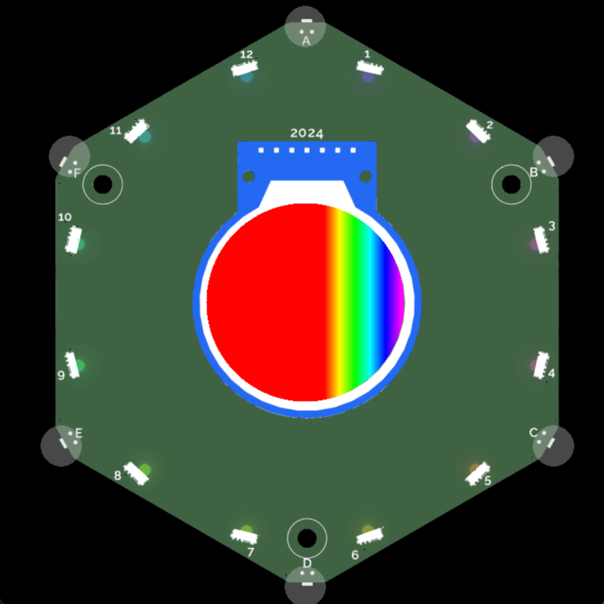
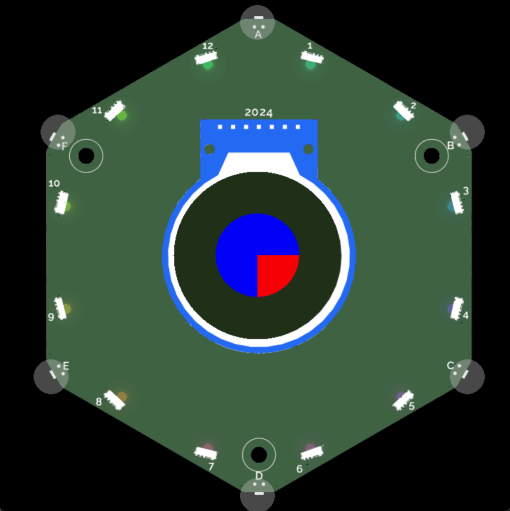

# `ctx` canvas overview

You can use the [`ctx`](https://github.com/emfcamp/badge-2024-software/blob/main/sim/fakes/ctx.py) package to draw lines, shapes, text, and images on a canvas.

This is the same library we use for the premade UI elements, so you can look at examples in the [`app_components` folder](https://github.com/emfcamp/badge-2024-software/tree/main/modules/app_components).

The docs are based on the [mdn web docs](https://developer.mozilla.org/en-US/docs/Web/API/CanvasRenderingContext2D/) which port the `ctx` library to JavaScript. It provides many more visual examples and we recommend you to look there for further instruction.

## Usage

To use the `ctx` object associated with your app use the [`draw()`](../development.md#methods) or the [`draw_overlays()`](../development.md#methods) methods.

Inside your method, you will generally first want to clear your background with the `clear_background()` method. That will remove the menu that is otherwise visible and provide you an empty background to start with.

```python
import app

from app_components import clear_background
from events.input import Buttons, BUTTON_TYPES


class ExampleApp(app.App):
    def __init__(self):
        self.button_states = Buttons(self)

    def update(self, delta):
        if self.button_states.get(BUTTON_TYPES["CANCEL"]):
            self.button_states.clear()

    def draw(self, ctx):
        clear_background(ctx)


__app_export__ = ExampleApp
```

{: style="width:400px;height: auto;margin:auto;display:block;" }

### Coordinates of the display area

With `ctx`, you need to provide a place for where to draw objects using coordinates in the form of `(x, y)`. The x-coordinate represents the horizontal coordinate and the y-coordinate the vertical. The middle is at `(0, 0)`.

{: style="width:400px;height: auto;margin:auto;display:block;" }

!!! note "Updating the coordinates"

      If you use the [`scale()` method](#scale-rotate-and-translate) you change the coordinates by a scaling factor and the above image will no longer reflect the positions where your objects will be drawn if you provide the associated coordinates.

The following is the code for the axes drawing:

```python
import app

from app_components import clear_background
from events.input import Buttons, BUTTON_TYPES
from app_components.tokens import line_height


class ExampleApp(app.App):
    def __init__(self):
        self.button_states = Buttons(self)

    def update(self, delta):
        if self.button_states.get(BUTTON_TYPES["CANCEL"]):
            self.button_states.clear()

    def draw(self, ctx):
        clear_background(ctx)
        ctx.rgb(0, 1, 0).begin_path()
        ctx.move_to(-120, 0)
        ctx.line_to(120, 0)
        ctx.move_to(0, 120)
        ctx.line_to(0, -120)

        for i in range(-5, 6):
            # draw indicator lines for x
            ctx.move_to(i*20, 5)
            ctx.line_to(i*20, -5)
            # draw indicator lines for y
            ctx.move_to(-5, i*20)
            ctx.line_to(5, i*20)

        # text for x and y
        ctx.stroke()

        for i in range(-5, 6):
            ctx.font_size = 12
            width = ctx.text_width(str(i*20))
            # x axes
            ctx.rgb(0, 1, 0).move_to(i*20 - width/2, 15).text(i*20)
            # y axes
            ctx.rgb(0, 1, 0).move_to(
                -15 - width, i*20 + 2*line_height).text(i*20)

        width = ctx.text_width("y")
        ctx.rgb(0, 1, 0).move_to(+15, -100+2*line_height).text("y")

        width = ctx.text_width("x")
        ctx.rgb(0, 1, 0).move_to(100 - width/2, -15).text("x")


__app_export__ = ExampleApp
```

### State of the canvas

Think of the `ctx` object as a canvas. The object stores the drawing state of the canvas on a stack. The drawing state consists of:

- The current transformation matrix.
- The current clipping region.
- The current dash list.
- The current values of the following attributes:

  - `x`: The current x coordinate. Think of it as where your cursor is on the canvas, ready to draw.
  - `y`: The current y coordinate.
  - `font`: The font to be used for text. Default: `""`. Options:

    - `"Arimo Regular"`
    - `"Arimo Bold"`
    - `"Arimo Italic"`
    - `"Arimo Bold Italic"`
    - `"Camp Font 1"`
    - `"Camp Font 2"`
    - `"Camp Font 3"`
    - `"Material Icons"`
    - `"Comic Mono"`

  - `font_size`: The font size to be used for text. Default: `10.0`.
  - `global_alpha`: The alpha (transparency) value that is applied to shapes and images before they are drawn onto the canvas. Default: `1.0`.
  - `text_align`: The alignment to be used for text. Default: `"start"`. Options:

    - `"right"`: The text is right-aligned.
    - `"left"`: The text is left-aligned.
    - `"justify"`: The text is justified.
    - `"center`: The text is centered.
    - `"start"`: The text is aligned at the normal start of the line (left-aligned for left-to-right locales, right-aligned for right-to-left locales).
    - `"end"`: The text is aligned at the normal end of the line (right-aligned for left-to-right locales, left-aligned for right-to-left locales).

  - `text_baseline`: The baseline to be used for text. Default `"alphabetic"`. Options:
    - `"alphabetic"`: The text baseline is the normal alphabetic baseline.
    - `"hanging"`: The text baseline is the hanging baseline. (Used by Tibetan and other Indic scripts.)
    - `"top"`: The text baseline is the top of the em square.
    - `"middle"`: The text baseline is the middle of the em square.
    - `"bottom"`: The text baseline is the bottom of the bounding box. This differs from the ideographic baseline in that the ideographic baseline doesn't consider descenders.
    - `"ideographic"`: The text baseline is the ideographic baseline; this is the bottom of the body of the characters, if the main body of characters protrudes beneath the alphabetic baseline. (Used by Chinese, Japanese, and Korean scripts.)
  - `line_width` The line width to be used for drawing lines. Default: `1.0`.
  - `image_smoothing`: Determines whether scaled images are smoothed. Default `True`.
  - `compositing_mode`: The current compositing mode.
  - `global_alpha`: The alpha (transparency) value that is applied to shapes and images before they are drawn onto the canvas.

You can `save()` the state of the canvas before drawing something on the canvas and `restore()` the state once you have finished drawing a special item. If for example you want to draw red squares, and then draw one green square, but don't want to have to re-specify the entire state, you can do this:

```python
import app

from app_components import clear_background
from events.input import Buttons, BUTTON_TYPES


class ExampleApp(app.App):
    def __init__(self):
        self.button_states = Buttons(self)

    def update(self, delta):
        if self.button_states.get(BUTTON_TYPES["CANCEL"]):
            self.button_states.clear()

    def draw(self, ctx):
        clear_background(ctx)
        ctx.rgb(200, 0, 0)
        ctx.rectangle(0, -40, 5, 5).fill()
        ctx.rectangle(0, -30, 5, 5).fill()
        ctx.rectangle(0, -20, 5, 5).fill()
        ctx.save()
        ctx.rgb(0, 200, 0).rectangle(0, -10, 5, 5).fill()
        # Restore to the state saved by the most recent call to save()
        ctx.restore()
        ctx.rectangle(0, 0, 5, 5).fill()
        ctx.rectangle(0, 10, 5, 5).fill()
        ctx.rectangle(0, 20, 5, 5).fill()
        ctx.rectangle(0, 30, 5, 5).fill()
        ctx.rectangle(0, 40, 5, 5).fill()


__app_export__ = ExampleApp
```

{: style="width:400px;height: auto;margin:auto;display:block;" }

### Color and opacity

This example places two circles next to each other with some overlap. One is colored red and the other blue. The blue circle is on top of the red circle and where they overlap, only the blue of the blue circle is visible.

```python
import app
import math

from app_components import clear_background
from events.input import Buttons, BUTTON_TYPES


class ExampleApp(app.App):
    def __init__(self):
        self.button_states = Buttons(self)

    def update(self, delta):
        if self.button_states.get(BUTTON_TYPES["CANCEL"]):
            self.button_states.clear()

    def draw(self, ctx):
        clear_background(ctx)
        ctx.save()

        # red left circle
        ctx.rgb(255, 0, 0).arc(-30, 0, 40, 0, 2 * math.pi, True).fill()

        # blue right circle
        ctx.rgb(0, 0, 255).arc(30, 0, 40, 0, 2 * math.pi, True).fill()

        ctx.restore()


__app_export__ = ExampleApp
```

You can add opacity to colors by using the `rgba()` method which makes the color translucent. You can specify the opacity on a scale from `0` (entirely see-through) to `1.0` (not see-through at all).

{: style="width:400px;height: auto;margin:auto;display:block;" }

```python
import app
import math

from app_components import clear_background
from events.input import Buttons, BUTTON_TYPES


class ExampleApp(app.App):
    def __init__(self):
        self.button_states = Buttons(self)

    def update(self, delta):
        if self.button_states.get(BUTTON_TYPES["CANCEL"]):
            self.button_states.clear()

    def draw(self, ctx):
        clear_background(ctx)
        ctx.save()

        # red left circle
        ctx.rgba(255, 0, 0, 1).arc(-30, 0, 40, 0, 2 * math.pi, True).fill()

        # blue right circle, 50% opacity
        ctx.rgba(0, 0, 100, 0.5).arc(30, 0, 40, 0, 2 * math.pi, True).fill()

        ctx.restore()


__app_export__ = ExampleApp
```

{: style="width:400px;height: auto;margin:auto;display:block;" }

### Gradients: radial and linear

This example shows an example of a radial gradient on a rectangle.

```python
import app

from app_components import clear_background
from events.input import Buttons, BUTTON_TYPES


class ExampleApp(app.App):
    def __init__(self):
        self.button_states = Buttons(self)

    def update(self, delta):
        if self.button_states.get(BUTTON_TYPES["CANCEL"]):
            self.button_states.clear()

    def draw(self, ctx):
        clear_background(ctx)
        ctx.save()

        ctx.radial_gradient(30, 30, 80, -30, -50, 70)
        ctx.add_stop(0, (100, 0, 100), 0.5)
        ctx.add_stop(1, (100, 0, 0), 0.8)
        ctx.rectangle(-100, -100, 200, 200).fill()

        ctx.restore()


__app_export__ = ExampleApp
```

{: style="width:400px;height: auto;margin:auto;display:block;" }

This example shows an example of a linear gradient on a rectangle.

```python
import app

from events.input import Buttons, BUTTON_TYPES


class ExampleApp(app.App):
    def __init__(self):
        self.button_states = Buttons(self)

    def update(self, delta):
        if self.button_states.get(BUTTON_TYPES["CANCEL"]):
            self.minimise()

    def draw(self, ctx):
        ctx.save()
        ctx.linear_gradient(0.18*120, 0.5*120, 0.95*120, 0.5*120)
        ctx.add_stop(0.0, (255, 0, 0), 1.0)
        ctx.add_stop(0.2, (255, 255, 0), 1.0)
        ctx.add_stop(0.4, (0, 255, 0), 1.0)
        ctx.add_stop(0.6, (0, 255, 255), 1.0)
        ctx.add_stop(0.8, (0, 0, 255), 1.0)
        ctx.add_stop(1.0, (255, 0, 255), 1.0)

        ctx.rectangle(-120, -120, 240, 240)
        ctx.fill()

        ctx.restore()


__app_export__ = ExampleApp
```

{: style="width:400px;height: auto;margin:auto;display:block;" }

### Gray

This example places three circles next to each other with some overlap. One is black, the next gray, and the last one white.

```python
import app
import math

from app_components import clear_background
from events.input import Buttons, BUTTON_TYPES


class ExampleApp(app.App):
    def __init__(self):
        self.button_states = Buttons(self)

    def update(self, delta):
        if self.button_states.get(BUTTON_TYPES["CANCEL"]):
            self.button_states.clear()

    def draw(self, ctx):
        clear_background(ctx)
        ctx.save()
        ctx.gray(0.0).arc(-30, 0, 40, 0, 2 * math.pi, True).fill()
        ctx.gray(0.5).arc(0, 0, 40, 0, 2 * math.pi, True).fill()
        ctx.gray(1.0).arc(30, 0, 40, 0, 2 * math.pi, True).fill()
        ctx.restore()


__app_export__ = ExampleApp
```

{: style="width:400px;height: auto;margin:auto;display:block;" }

### Creating text

This example adds a big, light red, filled rectangle to the canvas that is so big you won't see the edges of it. It forms the background. On top of the background, the example adds red text `Hello world` with the font `Camp Font 2` to the canvas on top of a big rectangle that.

```python
import app

from events.input import Buttons, BUTTON_TYPES


class ExampleApp(app.App):
    def __init__(self):
        self.button_states = Buttons(self)

    def update(self, delta):
        if self.button_states.get(BUTTON_TYPES["CANCEL"]):
            self.button_states.clear()

    def draw(self, ctx):
        ctx.save()
        ctx.font = ctx.get_font_name(5)
        ctx.rgb(100, 0, 0).rectangle(-120, -120, 240, 240).fill()
        ctx.rgb(255, 0, 0).move_to(-80, 0).text("Hello world")
        ctx.restore()


__app_export__ = ExampleApp
```

{: style="width:400px;height: auto;margin:auto;display:block;" }

You might want to change the font or create logic to test if a certain text will fit the provided space. Here is an example that sets the font for a text and checks if text will fit into the drawn rectangle and splits the text across two lines otherwise:

```python
import app

from app_components import clear_background
from events.input import Buttons, BUTTON_TYPES


class ExampleApp(app.App):
    def __init__(self):
        self.button_states = Buttons(self)

    def update(self, delta):
        if self.button_states.get(BUTTON_TYPES["CANCEL"]):
            self.button_states.clear()

    def reduce_text_until_fits(self, ctx, text, width_limit):
        extra_text = ""
        text_that_fits = text
        text_width = ctx.text_width(text_that_fits)
        while text_width > width_limit:
            character = text_that_fits[-1]
            text_that_fits = text_that_fits[:-1]
            extra_text = character + extra_text
            text_width = ctx.text_width(text_that_fits)
        return text_that_fits, extra_text

    def draw(self, ctx):
        clear_background(ctx)
        ctx.save()
        ctx.font = ctx.get_font_name(5)
        ctx.rgb(100, 0, 0).rectangle(-60, -30, 120, 60).fill()
        text = "Hello there world!"
        # we know the rectangle is 120 wide, with a margin of 5 on each side
        # that leaves 110 for text
        if ctx.text_width(text) >= 110:
            line_1, line_2 = self.reduce_text_until_fits(ctx, text, 110)
            ctx.rgb(255, 0, 0).move_to(-55, -10).text(line_1)
            ctx.rgb(255, 0, 0).move_to(-55, 10).text(line_2)
        else:
            ctx.rgb(255, 0, 0).move_to(-55, 0).text(text)
        ctx.restore()


__app_export__ = ExampleApp
```

{: style="width:400px;height: auto;margin:auto;display:block;" }

### Adding images

This example adds an image to the canvas. It also contains logic for getting the correct file path for the image depending on whether the app is deployed with the app store or being locally developed.

!!! note "Keep image size to approximately 30KB or smaller"

    Images above a certain file size may cause the app to crash. The display size is approximately 240px x 240px.

```python
import app
import sys, os

from app_components import clear_background
from events.input import Buttons, BUTTON_TYPES

if sys.implementation.name == "micropython":
    apps = os.listdir("/apps")
    path = ""
    for a in apps:
        # This is important for apps deployed to the appstore
        # The Snake app from naomi stored at
        # https://github.com/npentrel/tildagon-snake/
        # has all its files in the folder
        # npentrel_tildagon_snake
        if a == "github_user_github_repo_name":
            path = "/apps/" + a
    ASSET_PATH = path + "/assets/"
else:
    # while testing, put your files in the folder you are developing in,
    # for example: example/streak.jpg
    ASSET_PATH = "apps/example/"

class ExampleApp(app.App):
    def __init__(self):
        self.button_states = Buttons(self)

    def update(self, delta):
        if self.button_states.get(BUTTON_TYPES["CANCEL"]):
            self.button_states.clear()

    def draw(self, ctx):
        clear_background(ctx)
        ctx.save()
        ctx.image(ASSET_PATH + "streak.jpg", -100, -100, 200, 200)
        ctx.restore()


__app_export__ = ExampleApp
```

{: style="width:400px;height: auto;margin:auto;display:block;" }

### Shapes: Arcs and Rectangles

This example draws a big yellow filled circle. It then draws a filled green rectangle on top with opacity 50%. Finally, it draws the outline of a blue circle on top.

```python
import app
import math

from app_components import clear_background
from events.input import Buttons, BUTTON_TYPES


class ExampleApp(app.App):
    def __init__(self):
        self.button_states = Buttons(self)

    def update(self, delta):
        if self.button_states.get(BUTTON_TYPES["CANCEL"]):
            self.button_states.clear()

    def draw(self, ctx):
        clear_background(ctx)
        ctx.save()
        # Yellow circle in the middle
        ctx.rgb(255, 234, 0).arc(0, 0, 60, 0, 2 * math.pi, True).fill()
        # Green rectangle with 50% opacity
        ctx.rgba(0, 200, 0, 0.5).rectangle(-25, -25, 50, 50).fill()
        # Blue circle outline
        ctx.rgb(0, 0, 200).arc(0, 0, 10, 0, 2 * math.pi, True).stroke()
        ctx.restore()


__app_export__ = ExampleApp
```

{: style="width:400px;height: auto;margin:auto;display:block;" }

### Clipping

This example draws a blue circle and clips a square out of it and colors it red, resulting in a quarter of the circle being red.

```python
import app
import math

from app_components import clear_background
from events.input import Buttons, BUTTON_TYPES


class ExampleApp(app.App):
    def __init__(self):
        self.button_states = Buttons(self)

    def update(self, delta):
        if self.button_states.get(BUTTON_TYPES["CANCEL"]):
            self.button_states.clear()

    def draw(self, ctx):
        clear_background(ctx)
        ctx.save()
        # Blue circle
        ctx.arc(0, 0, 60, 0, 2 * math.pi, True)
        ctx.rgb(0, 0, 255).fill()

        # Define a clipping area for the circle
        ctx.arc(0, 0, 60, 0, 2 * math.pi, True)
        ctx.clip()
        # Add the shape into the clipping area
        ctx.rectangle(0, 0, 80, 80)
        ctx.rgb(255, 0, 0).fill()
        ctx.restore()


__app_export__ = ExampleApp
```

{: style="width:400px;height: auto;margin:auto;display:block;" }

### Scale, rotate, and translate

This example applies a scaling transformation to the canvas units vertically which makes the green rectangle 3 times as big!

```python
import app

from app_components import clear_background
from events.input import Buttons, BUTTON_TYPES


class ExampleApp(app.App):
    def __init__(self):
        self.button_states = Buttons(self)

    def update(self, delta):
        if self.button_states.get(BUTTON_TYPES["CANCEL"]):
            self.button_states.clear()

    def draw(self, ctx):
        clear_background(ctx)
        ctx.save()
        ctx.rgb(100, 0, 0).rectangle(-40, 0, 40, 20).fill()
        ctx.scale(1, 3)
        ctx.rgb(0, 100, 0).rectangle(0, 0, 40, 20).fill()
        ctx.restore()


__app_export__ = ExampleApp
```

{: style="width:400px;height: auto;margin:auto;display:block;" }

This example adds a rotation to the transformation matrix to move the previous image upside down.

```python
import app
import math

from app_components import clear_background
from events.input import Buttons, BUTTON_TYPES


class ExampleApp(app.App):
    def __init__(self):
        self.button_states = Buttons(self)

    def update(self, delta):
        if self.button_states.get(BUTTON_TYPES["CANCEL"]):
            self.button_states.clear()

    def draw(self, ctx):
        clear_background(ctx)
        ctx.save()
        ctx.rotate(math.pi)
        ctx.rgb(100, 0, 0).rectangle(-40, 0, 40, 20).fill()
        ctx.scale(1, 3)
        ctx.rgb(0, 100, 0).rectangle(0, 0, 40, 20).fill()
        ctx.restore()


__app_export__ = ExampleApp
```

{: style="width:400px;height: auto;margin:auto;display:block;" }

This example adds a translation transformation to the current matrix by moving the canvas and its origin `x` units horizontally and `y` units vertically on the grid.

```python
import app
import math

from app_components import clear_background
from events.input import Buttons, BUTTON_TYPES


class ExampleApp(app.App):
    def __init__(self):
        self.button_states = Buttons(self)

    def update(self, delta):
        if self.button_states.get(BUTTON_TYPES["CANCEL"]):
            self.button_states.clear()

    def draw(self, ctx):
        clear_background(ctx)
        ctx.save()
        ctx.translate(-50, 0)
        ctx.rotate(math.pi)
        ctx.rgb(100, 0, 0).rectangle(-40, 0, 40, 20).fill()
        ctx.scale(1, 3)
        ctx.rgb(0, 100, 0).rectangle(0, 0, 40, 20).fill()
        ctx.restore()


__app_export__ = ExampleApp
```

{: style="width:400px;height: auto;margin:auto;display:block;" }

### Creating multiple sub-paths

This example draws two lines in red. The first line begins at `(0, 0)` which is in the center and ends at `(50, 50)` which is towards the bottom right. The second line begins at `(50, 90)` and ends at `(280, 120)`.

```python
import app

from app_components import clear_background
from events.input import Buttons, BUTTON_TYPES


class ExampleApp(app.App):
    def __init__(self):
        self.button_states = Buttons(self)

    def update(self, delta):
        if self.button_states.get(BUTTON_TYPES["CANCEL"]):
            self.button_states.clear()

    def draw(self, ctx):
        clear_background(ctx)
        ctx.save()
        ctx.rgb(1, 0, 0).begin_path()
        ctx.move_to(0, 0)
        ctx.line_to(50, 50)
        ctx.move_to(-30, 50)
        ctx.line_to(50, 80)
        ctx.stroke()
        ctx.restore()


__app_export__ = ExampleApp
```

The provided example results in the following drawing:

{: style="width:400px;height: auto;margin:auto;display:block;" }

The following example changes the lines to be of different colors:

```python
import app

from app_components import clear_background
from events.input import Buttons, BUTTON_TYPES


class ExampleApp(app.App):
    def __init__(self):
        self.button_states = Buttons(self)

    def update(self, delta):
        if self.button_states.get(BUTTON_TYPES["CANCEL"]):
            self.button_states.clear()

    def draw(self, ctx):
        clear_background(ctx)
        ctx.save()
        ctx.rgb(1, 0, 0).begin_path()
        ctx.move_to(0, 0)
        ctx.line_to(50, 50)
        ctx.stroke()
        ctx.rgb(0, 1, 0)
        ctx.move_to(-30, 50)
        ctx.line_to(50, 80)
        ctx.stroke()
        ctx.restore()


__app_export__ = ExampleApp
```

{: style="width:400px;height: auto;margin:auto;display:block;" }

### Closing a path on a triangle

This example draws a triangle.

```python
import app

from app_components import clear_background
from events.input import Buttons, BUTTON_TYPES


class ExampleApp(app.App):
    def __init__(self):
        self.button_states = Buttons(self)

    def update(self, delta):
        if self.button_states.get(BUTTON_TYPES["CANCEL"]):
            self.button_states.clear()

    def draw(self, ctx):
        clear_background(ctx)
        ctx.save()
        ctx.rgb(1, 0, 0).begin_path()
        ctx.move_to(-30, -30)
        ctx.line_to(-30, 30)
        ctx.line_to(30, 0)
        ctx.close_path()
        ctx.stroke()
        ctx.restore()


__app_export__ = ExampleApp
```

{: style="width:400px;height: auto;margin:auto;display:block;" }

### Drawing a Bézier curve

This example draws a red Bézier curve based on start and end points and the control points. The start and end points are additionally drawn in blue and green for the visualization.

```python
import app
import math

from app_components import clear_background
from events.input import Buttons, BUTTON_TYPES


class ExampleApp(app.App):
    def __init__(self):
        self.button_states = Buttons(self)

    def update(self, delta):
        if self.button_states.get(BUTTON_TYPES["CANCEL"]):
            self.button_states.clear()

    def draw(self, ctx):
        clear_background(ctx)
        ctx.save()
        ctx.rgb(1, 0, 0).begin_path()
        # start point: (-80, -80)
        # first control point (a, b): (-70, -0)
        # second control point (c, d): (60, 20)
        # end point (e, f): (60, 80)

        # Add cubic bézier curve
        ctx.move_to(-80, -80)
        ctx.curve_to(-70, 0, 60, 20, 60, 80)
        ctx.stroke()

        # Show start and end points in blue
        ctx.rgb(0, 0, 1).begin_path()
        ctx.arc(-80, -80, 5, 0, 2 * math.pi, True)  # start point
        ctx.arc(60, 80, 5, 0, 2 * math.pi, True)  # end point
        ctx.fill()

        # Show control points in green
        ctx.rgb(0, 1, 0).begin_path()
        ctx.arc(-70, 0, 5, 0, 2 * math.pi, True)  # first control point
        ctx.arc(60, 20, 5, 0, 2 * math.pi, True)  # second control point
        ctx.fill()

        ctx.restore()


__app_export__ = ExampleApp
```

{: style="width:400px;height: auto;margin:auto;display:block;" }

## Methods

You can use the following methods on a `ctx` canvas object:

<!-- prettier-ignore -->
| Method | Description | Arguments | Returns |
| ------ | ----------- | --------- | ------- |
| `move_to(x, y)` | Begin a new sub-path at the point specified by the given `(x, y)` coordinates. | <ul><li>`x`: The x-axis (horizontal) coordinate of the point.</li><li>`y`: The y-axis (vertical) coordinate of the point.</li></ul> | `self`: The `ctx` object. |
| `curve_to(a, b, c, d, e, f)` | Add a cubic [Bézier curve](https://developer.mozilla.org/en-US/docs/Glossary/Bezier_curve) to the current sub-path. It requires three points: the first two are control points and the third one is the end point. The starting point is the latest point in the current path, which can be changed using `moveTo()` before creating the Bézier curve. | <ul><li>`a`: The x-axis coordinate of the first control point.</li><li>`b`: The y-axis coordinate of the first control point.</li><li>`c`: The x-axis coordinate of the second control point.</li><li>`d`: The y-axis coordinate of the second control point.</li><li>`e`: The x-axis coordinate of the end point.</li><li>`f`: The y-axis coordinate of the end point.</li></ul> | `self`: The `ctx` object. |
| `quad_to(a, b, c, d)` | Add a quadratic [Bézier curve](https://developer.mozilla.org/en-US/docs/Glossary/Bezier_curve) to the current sub-path. It requires two points: the first one is a control point and the second one is the end point. The starting point is the latest point in the current path, which can be changed using `moveTo()` before creating the quadratic Bézier curve. | <ul><li>`a`: The x-axis coordinate of the control point.</li><li>`b`: The y-axis coordinate of the control point.</li><li>`c`: The x-axis coordinate of the end point.</li><li>`d`: The y-axis coordinate of the end point.</li></ul> | `self`: The `ctx` object. |
| `rel_move_to(x, y)` | Begin a new sub-path at the point specified reached by adding `(x, y)` to the current coordinates. | <ul><li>`x`: The new sub-path will begin at the coordinates reached by moving `x` units horizontally and `y` units vertically on the grid.</li><li>`y`: The new sub-path will begin at the coordinates reached by moving `x` units horizontally and `y` units vertically on the grid.</li></ul> | `self`: The `ctx` object. |
| `rel_curve_to(a, b, c, d, e, f)` | Add a cubic Bézier curve to the current sub-path relative to the current position instead of relative to `(0, 0, 0)`. It requires three points: the first two are control points and the third one is the end point. The starting point is the latest point in the current path, which can be changed using `moveTo()` before creating the Bézier curve. | <ul><li>`a`: The x-axis coordinate of the first control point specified relative to the current point. That means, you must specify the units to move on the x axis from the current point.</li><li>`b`: The y-axis coordinate of the first control point specified relative to the current point. That means, you must specify the units to move on the y axis from the current point.</li><li>`c`: The x-axis coordinate of the second control point specified relative to the current point.</li><li>`d`: The y-axis coordinate of the second control point specified relative to the current point.</li><li>`e`: The x-axis coordinate of the end point specified relative to the current point.</li><li>`f`: The y-axis coordinate of the end point specified relative to the current point.</li></ul> | `self`: The `ctx` object. |
| `rel_quad_to(a, b, c, d)` | Add a quadratic Bézier curve to the current sub-path relative to the current position. It requires two points: the first one is a control point and the second one is the end point. The starting point is the latest point in the current path, which can be changed using `moveTo()` before creating the quadratic Bézier curve. | <ul><li>`a`: The x-axis coordinate of the control point specified relative to the current point. That means, you must specify the units to move on the x axis from the current point.</li><li>`b`: The y-axis coordinate of the control point specified relative to the current point. That means, you must specify the units to move on the y axis from the current point.</li><li>`c`: The x-axis coordinate of the end point.</li><li>`d`: The y-axis coordinate of the end point.</li></ul> | `self`: The `ctx` object. |
| `close_path()` | Attempt to add a straight line from the current point to the start of the current sub-path. If the shape has already been closed or has only one point, this function does nothing. This method doesn't draw anything to the canvas directly. You can render the path using the stroke() or fill() methods. | None. | `self`: The `ctx` object. |
| `translate(x, y)` | Add a translation transformation to the current matrix by moving the canvas and its origin `x` units horizontally and `y` units vertically on the grid. | <ul><li>`x`: Distance to move in the horizontal direction. Positive values are to the right, and negative to the left.</li><li>`y`: Distance to move in the vertical direction. Positive values are down, and negative are up.</li></ul> | `self`: The `ctx` object. |
| `scale(x, y)` | Add a scaling transformation to the canvas units horizontally and/or vertically. By default, one unit on the canvas is exactly one pixel. A scaling transformation modifies this behavior. For instance, a scaling factor of 0.5 results in a unit size of 0.5 pixels; shapes are thus drawn at half the normal size. Similarly, a scaling factor of 2.0 increases the unit size so that one unit becomes two pixels; shapes are thus drawn at twice the normal size. | <ul><li>`x`: Scaling factor in the horizontal direction. A negative value flips pixels across the vertical axis. A value of `1` results in no horizontal scaling.</li><li>`y`: Scaling factor in the vertical direction. A negative value flips pixels across the horizontal axis. A value of `1` results in no vertical scaling.</li></ul> | `self`: The `ctx` object. |
| `line_to(x, y)` | Add a straight line to the current sub-path by connecting the sub-path's last point to the specified `(x, y)` coordinates. Like other methods that modify the current path, this method does not directly render anything. To draw the path onto a canvas, you can use the `fill()` or `stroke()` methods. | <ul><li>`x`: The x-axis coordinate of the line's end point.</li><li>`y`: The y-axis coordinate of the line's end point.</li></ul> | `self`: The `ctx` object. |
| `rel_line_to(x, y)` | Add a straight line to the current sub-path by connecting the sub-path's last point to a point moved `x` units horizontally and `y` units vertically on the grid. Like other methods that modify the current path, this method does not directly render anything. To draw the path onto a canvas, you can use the `fill()` or `stroke()` methods. | <ul><li>`x`: The path will be drawn towards a point moved horizontally by `x` units and vertically by `y` units.</li><li>`y`: The path will be drawn towards a point moved horizontally by `x` units and vertically by `y` units.</li></ul> | `self`: The `ctx` object. |
| `rotate(v)` | Add a rotation to the transformation matrix. The rotation center point is always the canvas origin. To change the center point, you will need to move the canvas by using the `translate()` method. | `v`: The rotation angle, clockwise in radians. You can use degree \* pi / 180 to calculate a radian from a degree. | `self`: The `ctx` object. |
| `gray(v)` | Sets the color of the canvas to a color between `0.0` (black) and `1.0`. | `v`: Intensity of the gray color. `0.0` results in black and `1.0` in white. | `self`: The `ctx` object. |
| `rgba(r, g, b, a)` | Color the canvas in the color `(r, g, b)` with an alpha channel. | <ul><li>`r`: The intensity of the color with a value between `0` and `255` or between `0.0` and `1.0`.</li><li>`g`: The intensity of the color with a value between `0` and `255` or between `0.0` and `1.0`.</li><li>`b`: The intensity of the color with a value between `0` and `255` or between `0.0` and `1.0`.</li><li>`a`: The alpha channel which specifies the opacity for a color between `0.0` (fully transparent) and `1.0` (not transparent at all).</li></ul> | `self`: The `ctx` object. |
| `rgb(r, g, b)` | Color the canvas in the color `(r, g, b)`. | <ul><li>`r`: The intensity of the color with a value between `0` and `255` or between `0.0` and `1.0`.</li><li>`g`: The intensity of the color with a value between `0` and `255` or between `0.0` and `1.0`.</li><li>`b`: The intensity of the color with a value between `0` and `255` or between `0.0` and `1.0`.</li></ul> | `self`: The `ctx` object. |
| `text(s)` | Draw the provided text on the canvas. | `s`: The text to draw provided as a string. | `self`: The `ctx` object. |
| `round_rectangle(x, y, width, height, radius)` | Add a rounded rectangle on the canvas at position `(x, y)` with the provided width, height, and corner radius. | <ul><li>`x`: The horizontal position to draw the rectangle at.</li><li>`y`: The vertical position to draw the rectangle at.</li><li>`width`: The width of the rectangle to draw.</li><li>`height`: The height of the rectangle to draw.</li><li>`radius`: The radius of the rectangle's corners.</li></ul> | `self`: The `ctx` object. |
| `image(path, x, y, w, h)` | Draw an image to be read from the provided path onto the canvas. | <ul><li>`path`: The path to an image file.</li><li>`x`: The x-axis coordinate of the top left corner of the image to draw.</li><li>`y`: The y-axis coordinate of the top left corner of the image to draw.</li><li>`w`: The width of the image to draw.</li><li>`h`: The height of the image to draw.</li></ul> | `self`: The `ctx` object. |
| `rectangle(x, y, width, height)` | Add a rectangle to the current path. Like other methods that modify the current path, this method does not directly render anything. To draw the rectangle onto a canvas, you can use the `fill()` or `stroke()` methods. The `rect()` method creates a rectangular path whose starting point is at `(x, y)` and whose size is specified by width and height. | <ul><li>`x`: The x-axis coordinate (horizontal) of the rectangle's starting point. </li><li>`y`: The y-axis coordinate (vertical) of the rectangle's starting point.</li><li>`width`: The rectangle's width. Positive values are to the right, and negative to the left.</li><li>`height`: The rectangle's height. Positive values are down, and negative are up.</li></ul> | `self`: The `ctx` object. |
| `stroke()` | Stroke (outline) the current or given path with the current stroke style. | None. | `self`: The `ctx` object. |
| `save()` | Save the entire state of the canvas by pushing the current state onto a stack. | None. | `self`: The `ctx` object. |
| `restore()` | Restore the most recently saved canvas state by popping the top entry in the drawing state stack. If there is no saved state, this method does nothing. | None. | `self`: The `ctx` object. |
| `fill()` | Fill the current or given path. | None. | `self`: The `ctx` object. |
| `radial_gradient(x0, y0, r0, x1, y1, r1)` | Create a radial gradient using the size and coordinates of two circles. | <ul><li>`x0`: The x-axis coordinate of the start circle.</li><li>`y0`: The y-axis coordinate of the start circle.</li><li>`r0`: The radius of the start circle. Must be non-negative and finite.</li><li>`x1`: The x-axis coordinate of the end circle.</li><li>`y1`: The y-axis coordinate of the end circle.</li><li>`r1`: The radius of the end circle. Must be non-negative and finite.</li></ul> | `self`: The `ctx` object. |
| `linear_gradient(x0, y0, x1, y1)` | Create a gradient along the line connecting two given coordinates. | <ul><li>`x0`: The x-axis coordinate of the start point.</li><li>`y0`: The y-axis coordinate of the start point.</li><li>`x1`: The x-axis coordinate of the end point.</li><li>`y1`: The y-axis coordinate of the end point.</li></ul> | `self`: The `ctx` object. |
| `add_stop(pos, color, alpha)` | Adds a color stop in a gradient with the provided position, color, and alpha values. | <ul>`pos`: The position of the stop determining the order of the stops. <li></li><li>`color`: The colour at the stop. </li><li>`alpha`: The opacity value of the colour at the stop.</li></ul> | `self`: The `ctx` object. |
| `begin_path()` | Start a new path by emptying the list of sub-paths. Call this method when you want to create a new path. | None. | `self`: The `ctx` object. |
| `arc(x, y, radius, arc_from, arc_to, direction)` | Add a circular arc to the current sub-path. | <ul><li>`x`: The horizontal coordinate of the arc's center.</li><li>`y`: The vertical coordinate of the arc's center.</li><li>`radius`: The arc's radius. Must be positive.</li><li>`arg_from`: The angle at which the arc starts in radians, measured from the positive x-axis.</li><li>`arg_to`: The angle at which the arc ends in radians, measured from the positive x-axis.</li><li>`direction`: A boolean value. If true, draws the arc counter-clockwise between the start and end angles. </li></ul> | `self`: The `ctx` object. |
| `text_width(text)` | Calculate the width of the provided text. | `text`: The text to calculate the width of. | `width`: The width of the provided text. |
| `clip()` | Turn the current or given path into the current clipping region. The previous clipping region, if any, is intersected with the current or given path to create the new clipping region. For a visual example, see the [mdn web docs](https://developer.mozilla.org/en-US/docs/Web/API/CanvasRenderingContext2D/clip). | None. | `self`: The `ctx` object. |
| `get_font_name(i)` | Get the name of one of the 9 fonts: `"Arimo Regular"`, `"Arimo Bold"`, `"Arimo Italic"`, `"Arimo Bold Italic"`, `"Camp Font 1"`, `"Camp Font 2"`, `"Camp Font 3"`, `"Material Icons"`, and `"Comic Mono"`. | `i`: The number of the font to get the name of. A number between `0` and `8`. | `font_name`: The font. |
