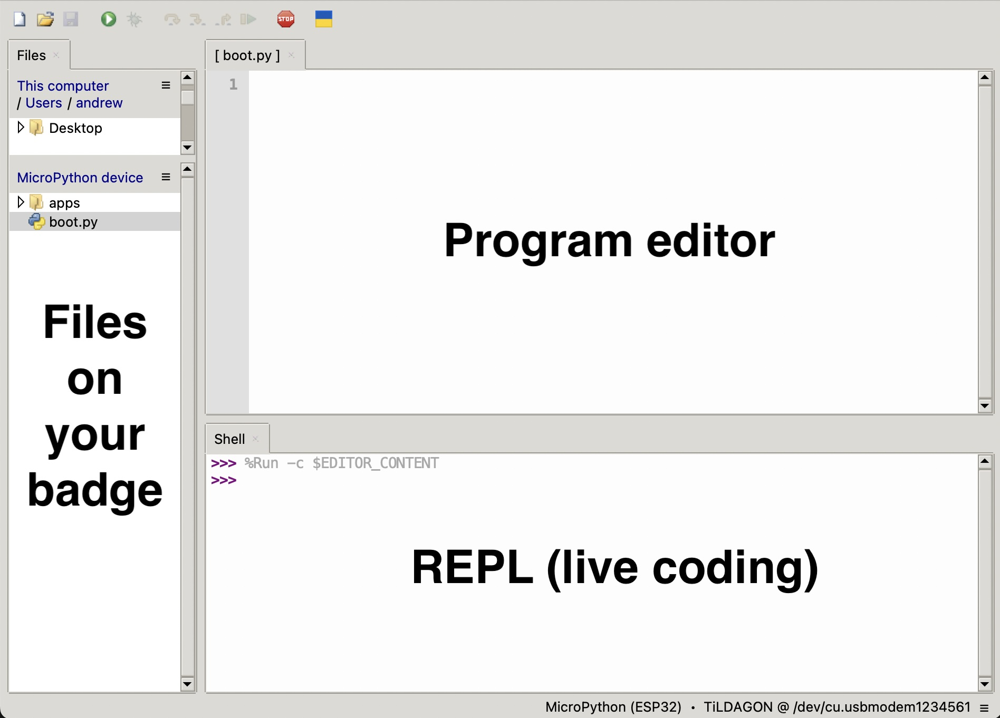

## Goals for the workshop

1. Flash some multicoloured (RGB) LEDs.
2. Detect presses of the buttons.
3. Use the direction sensor (accelerometer which is part of the IMU).

## Building your badge

If you haven't already built your badge, you need to [follow the instructions here](../using-the-badge/end-user-manual.md).

## What software do I need?

For this workshop, you will need to download [Thonny](https://thonny.org/). It is a free Python editor.

Thonny includes the ability to interact directly with the badge and it's files.
{: style="width:400px;height: auto;margin:auto;display:block;" }

- Program editor - This is where you generally write your program.
- REPL - This allows you to type Python in to be run immediately.
- Files - The files on your badge. The main one we will be using is the `boot.py` file, which runs once on startup of the badge.

You can use Thonny file manager to edit or remove any file on the badge.

## Getting started

Using Thonny with the file manager open (if it isn't, select `View -> Files` on the top bar), open the `boot.py` file. This is the file you need to edit for all of this. It runs once on startup (before handing over to the main badge software).

!!! danger

    If you edit the `boot.py`, this may stop the badge fully starting up into the normal EMF software. To revert back to the normal EMF software, you can always delete everything from within the `boot.py` file and save this back to the badge, using Thonny.
    You may then need to press the `reboop` button to restart the badge (one of the 3 buttons on the side of the lower circuit board).

## Flashing some LEDs

The Tildagon badge includes a number of RGB (red, green, blue, aka multicoloured) LEDs onboard.


Each of these LEDs has a number written beside it.

### Disable the pattern generator

Before using the below LED code, you need to disable the built in pattern generator (once), as it will take over once your program finishes if you don't.
This code below only needs to be run once.
```python
import settings
settings.set("pattern_generator_enable", False)
settings.save()
```
You can re-enable it from the main badge settings app.

### Using the LEDs

To turn one of these on, use the following code in the `boot.py` file.
```python
import simple_tildagon as st

st.led.set(3, [255, 0, 0])
```
The program above will **set LED 3 to red**.
The `[255, 0, 0]` section represents Red, Green, Blue mixing. Each can go up to 255 (full brightness for that colour).

!!! warning

    Have you got the following error?
    ```
    ImportError: no module named 'simple_tildagon'
    ```
    This means your badge needs updated before you can do this workshop. See [here on how to do this](../using-the-badge/end-user-manual.md), or use the built in OTA updater.

### Exercise 1

Try to set the following LEDs to colours

| LED number | Colour |
|------------|--------|
| 2          | Blue   |
| 5          | Purple |
| 9          | White  |
| 11         | Yellow |


## Inertial Measurement Unit (IMU)

The badge contains an IMU (Inertial Measurement Unit). This is a combination of an accelerometer, gyroscopes and sometimes a magnetometer (compass). It allows you to measure movement of the badge and for example the direction it is tilting.

To use it
```python

import simple_tildagon as st
import time


while True:
    # Options include is_tilted_left, is_tilted_right,
    # is_tilted_foward, is_tilted_back
    if st.imu.is_tilted_left():
        print("Left!")
    time.sleep(1) # Only checking every second
```

There is also a check for shaking using `st.imu.is_shaken()`.

### Exercise 2

Create a program that has individual LEDs switched on using the `is_tilted...`  methods. So if you tilt the badge left, LED 9 and 10 should come on.
If they shake, it should reset them all back to off.

!!! info "Tip"

    Use a `while True` loop as in the example. Don't forget the `time.sleep(1)` command, which would pause the program for 1 seconds in inside your `while True`. You can edit the amount of time if needed.


## Buttons

There are 6 buttons around the outside of the badge labeled A-F (plus 3 additional buttons on the bottom layer circuit board used for managing the badge). You can check if the 6 buttons are being pressed with the following program.

To use it use the following code:

```python

import simple_tildagon as st
import time


while True:
    # Options include is_tilted_left, is_tilted_right, is_tilted_foward, is_tilted_back
    if st.button.get("A"):
        print("Button A is being pressed!")
    time.sleep(1) # Only checking every second
```

!!! warning "Multiple loops"

    Be careful, you can only have 1 `while True` loop running. Add any code you want to use within it, as the program won't progress beyond the `while True` unless you use the `break` command to exit the loop.

### Exercise 3

Extend your previous program to switch all LEDs to purple once you press B button.

!!! info "Tip"

    You might want to use a Python `for index in range(some_number_in_here):` loop (a for loop), to allow you to set all the LEDs one after each other.

### Exercise 4

Extend your previous program to finish when the `F` button is pressed. This will need you to use the `break` command in Python to exit the while loop that should be running.


## Extensions

Now that you know the basics of using the hardware on the badge, here's a few other extension activities you could try

1. If the badge is shaken, show a random LED pattern - You might find the `random.randint(your_lower_num, your_upper_num)` a useful command for this. Don't forget to import it at the top using `import random`.

    For example:

    ```python
    import random

    print(random.randint(0, 5))
    ```

2. Can you create an LED toggle? If you press the `E` button, if the LED is off, turn it on (to whatever colour you want), but if it is already on, turn it off - You will need to use a variable for this.

3. Create a simple dice roller. When you shake the badge, a random LED is chosen (which is associated with a number).

4. Create a reaction game - An LEDs shows up by a button, the user must quickly press that button, after which another random LED lights up and they must press the button nearest that.

    You might want to make sure you use a very short `time.sleep(X)` value for this in the `while True:` loop!


## Building a full app

With the basics out of the way, using the `boot.py` file, the next step is to build a full application (that will work alongside all the other apps). You're also able to use the screen to display text/images, along with using the event system.
For more details on this, check out the [Write a  Tildagon OS App guide](../tildagon-apps/development.md) and the [Build the snake game tutorial](./examples/snake.md).
