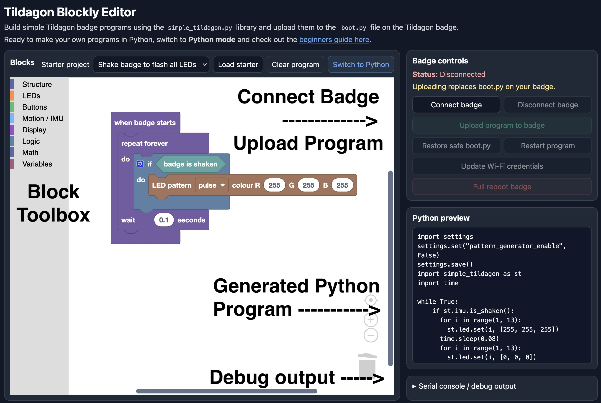
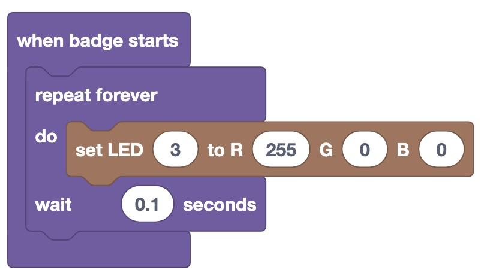
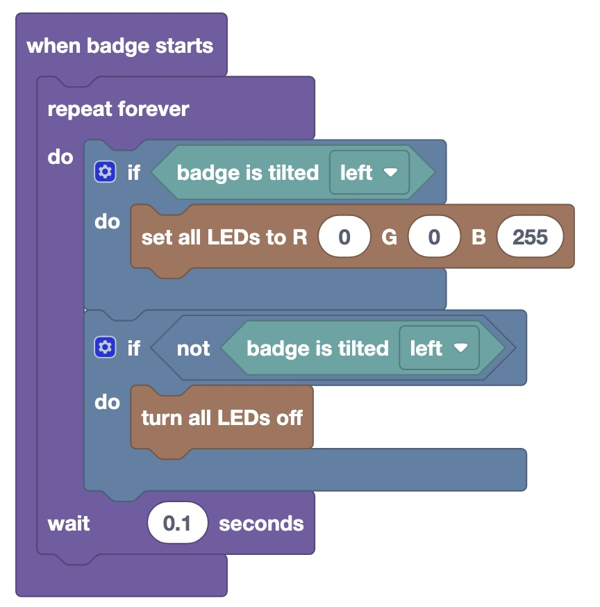
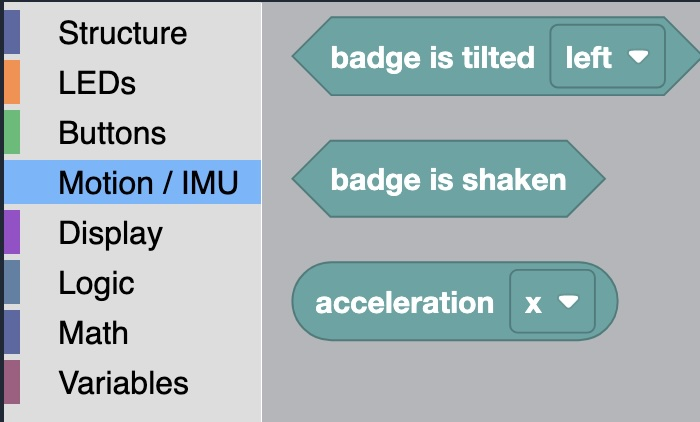
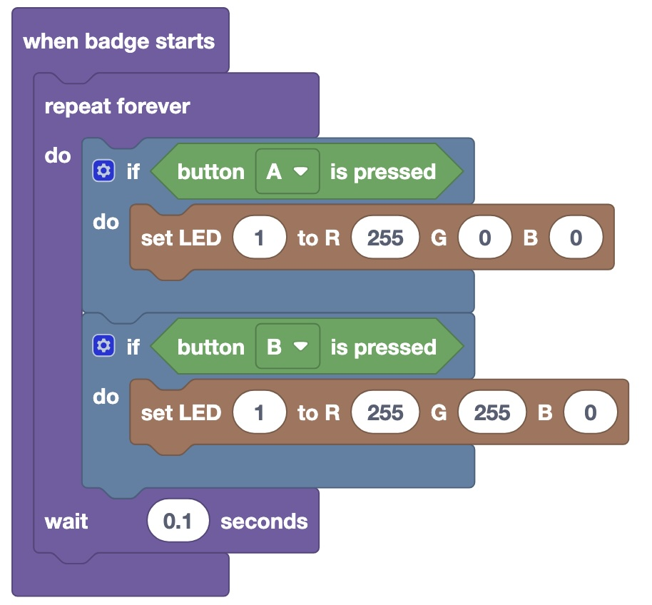
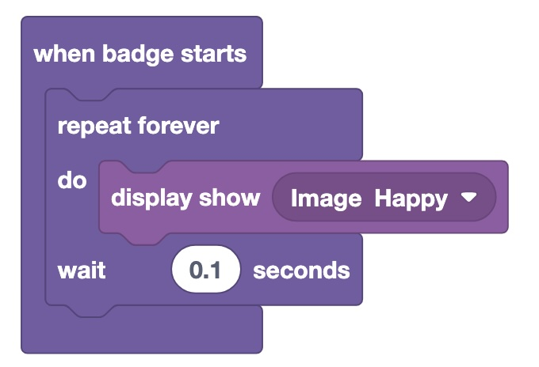

## Goals for the guide

1. Flash some multicoloured (RGB) LEDs.   
2. Detect presses of the buttons.   
3. Use the direction sensor (accelerometer which is part of the IMU).  
4. Show some pictures and text on the display.     

## Building your badge

If you haven't already built your badge, you need to [follow the Spaceagon assembly instructions](../using-the-badge/spaceagon-assembly.md).

## What software do I need?

All you need is a web browser with [Web Serial](https://caniuse.com/web-serial). You can access [Tildagon Blockly here](https://tildagon-blockly.causewaydigital.io/).   
   
Want to complete this guide with Python? Click here for the [Thonny Python guide](simple_tildagon_python.md).   

## What is Tildagon Blockly?    

Not programmed before or not familiar with Python? This is a great place to start! You can use a block-based programming environment (similar to MIT Scratch).   
{: style="width:400px;height: auto;margin:auto;display:block;" }

- Connect badge - This needs to be run first, to connect up to your badge so it's ready to copy programs over to.   
- Block Toolbox - You will find all the coding blocks in the block toolbox.   
- Generated Python - Your Python program will be automatically generated and can be previewed here.   
- Debug output - If your program doesn't work as expected (or doesn't work at all), check the debug output.   


Already a Python expert? Click here for the [Thonny Python guide](simple_tildagon_python.md) instead.    

## Getting started with Tildagon Blockly  
To get started with Tildagon Blockly, first click `connect badge`. You will need to select the badge from the pop-up Web Serial dialog box.   
Once you're ready to test your program, click `upload program to badge`.   

!!! warning

    Tildagon Blockly edits the `boot.py` file on the badge. This will stop the badge fully starting up into the normal EMF software. To revert back to the normal EMF software, click the `Restore safe boot.py` button. This should automatically restart the badge back into the normal EMF software, but you may need to press the `reboop` button to restart the badge manually (one of the 3 buttons on the side of the lower circuit board).

## Flashing some LEDs

The Tildagon badge includes a number of RGB (red, green, blue, aka multicoloured) LEDs onboard.


Each of these LEDs has a number written beside it.

### Using the LEDs

To turn one of these on, use the following code.   

{: style="width:400px;height:auto;display:block;margin:0;" }

The program above will **set LED 3 to red**.
The `[255, 0, 0]` section represents Red, Green, Blue mixing. Each can go up to 255 (full brightness for that colour).     
   
Try uploading it to your badge!   

!!! warning

    Have you got the following error?
    ```
    ImportError: no module named 'simple_tildagon'
    ```
    This means your badge needs to be updated before you can do this activity. See [here on how to do this](../using-the-badge/end-user-manual.md), or use the built-in OTA updater.

### Exercise 1

Try to set the following LEDs to colours

| LED number | Colour |
| ---------- | ------ |
| 2          | Blue   |
| 5          | Purple |
| 9          | White  |
| 11         | Yellow |

## Inertial Measurement Unit (IMU)

The badge contains an IMU (Inertial Measurement Unit). This is a combination of an accelerometer, gyroscopes and sometimes a magnetometer (compass). It allows you to measure movement of the badge and for example the direction it is tilting.

To use it, use the following code:

{: style="width:400px;height:auto;display:block;margin:0;" }
This program (one of the examples) sets all LEDs to blue when the badge is tilted to the left. When the badge is not being tilted, it switches all LEDs off.   
   
{: style="width:400px;height:auto;display:block;margin:0;" }  
You can also check if the badge has been shaken, or pull the raw acceleration values.   

### Exercise 2

Create a program that has individual LEDs switched on using the `badge is tilted` block. So if you tilt the badge left, LED 9 and 10 should come on.
If the badge is shaken, it should reset them all back to off.

!!! info "Tip"

    You can also use an if else statement with Blockly, instead of 2 if statements. Click the little gear icon in the if statement to add the else (or else if).   

## Buttons

There are 6 buttons around the outside of the badge labeled A-F (plus 3 additional buttons on the bottom layer circuit board used for managing the badge). You can check if the 6 buttons are being pressed with the following program.

To use it, use the following code:

{: style="width:400px;height:auto;display:block;margin:0;" }     
The above example sets LED 1 to red when the A button is pressed, then to yellow when the B button is pressed.   

### Exercise 3

Extend your previous program to switch all LEDs to purple once you press the B button.


### Exercise 4

Extend your previous program to finish when the `F` button is pressed. This will need you to use the `Stop Program` block to exit the program.   

## Display

You can display basic images and text on the display, using the display blocks.    

!!! warning "Warning"

    The display module in `simple_tildagon.py` is new for EMF 2026. As such, you need to make sure you are running badge software version 2.1.0 and above. You can check this from the `Update` app on the badge. 

You can display a basic picture on the screen using the `Display show` block.    
{: style="width:400px;height:auto;display:block;margin:0;" }  
{: style="width:400px;height:auto;display:block;margin:0;" }  
   
### Exercise 5  

Extend your previous program to show a happy face when tilted left and a sad face when tilted right.   
When shaken, show a surprised face.   

### Exercise 6   
   
Create a new program that displays a message on screen, that every 2 seconds, switches to a different colour.  

## Extensions

Now that you know the basics of using the hardware on the badge, here's a few other extension activities you could try

1. If the badge is shaken, show a random LED pattern - You might find the `random integer from 1 to 10` block in the `Math` section a useful block for this. 

2. Can you create an LED toggle? If you press the `E` button, if the LED is off, turn it on (to whatever colour you want), but if it is already on, turn it off - You will need to use a variable for this.

3. Create a simple dice roller. When you shake the badge, a random LED is chosen (which is associated with a number).

4. Create a reaction game - An LED shows up by a button, the user must quickly press that button, after which another random LED lights up and they must press the button nearest that.   

5. Create a name badge - Using the display functions, create a "Hello my name is ...." badge. Planning to show text over multiple lines? You need to be careful with how you use the `clear before` option in `display draw text`.   


## Next steps   

Now that you've successfully programmed your badge with blocks, the next step is getting hands on with Python.   
You can have a go at the same exercises in Python using the [Tildagon for beginners Python guide](simple_tildagon_python.md), or have a go at creating a real app for the Tildagon badge.   
For more details on this, check out the [Write a Tildagon OS App guide](../tildagon-apps/development.md) and the [Build the snake game tutorial](./examples/snake.md).
