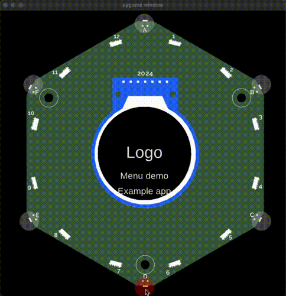

You can simulate your badge apps with the [Tildagon badge simulator](https://github.com/emfcamp/badge-2024-software/tree/main/sim).

## Installation

1. Clone the [badge-2024-software repo](https://github.com/emfcamp/badge-2024-software/tree/main/).
2. Open a terminal and navigate to the [sim](https://github.com/emfcamp/badge-2024-software/tree/main/sim) folder.
3. From there, run `pipenv install` to install all dependencies.

!!! note "Not running as expected?"

      Check the [known issues](https://github.com/emfcamp/badge-2024-software/tree/main/sim#known-issues).

## Simulate your app

The badge simulator simulates all apps in the [`sim/apps/`](https://github.com/emfcamp/badge-2024-software/tree/main/sim/apps/example/) folder To test your app, place your app's python file into the `sim/apps/` folder:

1. Create a folder for your app, for example `MyApp`.
2. In the new folder (for example `sim/apps/MyApp/`), copy your app's python file. For example, this is `app.py` for an example app:

   ```python
   import app

   from events.input import Buttons, BUTTON_TYPES


   class ExampleApp(app.App):
       def __init__(self):
           self.button_states = Buttons(self)

       def update(self, delta):
           if self.button_states.get(BUTTON_TYPES["CANCEL"]):
               # The button_states do not update while you are in the background.
               # Calling clear() ensures the next time you open the app, it stays open.
               # Without it the app would close again immediately.
               self.button_states.clear()
               self.minimise()

       def draw(self, ctx):
           ctx.save()
           ctx.rgb(0.2, 0, 0).rectangle(-120, -120, 240, 240).fill()
           ctx.rgb(1, 0, 0).move_to(-80, 0).text("Hello world")
           ctx.restore()

   __app_export__ = ExampleApp
   ```

3. In the same folder, create a file called `__init__.py` and use it to import your app's class. If you called your python app `app.py` and the class for your app is called `ExampleApp`, you would use the following content:

   ```python
   from .app import ExampleApp
   ```

4. In the same folder, create a file called `metadata.json` and add your app's metadata. The file needs to contain:

   - your app's name
   - the category for the app
   - the `callable` - which is the Python class for your app. When your app is run, this is the class that will be called to instantiate your app:

   ```json
   {
     "callable": "ExampleApp",
     "name": "Example app",
     "category": "unknown",
     "hidden": false
   }
   ```

5. Run the simulator an select your app to test it:

   ```sh
   pipenv run python run.py
   ```

{: style="margin:auto;display:block;" }

## Troubleshooting

!!! note "It runs in the simulator but not on the badge?"

      The simulator uses regular Python, while the badge runs apps with [MicroPython](https://docs.micropython.org/en/latest/). That means language specifics like match case statements will work in the simulator but not on the badge. To test whether your app runs on the badge, follow the instructions to [debug your app on your badge](./run-on-badge.md).

## What next?

<div class="grid cards" markdown>

- [Publish an app](./publish.md)

</div>
