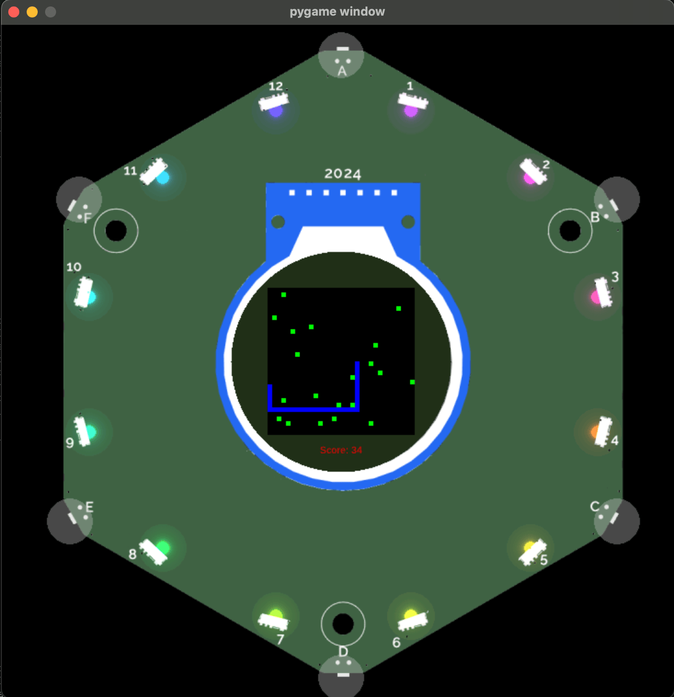

This tutorial, will guide you through building your own snake app, step by step.

{: style="width:400px;height: auto;margin:auto;display:block;" }

If you want to see the finished code, see [Finished Code](#finished-code).

## Environment setup

To start developing your own app, you first need to set up your environment. Follow the installation steps in [Simulate your app](./simulate.md).

## Create the app and test is

The badge simulator simulates all apps in the [`sim/apps/`](https://github.com/emfcamp/badge-2024-software/tree/main/sim/apps/example/) folder.

1. Create a folder for your snake app called `snake`.
2. In the new folder (`sim/apps/snake/`), create a file called `app.py` and add the following code:

    ```python
    import app

    from events.input import Buttons, BUTTON_TYPES


    class SnakeApp(app.App):
        def __init__(self):
            self.button_states = Buttons(self)

        def update(self, delta):
            if self.button_states.get(BUTTON_TYPES["CANCEL"]):
                self.button_states.clear()
                self.minimise()

        def draw(self, ctx):
            ctx.save()
            ctx.rgb(0.2,0,0).rectangle(-120,-120,240,240).fill()
            ctx.font_size = 14
            ctx.rgb(1,0,0).move_to(-90,0).text("This will be my snake game soon!")
            ctx.restore()

    __app_export__ = SnakeApp
    ```

    ??? question "Don't know what this code does?"

        If you want to read up on what this code does read [Write A Tildagon OS App](./development.md#hello-world-app).


3. In the same folder, create a file called `__init__.py` and use it to import your app's class `SnakeApp`:

    ```python
    from .app import SnakeApp
    ```

4. In the same folder, create a file called `metadata.json` and add your app's metadata. The file needs to contain:
      - your app's name `SnakeApp`
      - the category for the app
      - the `callable` - which is the Python class for your app. When your app is run, this is the class that will be called to instantiate your app:

    ```json
    {
            "callable": "SnakeApp",
            "name": "Snake Game",
            "category": "unknown",
            "hidden": false
        }
    ```

5. At this point you can run your app with the simulator for the first time. You should do this before continuing the tutorial to test that everything is working:

    ```sh
    pipenv run python run.py
    ```

{: style="width:400px;height: auto;margin:auto;display:block;" }

## Draw the game background

Your app starts and already displays something. Now you'll make it display the board that the snake game will run on. You're going to remove everything from the background with the `clear_background()` method and then of the app and then draw a black square on the screen.

To use the `clear_background()` method, you need to import it at the top of the file, with

```python
from app_components import clear_background
```

The `ctx` library allows you to draw many things onto the canvas of your app. One method it provides is the `rectangle()` method which takes an x- and a y- coordinate alongside a width and a height for the rectangle and draws the rectangle on the canvas. The width and height of the screen is `240`. Because the screen of your badge is a circle, we're going to use less than the full width and height of the screen and go with `160` for both.

!!! info "Learn more"

    You can learn more about the `ctx` library by reading the [`ctx` docs which provide many example apps](./widgets-and-hardware/ctx.md).

Use the `clear_background()` and the `rectangle()` method in the `draw()` method of your app:

```python
def draw(self, ctx):
    clear_background(ctx)
    ctx.save()

    # draw game board
    ctx.rgb(0, 0, 0).rectangle(0, 0, 160, 160).fill()

    ctx.restore()
```

If you try this code, you'll notice the board is not centered. That's because the coordinates `(0, 0)` are the center of the screen, rather than the top left corner. The rectangle is drawn 160 to the bottom and 160 to the right from there currently.

{: style="width:400px;height: auto;margin:auto;display:block;" }

While we could draw the rectangle from `(-80, 80)`, it is easier for our game if we can use the coordinates `(0, 0)` to mean the top left of the board. The `ctx` library provides a method called `translate()` which allows us to do just that:

```python
def draw(self, ctx):
    clear_background(ctx)
    ctx.save()

    ctx.translate(-80,-80)
    # draw game board
    ctx.rgb(0, 0, 0).rectangle(0, 0, 160, 160).fill()

    ctx.restore()
```

Your app's code should resemble this at this point:

```python
import app

from app_components import clear_background
from events.input import Buttons, BUTTON_TYPES


class SnakeApp(app.App):
    def __init__(self):
        self.button_states = Buttons(self)

    def update(self, delta):
        if self.button_states.get(BUTTON_TYPES["CANCEL"]):
            self.button_states.clear()
            self.minimise()

    def draw(self, ctx):
        clear_background(ctx)
        ctx.save()

        ctx.translate(-80,-80)
        # draw game board
        ctx.rgb(0, 0, 0).rectangle(0, 0, 160, 160).fill()

        ctx.restore()

    __app_export__ = SnakeApp
```

Go ahead and run your app in the simulator to ensure you can see the board:

{: style="width:400px;height: auto;margin:auto;display:block;" }

!!! tip "If you want to, please feel free to customize your snake app with different colours, sized, functionality..."

## Add the snake

Now that you have a board game, you can add the snake. To represent where the snake is, you'll use an array of tuples, where each tuple represents the coordinates of one of the snake's body parts:

```python
# example representation of a snake that is three squares long
example_snake = [(0, 1), (0, 2), (0, 3)]
```

Because the snake moves as the game progresses, you need to add state to keep track of where the snake and each of its body parts is. To do this you'll add a snake property on the `SnakeApp`. At the beginning of each game, the snake will be in the middle of the screen.

??? question "Wondering what _state_ is? Expand this!"

    State allows you to keep track of each element of a game. The app's properties that store a game's state are set in the `__init__()` method. The `update()` method is where the state of an app should be updated. The `draw()` method, on the other hand, visualizes the current state. This separation is intentional, keeping the app's logic separate from its visualization.

To make each body part of the snake easily visible, give the body parts of the snake the width and the height `5`. This means that if the entire board of the game has width `160x160`, the board ends up having `32x32` places. Therefore the middle of the game is at `(16, 16)`. Add this to the `SnakeApp`'s `__init__()` method:

```python
def __init__(self):
    self.button_states = Buttons(self)
    self.snake = [(16, 16)]
```

Great, your snake now exists, initially with one body part, and you know where it is. You can draw it with the app's `draw()` method, by adding these lines underneath where you draw the board:

```python
# draw snake
for x, y in self.snake:
    ctx.rgb(0, 0, 1).rectangle(x*5, y*5, 5, 5).fill()
```

This code will iterate over each of the snake's body parts, get the `(x, y)` coordinates and draw them in blue. The height and width of the body parts is `5` and because of this, you also want to multiply the x- and y-coordinates times 5 to place the snake at the correct position.

Your app should now resemble this:

```python
import app

from app_components import clear_background
from events.input import Buttons, BUTTON_TYPES


class SnakeApp(app.App):
    def __init__(self):
        self.button_states = Buttons(self)
        self.snake = [(16, 16)]

    def update(self, delta):
        if self.button_states.get(BUTTON_TYPES["CANCEL"]):
            self.button_states.clear()
            self.minimise()

    def draw(self, ctx):
        clear_background(ctx)
        ctx.save()

        ctx.translate(-80,-80)
        # draw game board
        ctx.rgb(0, 0, 0).rectangle(0, 0, 160, 160).fill()

        # draw snake
        for x, y in self.snake:
            ctx.rgb(0, 0, 1).rectangle(x*5, y*5, 5, 5).fill()

        ctx.restore()

__app_export__ = SnakeApp
```

Go ahead and run your app in the simulator to ensure you can see the snake:

{: style="width:400px;height: auto;margin:auto;display:block;" }

## Move the snake

Next, you'll make your snake move up, down, left, and right using the respective buttons on your badge. You've already got one button that does something and that is the `CANCEL` button. You can check for button presses in the `update()` method:

```python
def update(self, delta):
    if self.button_states.get(BUTTON_TYPES["RIGHT"]):
        # do something
    elif self.button_states.get(BUTTON_TYPES["LEFT"]):
        # do something
    elif self.button_states.get(BUTTON_TYPES["UP"]):
        # do something
    elif self.button_states.get(BUTTON_TYPES["DOWN"]):
        # do something
    elif self.button_states.get(BUTTON_TYPES["CANCEL"]):
        self.button_states.clear()
        self.minimise()
```

When a button is pressed we want the snake to start moving in the direction that matches the pressed button. To do this, add a `direction` property on the app.

```python
def __init__(self):
    self.button_states = Buttons(self)
    self.snake = [(16, 16)]
    self.direction = ""
```

Set the `direction` whenever a button is pressed:

```python
def update(self, delta):
    if self.button_states.get(BUTTON_TYPES["RIGHT"]):
        self.direction = "RIGHT"
    elif self.button_states.get(BUTTON_TYPES["LEFT"]):
        self.direction = "LEFT"
    elif self.button_states.get(BUTTON_TYPES["UP"]):
        self.direction = "UP"
    elif self.button_states.get(BUTTON_TYPES["DOWN"]):
        self.direction = "DOWN"
    elif self.button_states.get(BUTTON_TYPES["CANCEL"]):
        self.button_states.clear()
        self.minimise()
```

Now, let's make the coordinates of the `snake` update based on the `direction`. To do this define a new method on the app `def _move_snake()`. Use this method to check where the head of the snake (the first coordinates in the `snake` array) is. Calculate where the head of the snake should go next and add those coordinates to the beginning of the snake array, then remove the old last element of the snake array:

```python
def _move_snake(self):
    first_x, first_y = self.snake[0]
    if self.direction == "RIGHT":
        self.snake = [(first_x + 1, first_y)] + self.snake
        self.snake = self.snake[:-1]
    if self.direction == "LEFT":
        self.snake = [(first_x - 1, first_y)] + self.snake
        self.snake = self.snake[:-1]
    if self.direction == "UP":
        self.snake = [(first_x, first_y - 1)] + self.snake
        self.snake = self.snake[:-1]
    if self.direction == "DOWN":
        self.snake = [(first_x, first_y + 1)] + self.snake
        self.snake = self.snake[:-1]
```

The last thing to do before you test the code, is to call the `_move_snake()` method at the bottom of the `update()` method.

Your overall app should look like this now:

```python
import app

from app_components import clear_background
from events.input import Buttons, BUTTON_TYPES


class SnakeApp(app.App):
    def __init__(self):
        self.button_states = Buttons(self)
        self.snake = [(16, 16)]
        self.direction = ""

    def update(self, delta):
        if self.button_states.get(BUTTON_TYPES["RIGHT"]):
            self.direction = "RIGHT"
        elif self.button_states.get(BUTTON_TYPES["LEFT"]):
            self.direction = "LEFT"
        elif self.button_states.get(BUTTON_TYPES["UP"]):
            self.direction = "UP"
        elif self.button_states.get(BUTTON_TYPES["DOWN"]):
            self.direction = "DOWN"
        elif self.button_states.get(BUTTON_TYPES["CANCEL"]):
            self.button_states.clear()
            self.minimise()
        self._move_snake()

    def _move_snake(self):
        first_x, first_y = self.snake[0]
        if self.direction == "RIGHT":
            self.snake = [(first_x + 1, first_y)] + self.snake
            self.snake = self.snake[:-1]
        if self.direction == "LEFT":
            self.snake = [(first_x - 1, first_y)] + self.snake
            self.snake = self.snake[:-1]
        if self.direction == "UP":
            self.snake = [(first_x, first_y - 1)] + self.snake
            self.snake = self.snake[:-1]
        if self.direction == "DOWN":
            self.snake = [(first_x, first_y + 1)] + self.snake
            self.snake = self.snake[:-1]

    def draw(self, ctx):
        clear_background(ctx)
        ctx.save()

        ctx.translate(-80,-80)
        # draw game board
        ctx.rgb(0, 0, 0).rectangle(0, 0, 160, 160).fill()

        # draw snake
        for x, y in self.snake:
            ctx.rgb(0, 0, 1).rectangle(x*5, y*5, 5, 5).fill()

        ctx.restore()

__app_export__ = SnakeApp
```

Go ahead and run your app in the simulator, then press the up, down, right, or left buttons to ensure you can move the snake. Be aware that your snake can currently move off the visible screen, so pay attention when you open the app!

{: style="margin:auto;display:block;" }

### Adjust the speed of the game

The snake currently moves very quickly. You can adjust the speed of the snake by updating the snake's position less frequently. The app's `update` method is called every 50ms by default and it provides the time since the last call to `update()` as the `delta` variable to the method. To move the snake only every 0.5s, we can add a counter to the app that adds the delta of each call to update until we reach 0.5s and then updates the snake. Add a variable called `step` to the app:

```python
def __init__(self):
    self.button_states = Buttons(self)
    self.snake = [(16, 16)]
    self.direction = ""
    self.step = 0
```

Then, replace the call to `self._move_snake()` with the following code:

```python
# Only move snake every half second
self.step = self.step + delta
if self.step > 500:
    self.step = 0
    self._move_snake()
```

Your app should now resemble this:

```python
import app

from app_components import clear_background
from events.input import Buttons, BUTTON_TYPES


class SnakeApp(app.App):
    def __init__(self):
        self.button_states = Buttons(self)
        self.snake = [(16, 16)]
        self.direction = ""
        self.step = 0


    def update(self, delta):
        if self.button_states.get(BUTTON_TYPES["RIGHT"]):
            self.direction = "RIGHT"
        elif self.button_states.get(BUTTON_TYPES["LEFT"]):
            self.direction = "LEFT"
        elif self.button_states.get(BUTTON_TYPES["UP"]):
            self.direction = "UP"
        elif self.button_states.get(BUTTON_TYPES["DOWN"]):
            self.direction = "DOWN"
        elif self.button_states.get(BUTTON_TYPES["CANCEL"]):
            self.button_states.clear()
            self.minimise()

        # Only move snake every half second
        self.step = self.step + delta
        if self.step > 500:
            self.step = 0
            self._move_snake()

    def _move_snake(self):
        first_x, first_y = self.snake[0]
        if self.direction == "RIGHT":
            self.snake = [(first_x + 1, first_y)] + self.snake
            self.snake = self.snake[:-1]
        if self.direction == "LEFT":
            self.snake = [(first_x - 1, first_y)] + self.snake
            self.snake = self.snake[:-1]
        if self.direction == "UP":
            self.snake = [(first_x, first_y - 1)] + self.snake
            self.snake = self.snake[:-1]
        if self.direction == "DOWN":
            self.snake = [(first_x, first_y + 1)] + self.snake
            self.snake = self.snake[:-1]

    def draw(self, ctx):
        clear_background(ctx)
        ctx.save()

        ctx.translate(-80,-80)
        # draw game board
        ctx.rgb(0, 0, 0).rectangle(0, 0, 160, 160).fill()

        # draw snake
        for x, y in self.snake:
            ctx.rgb(0, 0, 1).rectangle(x*5, y*5, 5, 5).fill()

        ctx.restore()

__app_export__ = SnakeApp
```

Go ahead and run your app in the simulator to ensure your snake now moves more slowly:

{: style="margin:auto;display:block;" }

## Add food

You can now move your single-element snake around the board. Let's now give your snake food.

As with the snake's coordinates, you'll want to start by adding a property on the app to keep track of where all the food is:

```python
def __init__(self):
    self.button_states = Buttons(self)
    self.snake = [(16, 16)]
    self.food = []
    self.direction = ""
    self.step = 0
```

Next, you'll want randomly add food to the board. Add the `random` package at the top of your file:

```python
import random
```

Then, define a `_generate_food()` method that creates random coordinates for a new food item and adds them to the `food` array if they are not already present. This ensures we don't add food in a place where there is already food:

```python
def _generate_food(self):
    coordinates = (random.randrange(32), random.randrange(32))
    if not coordinates in self.food:
        self.food = self.food + [coordinates]
```

You could call this method in multiple ways. I suggest you use the `background_task()` method which allows you to add food asynchronously every few seconds:

```python
    async def background_task(self):
        while True:
            await asyncio.sleep(5)
            self._generate_food()
```

Add the `asyncio` package at the top of your file:

```python
import asyncio
```

To use the asynchronous `background_task()` method, you have to call `super().__init__()` inside the `__init__()` method of your app which will initialize the properties of the base class which contains an `overlays` property that the `background_task()` method relies on.

```python
def __init__(self):
    # Need to call to access overlays
    super().__init__()
    self.button_states = Buttons(self)
    self.snake = [(16, 16)]
    self.food = []
    self.direction = ""
    self.step = 0
```

To draw the food on the screen, you must also add it to the `draw()` method. Add the following lines after you draw the game board and before you draw the snake. `ctx` draws things in the order provided, so you want to make sure that the food is on top of the board and the snake is on top of the food.

```python
# draw food
for x, y in self.food:
    ctx.rgb(0, 1, 0).rectangle(x*5, y*5, 5, 5).fill()
```

Your app should now resemble this:

```python
import app
import asyncio
import random

from app_components import clear_background
from events.input import Buttons, BUTTON_TYPES


class SnakeApp(app.App):
    def __init__(self):
        # Need to call to access overlays
        super().__init__()
        self.button_states = Buttons(self)
        self.snake = [(16, 16)]
        self.food = []
        self.direction = ""
        self.step = 0

    def update(self, delta):
        if self.button_states.get(BUTTON_TYPES["RIGHT"]):
            self.direction = "RIGHT"
        elif self.button_states.get(BUTTON_TYPES["LEFT"]):
            self.direction = "LEFT"
        elif self.button_states.get(BUTTON_TYPES["UP"]):
            self.direction = "UP"
        elif self.button_states.get(BUTTON_TYPES["DOWN"]):
            self.direction = "DOWN"
        elif self.button_states.get(BUTTON_TYPES["CANCEL"]):
            self.button_states.clear()
            self.minimise()

        # Only move snake every half second
        self.step = self.step + delta
        if self.step > 500:
            self.step = 0
            self._move_snake()

    def _move_snake(self):
        first_x, first_y = self.snake[0]
        if self.direction == "RIGHT":
            self.snake = [(first_x + 1, first_y)] + self.snake
            self.snake = self.snake[:-1]
        if self.direction == "LEFT":
            self.snake = [(first_x - 1, first_y)] + self.snake
            self.snake = self.snake[:-1]
        if self.direction == "UP":
            self.snake = [(first_x, first_y - 1)] + self.snake
            self.snake = self.snake[:-1]
        if self.direction == "DOWN":
            self.snake = [(first_x, first_y + 1)] + self.snake
            self.snake = self.snake[:-1]

    def _generate_food(self):
        coordinates = (random.randrange(32), random.randrange(32))
        if not coordinates in self.food:
            self.food = self.food + [coordinates]

    async def background_task(self):
        while True:
            await asyncio.sleep(5)
            self._generate_food()

    def draw(self, ctx):
        clear_background(ctx)
        ctx.save()

        ctx.translate(-80,-80)
        # draw game board
        ctx.rgb(0, 0, 0).rectangle(0, 0, 160, 160).fill()

        # draw food
        for x, y in self.food:
            ctx.rgb(0, 1, 0).rectangle(x*5, y*5, 5, 5).fill()

        # draw snake
        for x, y in self.snake:
            ctx.rgb(0, 0, 1).rectangle(x*5, y*5, 5, 5).fill()

        ctx.restore()

__app_export__ = SnakeApp
```

Go ahead and run your app in the simulator to see your food appear:

{: style="margin:auto;display:block;" }

### Eat food and grow

Currently you can move your snake over the food but the food does not disappear and your snake does not grow. Let's add logic to do that.

When your snake moves, you can add a check for whether there is food present where the head of the snake is. You can check if the coordinates where the head of the snake is are present in the `food` array. If there is food, remove the coordinates from the `food` array, because the food has been eaten, and add the coordinates of the new snake part to the `snake` array:

```python
def _move_snake(self):
    first_x, first_y = self.snake[0]
    if self.direction == "RIGHT":
        self.snake = [(first_x + 1, first_y)] + self.snake
        self.snake = self.snake[:-1]
    if self.direction == "LEFT":
        self.snake = [(first_x - 1, first_y)] + self.snake
        self.snake = self.snake[:-1]
    if self.direction == "UP":
        self.snake = [(first_x, first_y - 1)] + self.snake
        self.snake = self.snake[:-1]
    if self.direction == "DOWN":
        self.snake = [(first_x, first_y + 1)] + self.snake
        self.snake = self.snake[:-1]

    # if there is food there, eat food
    if self.snake[0] in self.food:
        self.food.remove(self.snake[0])
        self.snake = self.snake + [self.snake[0]]
```

Your app should now resemble this:

```python
import app
import asyncio
import random

from app_components import clear_background
from events.input import Buttons, BUTTON_TYPES


class SnakeApp(app.App):
    def __init__(self):
        # Need to call to access overlays
        super().__init__()
        self.button_states = Buttons(self)
        self.snake = [(16, 16)]
        self.food = []
        self.direction = ""
        self.step = 0

    def update(self, delta):
        if self.button_states.get(BUTTON_TYPES["RIGHT"]):
            self.direction = "RIGHT"
        elif self.button_states.get(BUTTON_TYPES["LEFT"]):
            self.direction = "LEFT"
        elif self.button_states.get(BUTTON_TYPES["UP"]):
            self.direction = "UP"
        elif self.button_states.get(BUTTON_TYPES["DOWN"]):
            self.direction = "DOWN"
        elif self.button_states.get(BUTTON_TYPES["CANCEL"]):
            self.button_states.clear()
            self.minimise()

        # Only move snake every half second
        self.step = self.step + delta
        if self.step > 500:
            self.step = 0
            self._move_snake()

    def _move_snake(self):
        first_x, first_y = self.snake[0]
        if self.direction == "RIGHT":
            self.snake = [(first_x + 1, first_y)] + self.snake
            self.snake = self.snake[:-1]
        if self.direction == "LEFT":
            self.snake = [(first_x - 1, first_y)] + self.snake
            self.snake = self.snake[:-1]
        if self.direction == "UP":
            self.snake = [(first_x, first_y - 1)] + self.snake
            self.snake = self.snake[:-1]
        if self.direction == "DOWN":
            self.snake = [(first_x, first_y + 1)] + self.snake
            self.snake = self.snake[:-1]

        # if there is food there, eat food
        if self.snake[0] in self.food:
            self.food.remove(self.snake[0])
            self.snake = self.snake + [self.snake[0]]


    def _generate_food(self):
        coordinates = (random.randrange(32), random.randrange(32))
        if not coordinates in self.food:
            self.food = self.food + [coordinates]

    async def background_task(self):
        while True:
            await asyncio.sleep(5)
            self._generate_food()

    def draw(self, ctx):
        clear_background(ctx)
        ctx.save()

        ctx.translate(-80,-80)
        # draw game board
        ctx.rgb(0, 0, 0).rectangle(0, 0, 160, 160).fill()

        # draw food
        for x, y in self.food:
            ctx.rgb(0, 1, 0).rectangle(x*5, y*5, 5, 5).fill()

        # draw snake
        for x, y in self.snake:
            ctx.rgb(0, 0, 1).rectangle(x*5, y*5, 5, 5).fill()

        ctx.restore()

__app_export__ = SnakeApp
```

Go ahead and run your app in the simulator to ensure your snake can eat the food:

{: style="margin:auto;display:block;" }

## Keep score

Most games keep track of a score as you play, so let's add that in as well. Add a `score` property to the app:

```python
def __init__(self):
    # Need to call to access overlays
    super().__init__()
    self.button_states = Buttons(self)
    self.snake = [(16, 16)]
    self.food = []
    self.direction = ""
    self.step = 0
    self.score = 0
```

Increase the score whenever the snake eats food:

```python
if self.snake[0] in self.food:
    self.food.remove(self.snake[0])
    self.snake = self.snake + [self.snake[0]]
    self.score = self.score + 1
```

Next, add the score to the display by adding it to the `draw()` method:

- Set the `font_size` to `12`.
- Calculate the width of the text using the `text_width()` method.
- Then add the text to the display using the `text()` method.

Draw the score before you call the `translate()` method:

```python
# draw score
ctx.font_size = 12
width = ctx.text_width("Score: {}".format(self.score))
ctx.rgb(1,0,0).move_to(0 - width/2,100).text("Score: {}".format(self.score))
```

Your app should now resemble this:

```python
import app
import asyncio
import random

from app_components import clear_background
from events.input import Buttons, BUTTON_TYPES


class SnakeApp(app.App):
    def __init__(self):
        # Need to call to access overlays
        super().__init__()
        self.button_states = Buttons(self)
        self.snake = [(16, 16)]
        self.food = []
        self.direction = ""
        self.step = 0
        self.score = 0


    def update(self, delta):
        if self.button_states.get(BUTTON_TYPES["RIGHT"]):
            self.direction = "RIGHT"
        elif self.button_states.get(BUTTON_TYPES["LEFT"]):
            self.direction = "LEFT"
        elif self.button_states.get(BUTTON_TYPES["UP"]):
            self.direction = "UP"
        elif self.button_states.get(BUTTON_TYPES["DOWN"]):
            self.direction = "DOWN"
        elif self.button_states.get(BUTTON_TYPES["CANCEL"]):
            self.button_states.clear()
            self.minimise()

        # Only move snake every half second
        self.step = self.step + delta
        if self.step > 500:
            self.step = 0
            self._move_snake()

    def _move_snake(self):
        first_x, first_y = self.snake[0]
        if self.direction == "RIGHT":
            self.snake = [(first_x + 1, first_y)] + self.snake
            self.snake = self.snake[:-1]
        if self.direction == "LEFT":
            self.snake = [(first_x - 1, first_y)] + self.snake
            self.snake = self.snake[:-1]
        if self.direction == "UP":
            self.snake = [(first_x, first_y - 1)] + self.snake
            self.snake = self.snake[:-1]
        if self.direction == "DOWN":
            self.snake = [(first_x, first_y + 1)] + self.snake
            self.snake = self.snake[:-1]

        # if there is food there, eat food
        if self.snake[0] in self.food:
            self.food.remove(self.snake[0])
            self.snake = self.snake + [self.snake[0]]
            self.score = self.score + 1


    def _generate_food(self):
        coordinates = (random.randrange(32), random.randrange(32))
        if not coordinates in self.food:
            self.food = self.food + [coordinates]

    async def background_task(self):
        while True:
            await asyncio.sleep(5)
            self._generate_food()

    def draw(self, ctx):
        clear_background(ctx)
        ctx.save()

        # draw score
        ctx.font_size = 12
        width = ctx.text_width("Score: {}".format(self.score))
        ctx.rgb(1,0,0).move_to(0 - width/2,100).text("Score: {}".format(self.score))

        ctx.translate(-80,-80)
        # draw game board
        ctx.rgb(0, 0, 0).rectangle(0, 0, 160, 160).fill()

        # draw food
        for x, y in self.food:
            ctx.rgb(0, 1, 0).rectangle(x*5, y*5, 5, 5).fill()

        # draw snake
        for x, y in self.snake:
            ctx.rgb(0, 0, 1).rectangle(x*5, y*5, 5, 5).fill()

        ctx.restore()

__app_export__ = SnakeApp
```

Go ahead and run your app in the simulator to check the score:

{: style="width:400px;height: auto;margin:auto;display:block;" }

## Constraints and game state

The game is now mostly functional but you cannot currently lose the game. Let's add game state:

```python
def __init__(self):
    # Need to call to access overlays
    super().__init__()
    self.button_states = Buttons(self)
    self.snake = [(16, 16)]
    self.food = []
    self.direction = ""
    self.step = 0
    self.score = 0
    self.game = ""
```

Let's change the game state to `"ON"` once the player presses a button:

```python
def update(self, delta):
    if self.button_states.get(BUTTON_TYPES["RIGHT"]):
        self.direction = "RIGHT"
        self.game = "ON"
    elif self.button_states.get(BUTTON_TYPES["LEFT"]):
        self.direction = "LEFT"
        self.game = "ON"
    elif self.button_states.get(BUTTON_TYPES["UP"]):
        self.direction = "UP"
        self.game = "ON"
    elif self.button_states.get(BUTTON_TYPES["DOWN"]):
        self.direction = "DOWN"
        self.game = "ON"
    elif self.button_states.get(BUTTON_TYPES["CANCEL"]):
        self.button_states.clear()
        self.game = ""
        self.minimise()

    # Only move snake every half second
    self.step = self.step + delta
    # Only move the snake if the game has started
    if self.game == "ON":
        if self.step > 500:
            self.step = 0
            self._move_snake()
```

Currently, the game generates new food even even before the game has started. Let's change that by changing the `background_task()` method to only generate food when the game is `"ON"`:

```python
async def background_task(self):
    while True:
        await asyncio.sleep(5)
        if self.game == "ON":
            self._generate_food()
```

Let's also at this point add logic to check that the snake's head is within the board's dimensions and change the game state to `"OVER"` if it isn't. Add the logic after eating the food:

```python
# check if outside game borders
x, y = self.snake[0]
if x < 0 or x >= 32:
    self.game = "OVER"
if y < 0 or y >= 32:
    self.game = "OVER"
```

Lastly, let's add a dialogue at the end of the game to say that the game is over and to allow the player to start a new came. Import the `YesNoDialog` class from the `app_components` package:

```python
from app_components import YesNoDialog, clear_background
```

Then add a property to the `app` for the YesNoDialog:

```python
def __init__(self):
    # Need to call to access overlays for dialog
    super().__init__()
    self.score = 0
    self.snake = [(16, 16)]
    self.food = []
    self.direction = ""
    self.button_states = Buttons(self)
    self.step = 0
    self.game = ""
    self.dialog = None
```

At the end of the `update()` method set the `self.dialog` property. Pass it some dialogue and two methods that handle the yes and no options of the dialog. Call them `_reset` for the option that starts a new game and `_exit` for the other option:

```python
# Only move snake every half second
self.step = self.step + delta
if self.game == "ON":
    if self.step > 500:
        self.step = 0
        self._move_snake()
elif self.game == "OVER":
    self.dialog = YesNoDialog(
        message="Oh no. Play Again?",
        on_yes=self._reset,
        on_no=self._exit,
        app=self,
    )
    # Reset the game variable to ensure this dialog is only created once
    self.game = ""
```

Define the `_reset()` method and make it reset the game state:

```python
def _reset(self):
    self.snake = [(16,16)]
    self.food = []
    self.direction = ""
    self.score = 0
    self.dialog = None
```

The `_exit()` method, should clear the button state and minimise the app. If you don't clear the button state, the next time you open the app it will close again immediately because it will check the button state and see that the cancel button was clicked. I think it also makes sense to reset the game state before exiting, so the `_exit()` method will also call the `_reset()` method:

```python
def _exit(self):
    self._reset()
    self.button_states.clear()
    self.minimise()
```

Lastly, add the logic in the `draw()` method to draw the notification:

```python
if self.dialog:
    self.dialog.draw(ctx)
```

### Finished code

Your app should now resemble this:

```python
import app
import asyncio
import random

from app_components import YesNoDialog, clear_background
from events.input import Buttons, BUTTON_TYPES


class SnakeApp(app.App):
    def __init__(self):
        # Need to call to access overlays
        super().__init__()
        self.button_states = Buttons(self)
        self.snake = [(16, 16)]
        self.food = []
        self.direction = ""
        self.step = 0
        self.score = 0
        self.game = ""
        self.dialog = None

    def _reset(self):
        self.snake = [(16,16)]
        self.food = []
        self.direction = ""
        self.score = 0
        self.dialog = None

    def _exit(self):
        self._reset()
        self.button_states.clear()
        self.minimise()


    def update(self, delta):
        if self.button_states.get(BUTTON_TYPES["RIGHT"]):
            self.direction = "RIGHT"
            self.game = "ON"
        elif self.button_states.get(BUTTON_TYPES["LEFT"]):
            self.direction = "LEFT"
            self.game = "ON"
        elif self.button_states.get(BUTTON_TYPES["UP"]):
            self.direction = "UP"
            self.game = "ON"
        elif self.button_states.get(BUTTON_TYPES["DOWN"]):
            self.direction = "DOWN"
            self.game = "ON"
        elif self.button_states.get(BUTTON_TYPES["CANCEL"]):
            self.button_states.clear()
            self.game = ""
            self.minimise()

        # Only move snake every half second
        self.step = self.step + delta
        if self.game == "ON":
            if self.step > 500:
                self.step = 0
                self._move_snake()
        elif self.game == "OVER":
            self.dialog = YesNoDialog(
                message="Oh no. Play Again?",
                on_yes=self._reset,
                on_no=self._exit,
                app=self,
            )
            # Reset the game variable to ensure this dialog is only created once
            self.game = ""

    def _move_snake(self):
        first_x, first_y = self.snake[0]
        if self.direction == "RIGHT":
            self.snake = [(first_x + 1, first_y)] + self.snake
            self.snake = self.snake[:-1]
        if self.direction == "LEFT":
            self.snake = [(first_x - 1, first_y)] + self.snake
            self.snake = self.snake[:-1]
        if self.direction == "UP":
            self.snake = [(first_x, first_y - 1)] + self.snake
            self.snake = self.snake[:-1]
        if self.direction == "DOWN":
            self.snake = [(first_x, first_y + 1)] + self.snake
            self.snake = self.snake[:-1]

        # if there is food there, eat food
        if self.snake[0] in self.food:
            self.food.remove(self.snake[0])
            self.snake = self.snake + [self.snake[0]]
            self.score = self.score + 1

        # check if outside game borders
        x, y = self.snake[0]
        if x < 0 or x >= 32:
            self.game = "OVER"
        if y < 0 or y >= 32:
            self.game = "OVER"

    def _generate_food(self):
        coordinates = (random.randrange(32), random.randrange(32))
        if not coordinates in self.food:
            self.food = self.food + [coordinates]

    async def background_task(self):
        while True:
            await asyncio.sleep(5)
            if self.game == "ON":
                self._generate_food()

    def draw(self, ctx):
        clear_background(ctx)
        ctx.save()

        # draw score
        ctx.font_size = 12
        width = ctx.text_width("Score: {}".format(self.score))
        ctx.rgb(1,0,0).move_to(0 - width/2,100).text("Score: {}".format(self.score))

        ctx.translate(-80,-80)
        # draw game board
        ctx.rgb(0, 0, 0).rectangle(0, 0, 160, 160).fill()

        # draw food
        for x, y in self.food:
            ctx.rgb(0, 1, 0).rectangle(x*5, y*5, 5, 5).fill()

        # draw snake
        for x, y in self.snake:
            ctx.rgb(0, 0, 1).rectangle(x*5, y*5, 5, 5).fill()

        ctx.restore()

        if self.dialog:
            self.dialog.draw(ctx)

__app_export__ = SnakeApp
```

Go ahead and run your app in the simulator to test the game state logic:

{: style="width:400px;height: auto;margin:auto;display:block;" }

## Optional: Use the IMU

You can optionally use the IMU on the badge to move the snake by tilting the badge. Note that this only works on the badge itself, so you will need to [debug your app on your badge](./run-on-badge.md).

To use the imu, import the `imu` package:

```python
import imu
```

Then add the `self.acc_read` variable to the ``__init__()` method:

```python
def __init__(self):
    # Need to call to access overlays
    super().__init__()
    self.button_states = Buttons(self)
    self.snake = [(16, 16)]
    self.food = []
    self.direction = ""
    self.step = 0
    self.score = 0
    self.game = ""
    self.dialog = None
    self.acc_read = None
```

And finally change the `update()` method to use the IMU readings. The IMU readings contain `(x, y, z)` coordinates describing the tilt of the badge. The code checks whether the X or Y value is most tilted and then sets the snake's direction to be the corresponding direction.

```python
def update(self, delta):
    self.acc_read = imu.acc_read()
    if self.button_states.get(BUTTON_TYPES["CANCEL"]):
        self.button_states.clear()
        self.game = ""
        self.minimise()
    # Press confirm to start the game
    elif self.button_states.get(BUTTON_TYPES["CONFIRM"]):
        self.button_states.clear()
        self.game = "ON"

    # If the game is not over or unset
    if self.game not in ["", "OVER"]:
        # Check whether Y or X coordinate
        if abs(self.acc_read[0]) > abs(self.acc_read[1]):
            # Use X coordinate to go up or down
            if self.acc_read[0] > 0:
                # A positive X coordinate indicates the bottom is tilted down
                self.direction = "DOWN"
                self.game = "ON"
            else:
                # A negative X coordinate indicates the top is tilted down
                self.direction = "UP"
                self.game = "ON"
        else:
            # Use Y coordinate to go left or right
            if self.acc_read[1] > 0:
                # A positive Y coordinate indicates the badge is tilted to the right
                self.direction = "RIGHT"
                self.game = "ON"
            else:
                # A positive Y coordinate indicates the badge is tilted to the left
                self.direction = "LEFT"
                self.game = "ON"

    # Only move snake every half second
    self.step = self.step + delta
    if self.game == "ON":
        if self.step > 500:
            self.step = 0
            self._move_snake()
    elif self.game == "OVER":
        self.dialog = YesNoDialog(
            message="Game Over.\nPlay Again?",
            on_yes=self._reset,
            on_no=self._exit,
            app=self,
        )
        # Reset the game variable to ensure this dialog is only created once
        self.game = ""
        self.direction = ""
```

Follow the instructions in [debug your app on your badge](./run-on-badge.md) to test your app.

## Next steps

Congratulations! You now have a finished snake app! There are many more features you could add:

- Checks for collisions with the rest of the snake.
- Obstacles and obstacle collision checks.
- You could add a hunger mechanic to ensure a snake must eat within a certain time frame.

If you change the app, please [publish it to the App store](./publish.md).
