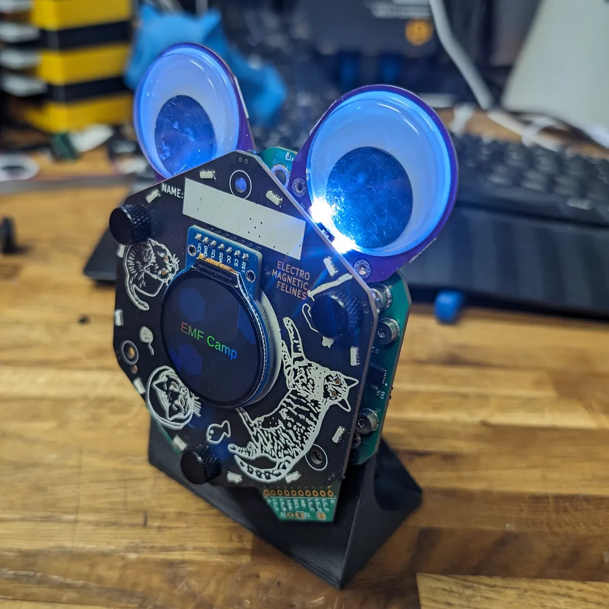
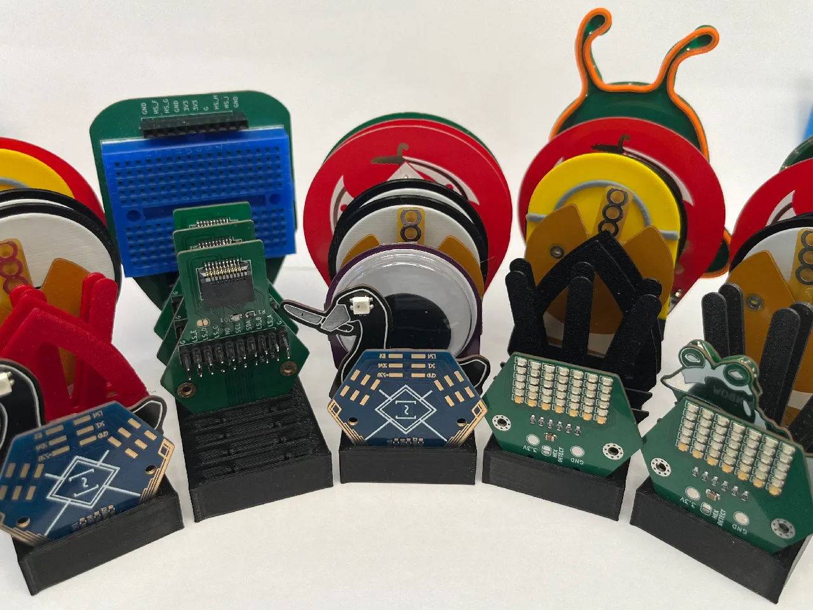
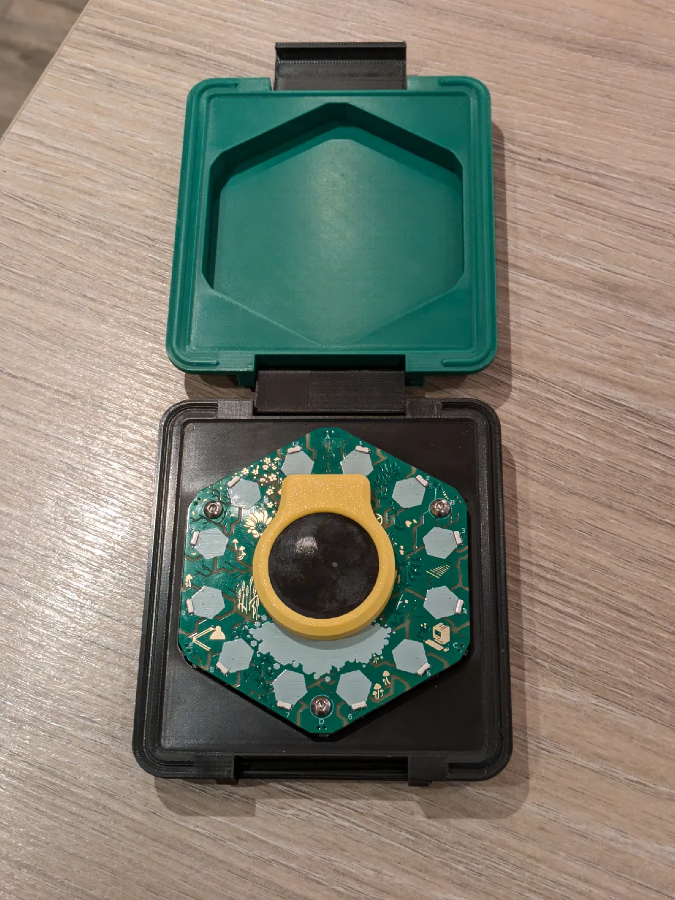
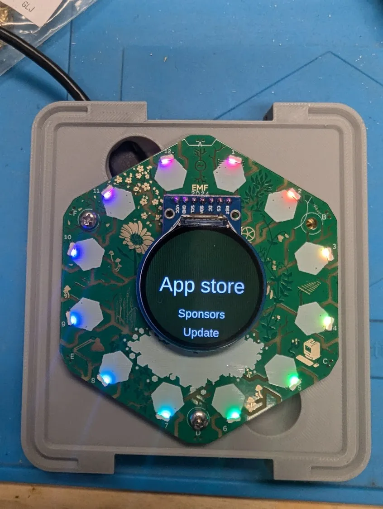
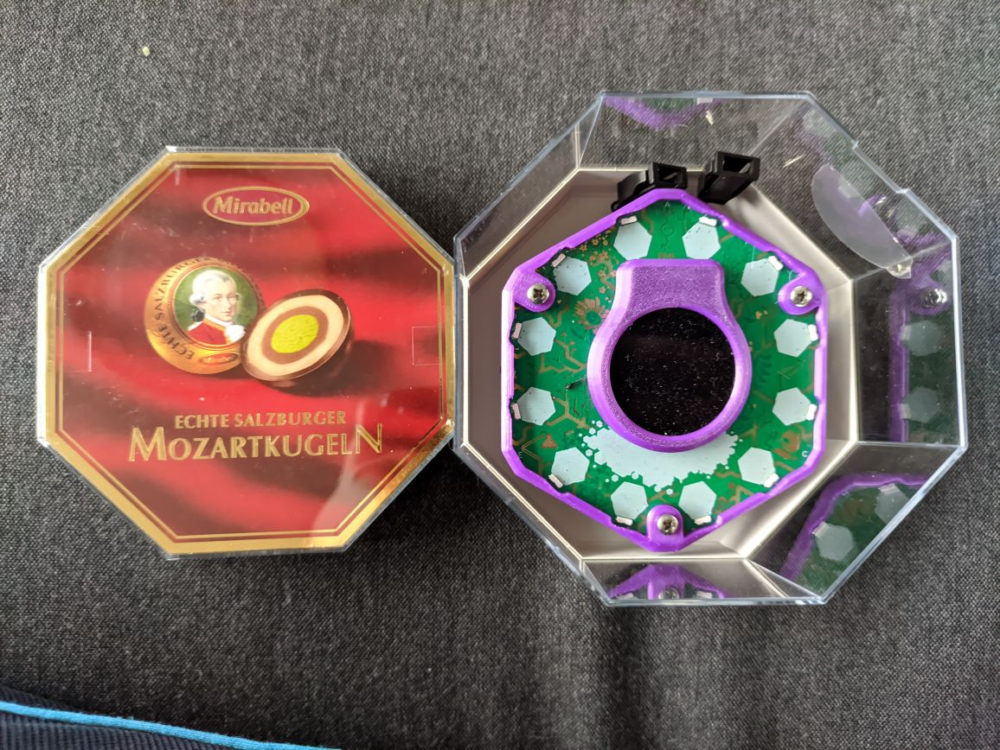
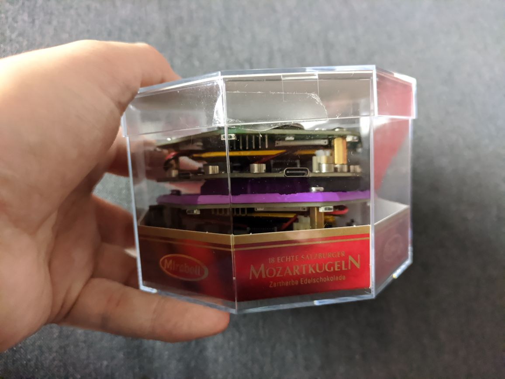
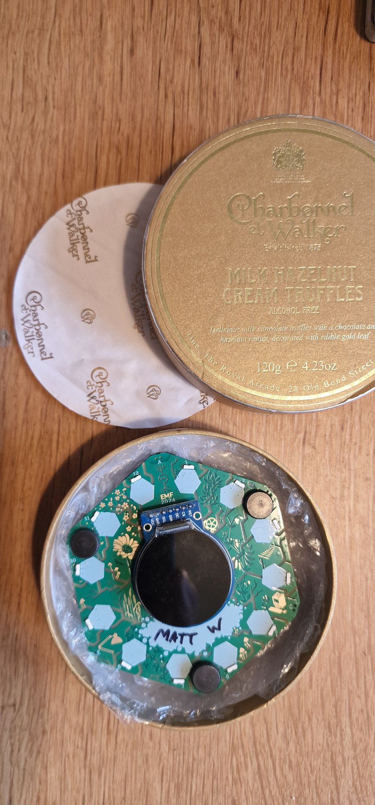

## General Accessories

### A 3D-printed case

You can print the [Official 3d Printable Case for the 2024 EMF Camp Badge](https://github.com/emfcamp/badge-2024-addons/tree/main/3d-printable-case).

### A 3D-printed stand

You can print a [Tildagon stand](https://www.printables.com/model/909352-tildagon-stand) to better display your badge.

{: style="width:400px;height: auto;margin:auto;display:block;" }

### Fancy lanyard

The badge uses a USB-C to USB-C cable as the lanyard - any USB-C cable will do, we recommend one around a meter long but it's up to you! You can also use regular lanyards if you would prefer.

Some suitable cables are:

- [A glowing charging cable](https://www.amazon.co.uk/Charging-iPhone-Samsung-Galaxy-Laptops/dp/B0CQ2ZY9M6/)

- [Another glowing one](https://www.amazon.co.uk/Charger-Glowing-Aluminum-Charging-Colorful/dp/B0CNXTWL2M/)

- [Guess what? It glows.](https://www.amazon.co.uk/Sikai-Charger-Charging-Braeathing-Compatible/dp/B0BVW12VJ3/)

You can also use one that doesn't glow, search for "usb c to usb c", or add "rgb" on the end if you want to research your own glowing ones.
: Note, that we do not recommend metal-shrouded usb cables as they can short circuits if they touch hexpansions.

!!! info "Lanyard not lighting up?"

    Unfortunately, not all badges support the glowing USB cables. We're not currently sure why.

### Thumbscrews

- [Aliexpress link](https://a.aliexpress.com/_Eu8bBsx)

### Hexpansion storage

You can print a [storage for 6/12/18 Hexpansions and for Gridfinity fans a 1x1x2 with 6 slots and a 2x1x2 with 14 slots](https://www.printables.com/model/924600-hexpansion-storage-for-emf-camp-tildagon-badge).

{: style="width:400px;height: auto;margin:auto;display:block;" }

## Badge storage solutions

People have created printable cases and also found several other containers that fit the badge well:

### Tildacase

You can print a [Tildacase](https://www.printables.com/model/921786-tildagon-tildacase):

{: style="width:400px;height: auto;margin:auto;display:block;" }

and even a [Tildacase with hole for USB-C](https://www.printables.com/model/947947-tildagon-tildacase-with-in-case-usb-c
):

{: style="width:400px;height: auto;margin:auto;display:block;" }

### Mozartkugeln box

{: style="width:400px;height: auto;margin:auto;display:block;" }

{: style="width:400px;height: auto;margin:auto;display:block;" }

### Charbonnel et Walker box

{: style="width:400px;height: auto;margin:auto;display:block;" }

### Share your addon

!!! note "Have an addon to share?"

    Share it in the [badge-2024-addons](https://github.com/emfcamp/badge-2024-addons/tree/main) repository!

## Accessory Hexpansions



