## General Accessories

### 3D-printed badge cases

!!! warning
    The frontboard of the 2026 badge is different from the 2024 badge, so 3D-printed cases designed for the 2024 badge may not fit the 2026 badge correctly.

#### 2026 badge cases

You can print the [Spaceagon Case](https://github.com/nightcaster/Spaceagon-Case):

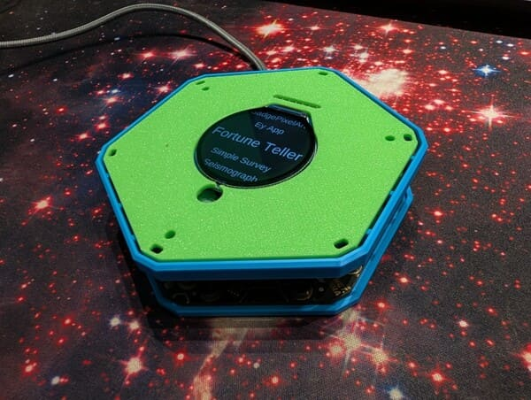

#### 2024 badge cases

You can print the [Official 3d Printable Case for the 2024 EMF Camp Badge](https://github.com/emfcamp/badge-2024-addons/tree/main/3d-printable-case).

Alternatively, you can print the [EMF Tildagon badge case](https://www.printables.com/model/1643166-emf-tildagon-badge-case-emf-2024-badge) by [Nightcaster](https://www.printables.com/@Nightcaster_2199699).

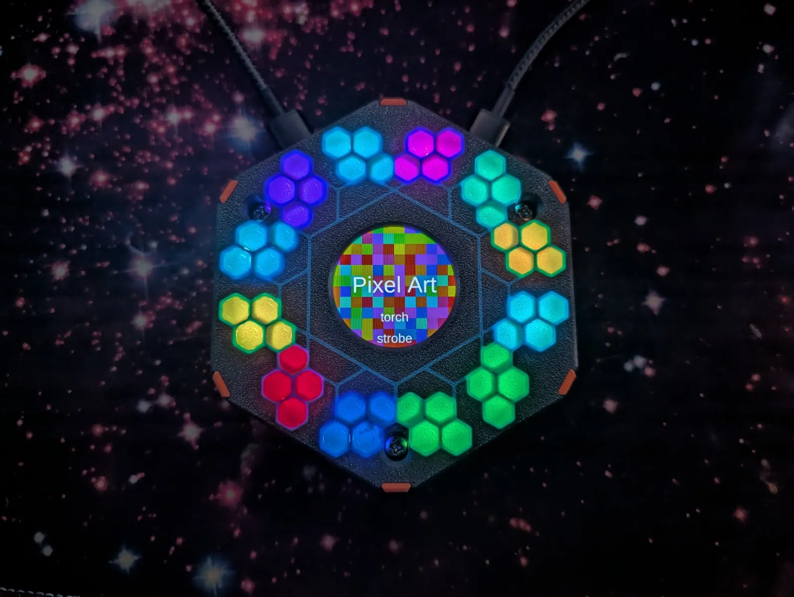

You can also print the [EMF Camp Tildagon badge top bumper cover](https://www.printables.com/model/917443-emfcamp-tildagon-badge-top-bumpercover).

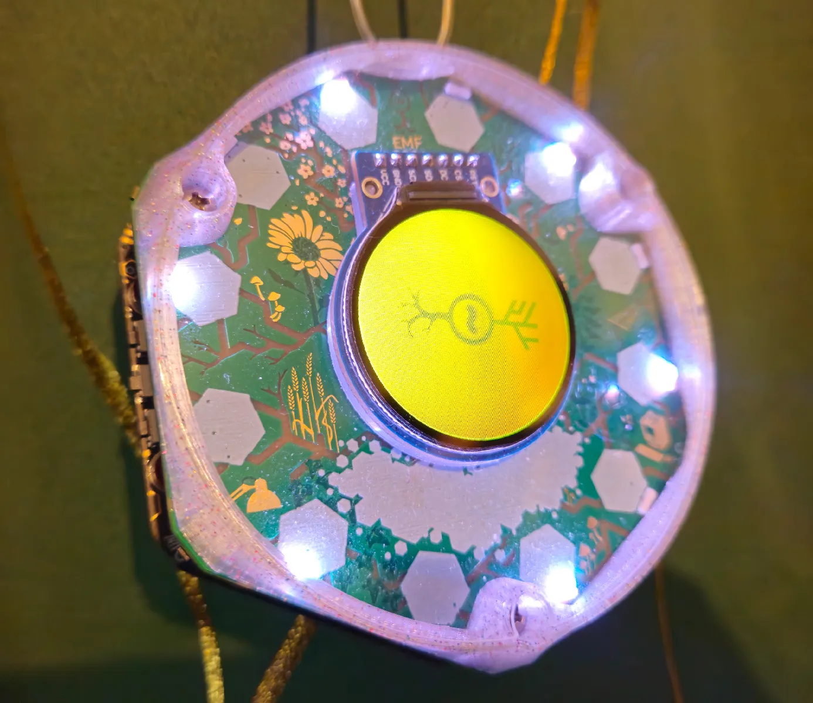

### Screen shim

You can print a [GC9A01 screen shim for the EMF Tildagon badge](https://www.printables.com/model/917684-emfcamp-tildagon-badge-gc9a01-screen-shim-with-loc) to help position and support the display; the model includes locating features for a precise fit.

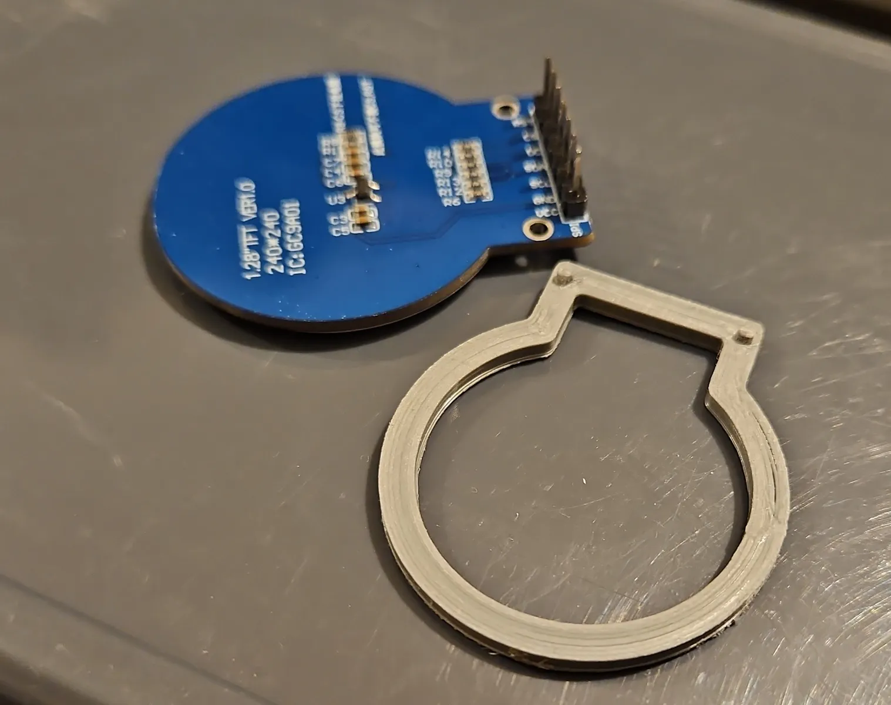

### A 3D-printed stand

You can print this [Tildagon badge stand](https://www.printables.com/model/900532-emf-tildagon-badge-stand) to keep your badge propped up and on display. All buttons and USB ports stay accessible, but the stand blocks the bottom two hexpansion ports. It prints without supports; check the remixed versions on Printables if your badge has a bumper case.

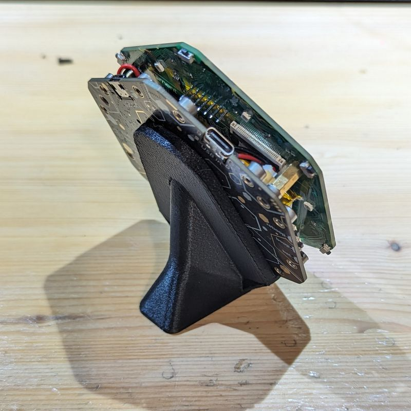{: style="width:400px;height: auto;margin:auto;display:block;" }

Alternatively, you can print this [Tildagon stand](https://www.printables.com/model/909352-tildagon-stand). It requires 2x M3 x 6mm machine screws.

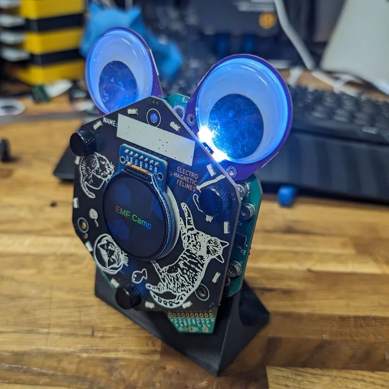{: style="width:400px;height: auto;margin:auto;display:block;" }

### Rear grab handle

You can print a [Tildagon Handle](https://www.printables.com/model/1756046-tildagon-handle) by Danny Walker — a rear grab handle that makes the badge easier to hold when you have lots of hexpansions plugged in. It attaches to the rear of the badge with 3 × M3 screws through the standard screw holes.

!!! note "Screw length"
    The 2026 version of the badge has screws inserted from this direction, so you'll likely need longer screws than stock. For the 2024 version, M3 × 5 screws into the PCB standoffs should work.

### Pixel-snap & MagSafe mount

A 3D-printed adapter that attaches to the rear of the badge, letting you snap on Pixel-snap and MagSafe compatible accessories. By Brian Corteil.

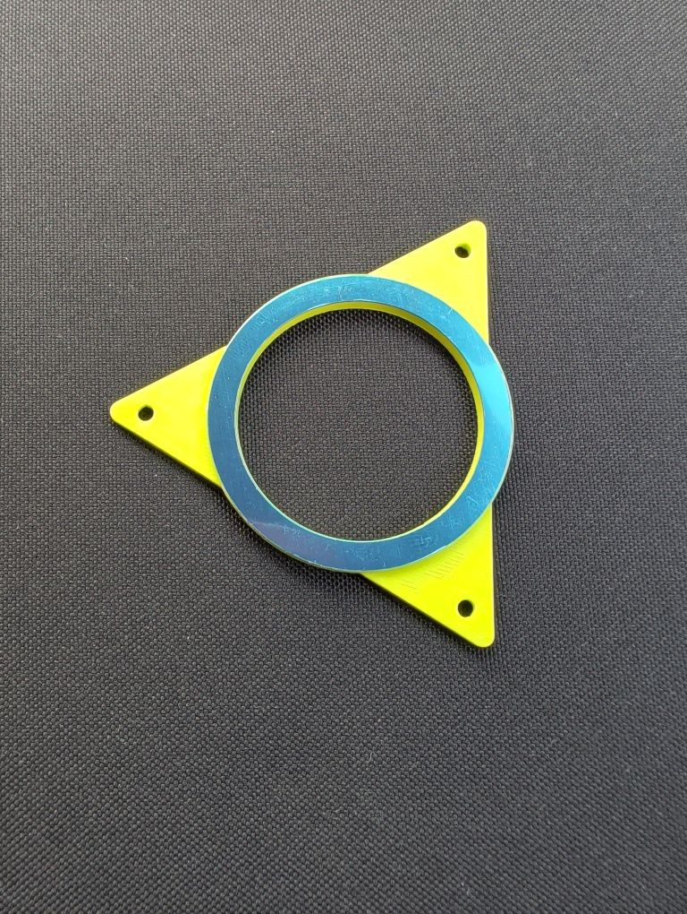{: style="width:400px;height: auto;margin:auto;display:block;" }

### EMF model

Whle not technically an accessory, please enjoy this giant build of a Tildagon.

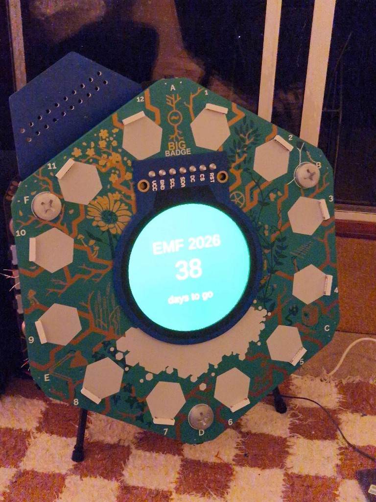{: style="width:400px;height: auto;margin:auto;display:block;" }

[See more on Hachyderm](https://hachyderm.io/@HughEvansDev/116716666838418028)

### Fancy lanyard

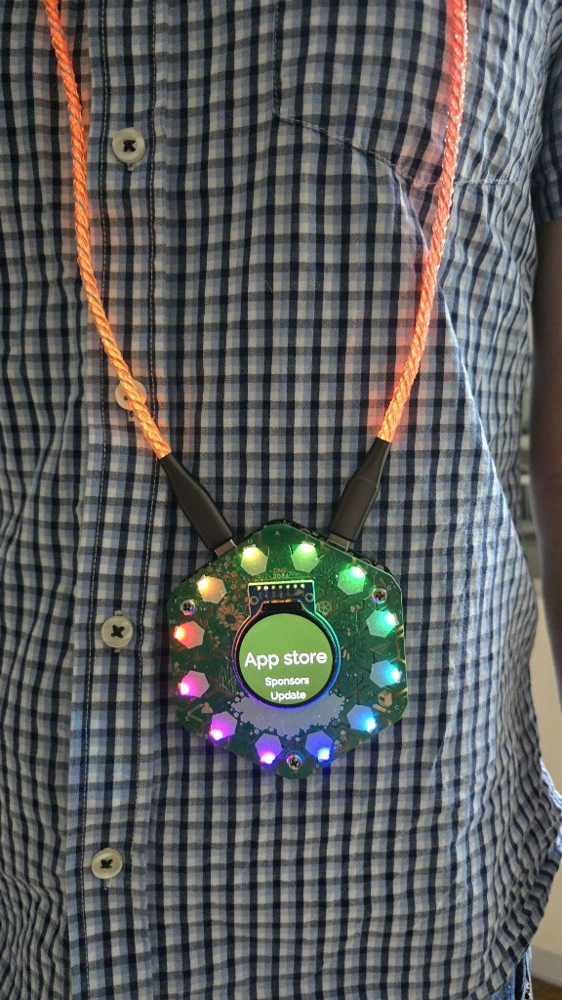{: style="width:400px;height: auto;margin:auto;display:block;" }

The badge uses a USB-C to USB-C cable as the lanyard - any USB-C cable will do, we recommend one around a meter long but it's up to you! You can also use regular lanyards if you would prefer.

Some suitable cables are:

- [A glowing charging cable](https://www.amazon.co.uk/Charging-iPhone-Samsung-Galaxy-Laptops/dp/B0CQ2ZY9M6/)

- [Another glowing one](https://www.amazon.co.uk/Charger-Glowing-Aluminum-Charging-Colorful/dp/B0CNXTWL2M/)

- [Guess what? It glows.](https://www.amazon.co.uk/Sikai-Charger-Charging-Braeathing-Compatible/dp/B0BVW12VJ3/)

You can also use one that doesn't glow, search for "usb c to usb c", or add "rgb" on the end if you want to research your own glowing ones.
: Note, that we do not recommend metal-shrouded usb cables as they can short circuits if they touch hexpansions.

!!! info "Lanyard not lighting up?"

    Unfortunately, not all badges support the glowing USB cables. We're not currently sure why.

### Thumbscrews

- [Aliexpress link](https://a.aliexpress.com/_Eu8bBsx)

### Hexpansion storage

You can print a [storage for 6/12/18 Hexpansions and for Gridfinity fans a 1x1x2 with 6 slots and a 2x1x2 with 14 slots](https://www.printables.com/model/924600-hexpansion-storage-for-emf-camp-tildagon-badge).

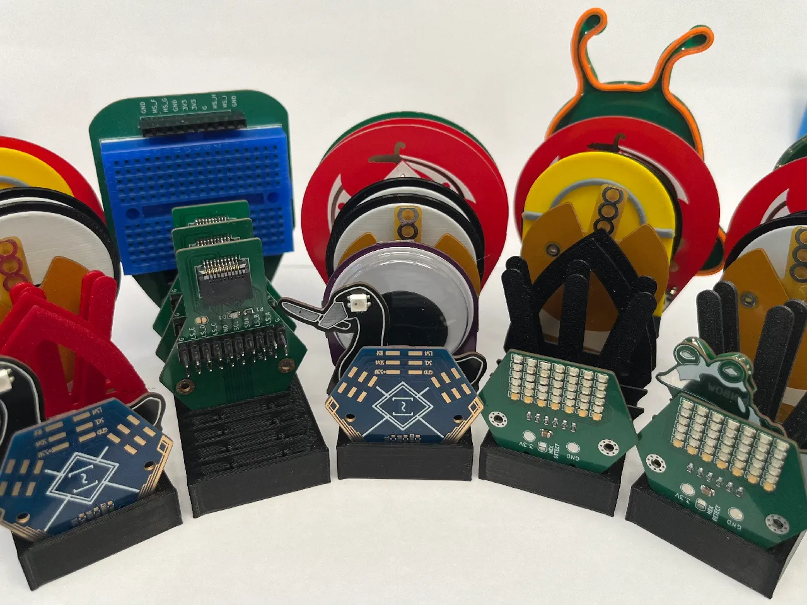{: style="width:400px;height: auto;margin:auto;display:block;" }

### Hexpansion "storage"

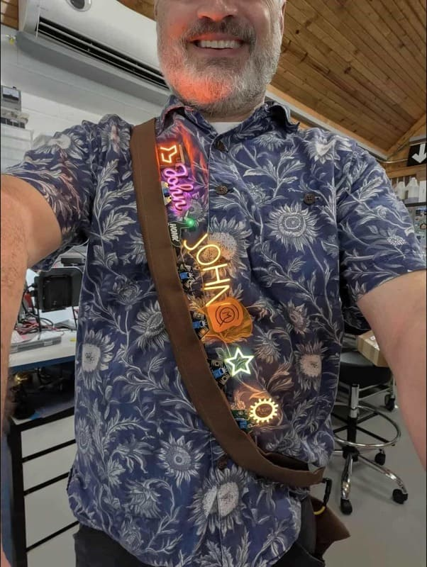{: style="width:400px;height: auto;margin:auto;display:block;" }

## Badge storage solutions

People have created printable cases and also found several other containers that fit the badge well:

### Tildacase

You can print a [Tildacase](https://www.printables.com/model/921786-tildagon-tildacase):

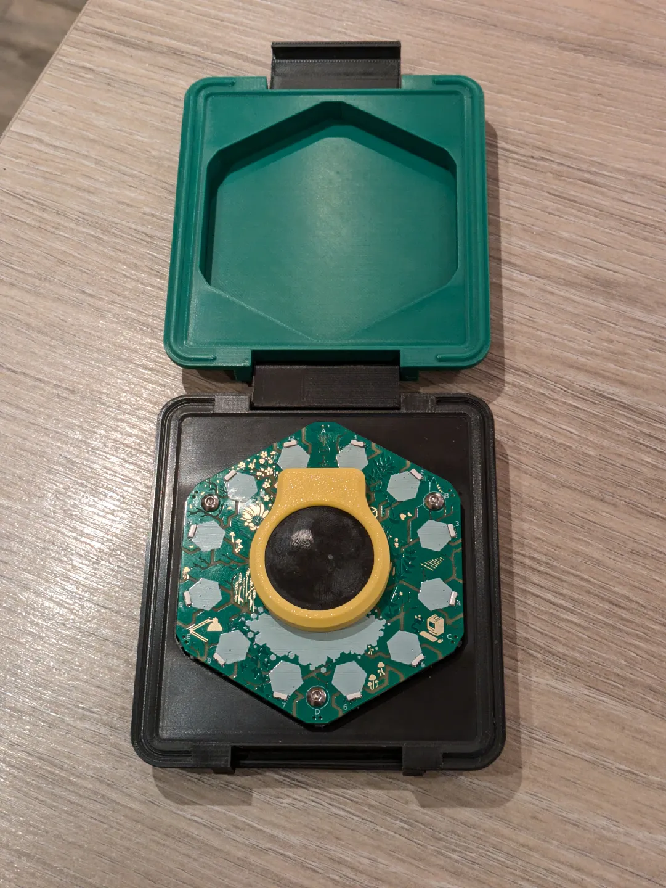{: style="width:400px;height: auto;margin:auto;display:block;" }

and even a [Tildacase with hole for USB-C](https://www.printables.com/model/947947-tildagon-tildacase-with-in-case-usb-c
):

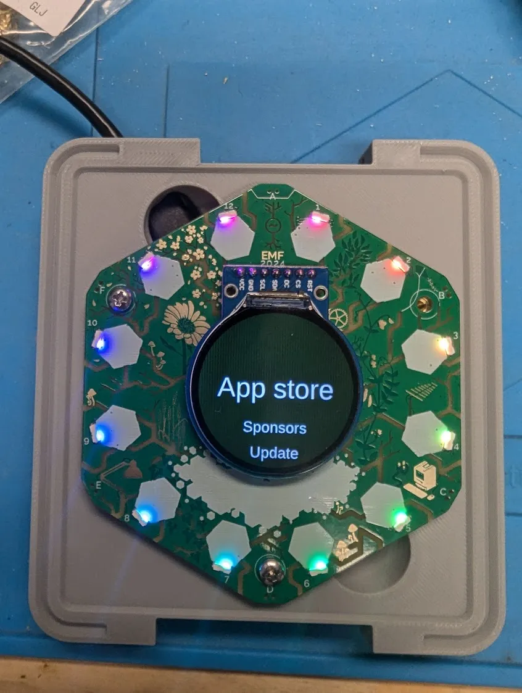{: style="width:400px;height: auto;margin:auto;display:block;" }

Or this [remixed Tildacase](https://www.printables.com/model/940651-tildagon-tildacase-fits-badge-with-both-bumpers):

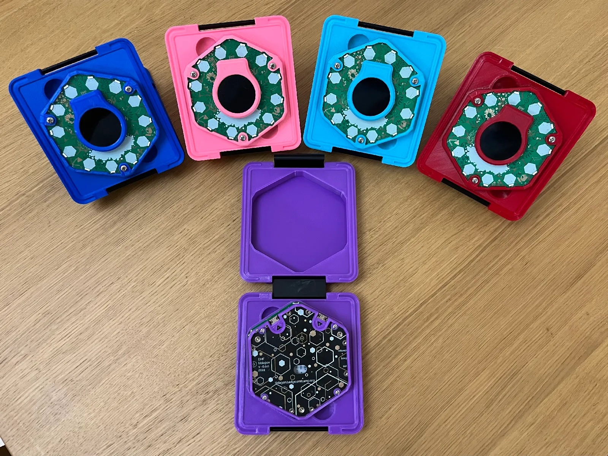

### Mozartkugeln box

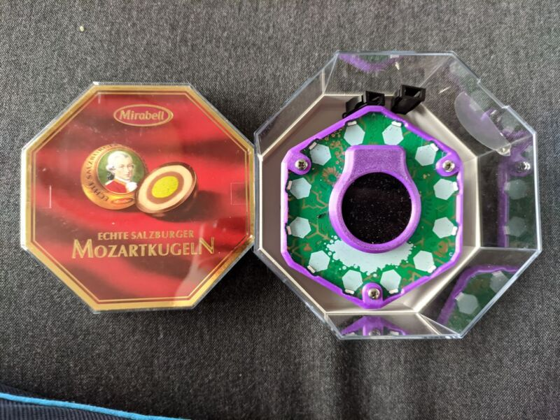{: style="width:400px;height: auto;margin:auto;display:block;" }

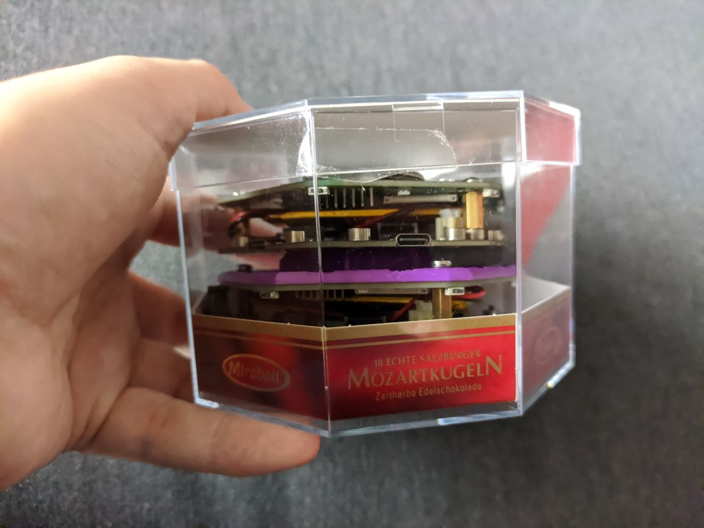{: style="width:400px;height: auto;margin:auto;display:block;" }

### Charbonnel et Walker box

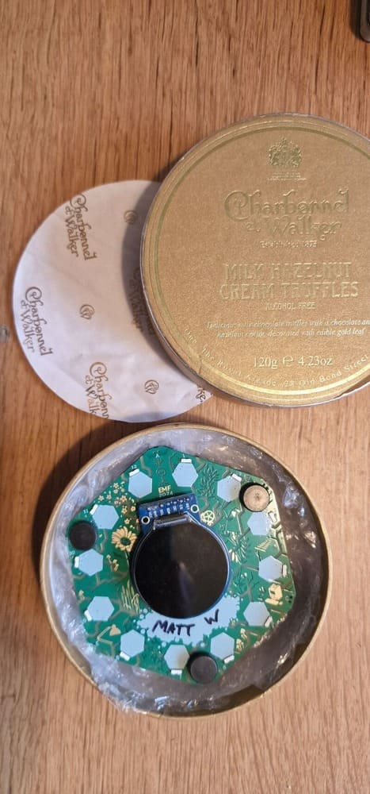{: style="width:400px;height: auto;margin:auto;display:block;" }

### Lego pick-a-brick pots

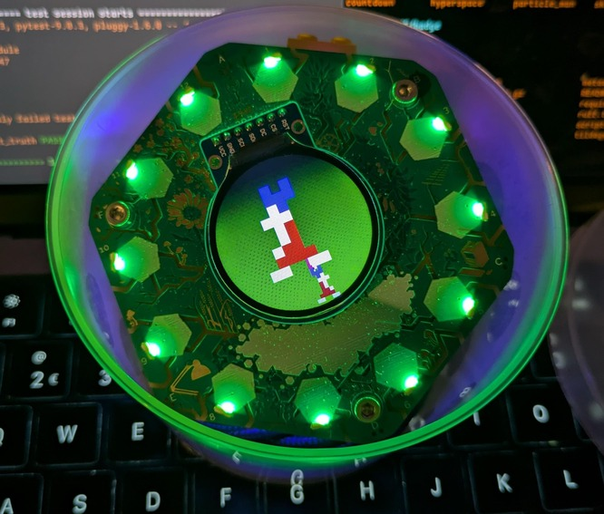{: style="width:400px;height: auto;margin:auto;display:block;" }

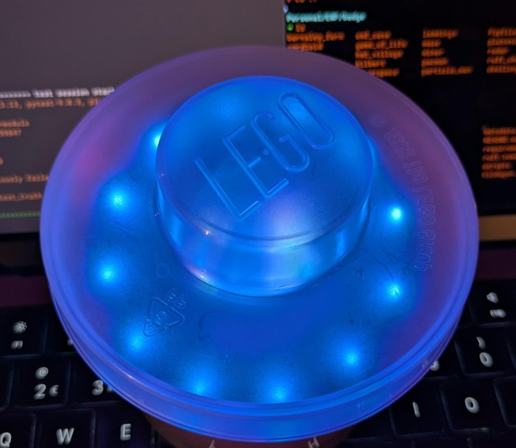{: style="width:400px;height: auto;margin:auto;display:block;" }

## Share your addon

!!! note "Have an addon to share?"

    Share it in the [badge-2024-addons](https://github.com/emfcamp/badge-2024-addons/tree/main) repository!

## Accessory Hexpansions



