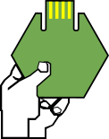

{: style="width:300px; height: auto" , align=right }

The Tildagon is a badge that you can wear around your neck. It has a round screen, six buttons, and lots of colourful LEDs. It has a USB-C connector, WiFi, and a battery. It can run MicroPython, and has six hexpansion connectors.

The badge will automatically connect to camp wifi, and you can use the [app store](https://apps.badge.emfcamp.org/) to install apps.

The hexpansions that the badge supports allow you to extend the functionality of the badge with hardware made by [yourself](../hexpansions/creating-hexpansions.md) or other attendees.

- [I want to assemble a Spaceagon (2026)](./spaceagon-assembly.md)
- [I want to assemble a Tildagon (2024)](./tildagon-assembly.md)
- [I want to connect to another Wi-Fi network](./connect-to-wifi.md)
- [(Re)flash your badge](./flash-the-badge.md)
- [Insert hexpansions](#hexpansions)
- [Operate your badge](#operate-your-badge)
- [Accessories](./accessory-ideas.md)
- [Common problems](./common-problems.md)

## Hexpansions

Slide a hexpansion into a slot on the edge of the badge until the connector tab is fully connected. The badge should detect it automatically and light up the port.

{: style="width:100px;height: auto;margin:auto;display:block;" }

Hexpansions must be **1mm thick** to fit properly. If yours is not detected, see [Detecting hexpansions](./common-problems.md#detecting-hexpansions).

## Operate your badge

### Power on

To power on your badge, press and hold the bottom button designated _bat_ (the designation is on the back of the badge) for 2 seconds.

### Navigate the menu

Use the buttons **A** (`UP`) and **D** (`DOWN`) to move up and down in the menu. To select a menu item, press **C** (`CONFIRM`). To go back to a previous menu or exit an app, press **F** (`CANCEL`).

!!! info "Note that badge apps may use buttons differently."

### Power off

To power off the badge, select the menu item **Power off**.

If your screen is broken, follow the steps in [Turn off badge with broken screen](./common-problems.md#turn-off-badge-with-broken-screen).

## Buttons

### Front of the badge

- **A** (`UP`): In the menu, this button navigates up. In apps the functionality may vary.
- **B** (`RIGHT`): When entering text in a dialogue, this button allows you to add another letter. In apps the functionality may vary.
- **C** (`CONFIRM`): This generally confirm the selection. In a dialogue, this button means yes. In apps the functionality may vary.
- **D** (`DOWN`): In the menu, this button navigates down. In apps the functionality may vary.
- **E** (`LEFT`): When entering text in a dialogue, this button allows you to move left. In apps the functionality may vary.
- **F** (`CANCEL`): This generally cancels the selection. In a dialogue, this button means no. In apps the functionality may vary.

### Back of the board

The **boop**, **reboop**, and **bat** buttons are on the base board (the back half of the badge), on the left-hand side. Their names are printed on the board next to each button.

- **reboop**: Press and hold the **reboop** button to perform a soft (re)boot.
- **boop**: Press and hold the **boop** button while connecting to power to load the bootloader (the badge needs to be powered off before connecting to power).
- **bat**: Press the **bat** button to power on your badge.

### Troubleshooting

For common issues, see [Common problems](../using-the-badge/common-problems.md).
