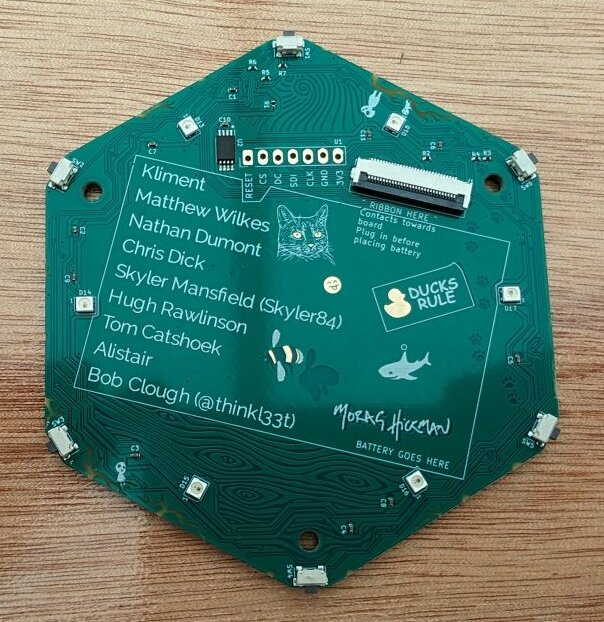

If you need to replace your badge components, you can order a replacement part from ebay, aliexpress etc.

## Replace your screen

The badge uses a GC9A01 1.28" round LCD module.

Some links to the correct screen:

- [Aliexpress with connector soldered on](https://www.aliexpress.com/item/1005004392903184.html)
- [Aliexpress with loose connector](https://www.aliexpress.com/item/1005005936868343.html)
- [Amazon](https://www.amazon.co.uk/ARCELI-Arduino-Resolution-Interface-Display/dp/B0CFXVD9HX/)

Carefully pull the connector of the display up perpendicular to the board surface, without bending the pins. If you bought a new display with a connector that is soldered on, carefully push the connector of the new display into the slots. The display is held in place by friction, so this is all you need to do.

If you bought a display with a loose pins you have to also push the display onto the pin and solder it on the screen site, otherwise it won't make electrical contact.

## Replace the FPC connector

The badge uses a [JUSHUO AFC01-S30FCC-00](https://www.lcsc.com/product-detail/FFC-FPC-Connectors_JUSHUO-AFC01-S30FCC-00_C262279.html).

!!! tip "You've found a badge CHALLENGE!"

    Your challenge, should you choose to accept it, is to document how you replaced your FPC if you do so (pictures would be great!). To see more information and accept the challenge (that is, comment on the issue), see this [issue](https://github.com/emfcamp/badge-2024-documentation/issues/175).

## Replace the flexible cable

The badge uses a [HCTL HC-FFC05-30P-100-A-01 (30 pin 0.5mm pitch 100mm same side connector)](https://www.lcsc.com/product-detail/FFC-FPC-Connect-Cables_HCTL-HC-FFC05-30P-100-A-01_C6575029.html).

Check out the steps to [Assemble your badge](./end-user-manual.md#assembly) to see how your badge was assembled. Reverse the steps by unscrewing your badge front and then carefully opening the connectors to remove the cable and replace it with the new one.

  
  

## Replace a button

The badge uses [TS24CA tactile switches](https://www.lcsc.com/product-detail/Tactile-Switches_SHOU-HAN-TS24CA_C393942.html).

!!! tip "You've found a badge CHALLENGE!"

    Your challenge, should you choose to accept it, is to document how you replaced one of your buttons if you do so. To see more information and accept the challenge (that is, comment on the issue), see this [issue](https://github.com/emfcamp/badge-2024-documentation/issues/175).

## Replace an LED

The badge uses two types of LEDs:

- 12 side RGB LEDs of type [SK6805SIDE-S](https://www.lcsc.com/product-detail/Light-Emitting-Diodes-LED_OPSCO-Optoelectronics-SK6805SIDE-S_C2909057.html)
- 7 RGB LEDs of type [SK6805MICRO-J](https://www.lcsc.com/product-detail/Light-Emitting-Diodes-LED_OPSCO-Optoelectronics-SK6805MICRO-J_C2909056.html)

!!! tip "You've found a badge CHALLENGE!"

    Your challenge, should you choose to accept it, is to document how you replaced your LED if you do so (pictures would be great!). To see more information and accept the challenge (that is, comment on the issue), see this [issue](https://github.com/emfcamp/badge-2024-documentation/issues/175).

## Replace a battery

The badge uses a [2000mAh 3.7V LiPo Battery](https://thepihut.com/products/2000mah-3-7v-lipo-battery). You can look for batteries with higher or lower mAh numbers, this just affects how long the battery lasts (higher number, longer battery life). The battery size maximum is 64x40x7mm. Bigger batteries will not fit. Smaller ones will fit.

Make sure the connector and pinout are correct. Compare the photo of the connector with the battery you have and ensure the colours match.

{: style="width:300px;height: auto;margin:auto;display:block;" }

Check out the steps to [Assemble your badge](./end-user-manual.md#assembly) to see how your badge was assembled. Reverse the steps by unscrewing your badge front and then carefully removing the old battery from the glue dots. You will probably need small pliers to pull the connector out of its socket.
