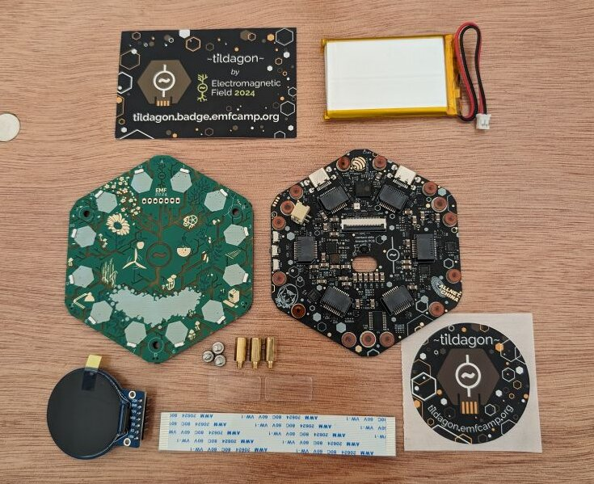
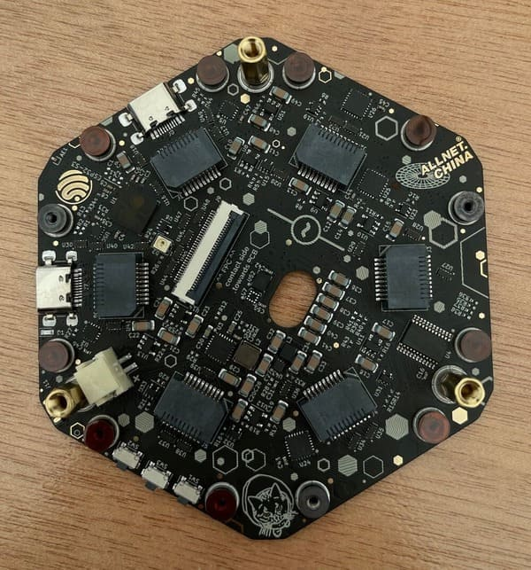
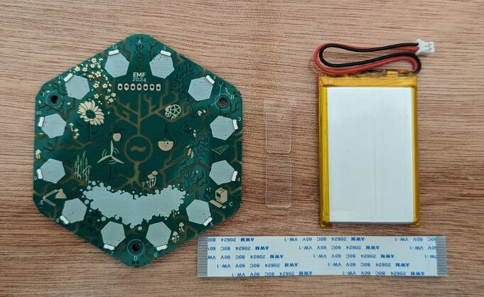
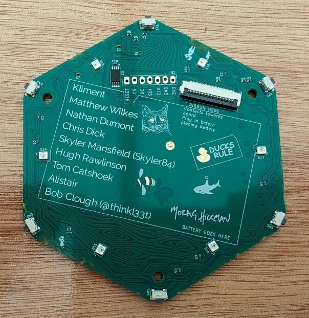
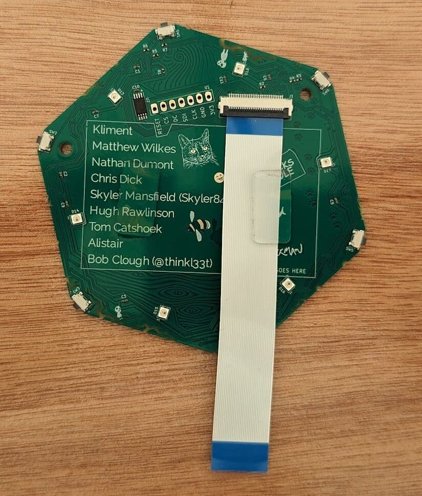
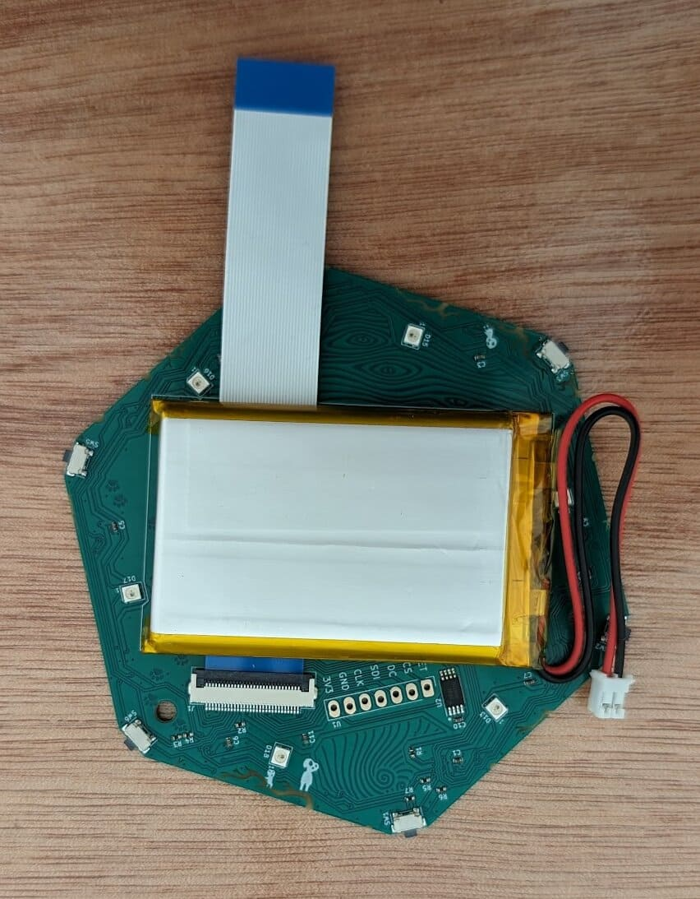
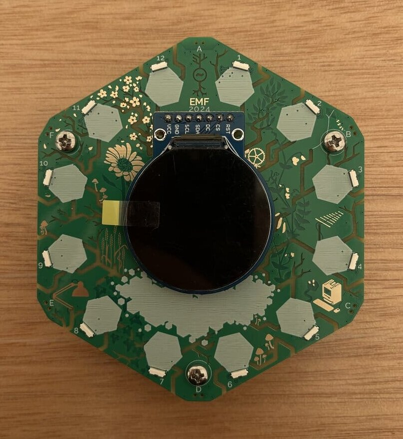

!!! tip "Looking for the 2026 badge?"

    If you have a Spaceagon upgrade kit or a complete 2026 kit, follow the [Spaceagon assembly](./spaceagon-assembly.md) instructions instead.

The following components come with each badge kit:

{: style="width:500px;height: auto;margin:auto;display:block;" }

From top to bottom, left to right:

- Tildagon information with link to docs
- battery
- badge front
- badge base
- display
- 3 M3×5 screws, 2 glue stickers
- flexible cable
- Tildagon sticker

The large screws in your kit are **M3×5** and fit the brass **M3** standoffs on the base board. If you mount hexpansions with screws, those use the smaller **M2** screws. See [Create a hexpansion](../hexpansions/creating-hexpansions.md#mounting-holes).

## 1. Attach the standoffs to the base of the badge

!!! warning "Important: board spacing update for 2026 badge"

    To avoid battery squishing, we're increasing board spacing by 1mm to use 11mm tall standoffs! If you're assembling your badge, please use the updated standoffs included in your kit.

Get the three brass M3 standoffs. Remove the plastic protector stickers on top of the middle screw mounts wherever you see three mounts together:

  
  
  

{: style="width:300px;height: auto;margin:auto;display:block;" }

## 2. Assemble the front of the badge

Start with the badge front, flexible cable, and glue bits:

{: style="width:400px;height: auto;margin:auto;display:block;" }

Flip the badge front, so you can see the names of the badge team:

{: style="width:300px;height: auto;margin:auto;display:block;" }

Attach the display ribbon to connector. Lift the black bit and slide the ribbon cable into the connector. The contacts should be placed towards the board. The blue side of the ribbon should remain visible.

  
  

Next, attach the glue stickers to the badge front inside the rectangle.

{: style="width:300px;height: auto;margin:auto;display:block;" }

Peel the protectors from the glue stickers to attach the battery. Then, get the battery and place it **over** the ribbon cable inside the rectangle ensuring the battery goes completely inside the rectangle.

{: style="width:500px;height: auto;margin:auto;display:block;" }

## 3. Attach the display

Attach the other end of the flexible ribbon cable to the back board. Then gently push the display into the pins on the front of the badge.

!!! note "Display not working?"

    See [Replace your screen](./common-problems.md#broken-components).

## 4. Flash your badge

!!! info "Your badge is probably already flashed"

    If you received your badge after 1pm Friday 31st May, you do not need to complete this step as badges were pre-flashed!

If your badge is not yet flashed, follow the directions in [Flash your badge](./flash-the-badge.md) before you continue assembly.

## 5. Attach the battery to the back of the badge

On the back of the battery, remove the plastic lid from the battery connector:

  
  

Then attach the battery cable to battery connector on the back board.

  
  

## 6. Screw the badge front to the badge back

Use the 3 **M3×5** screws to screw the badge front to the badge base, into the brass M3 standoffs. The top of the base board is between the two USB-C ports and should be aligned with the top of the front board which is where the **A** button is.

  
  

{: style="width:500px;height: auto;margin:auto;display:block;" }

That's it! Next, see the [end user manual](./end-user-manual.md) for how to use your badge.
